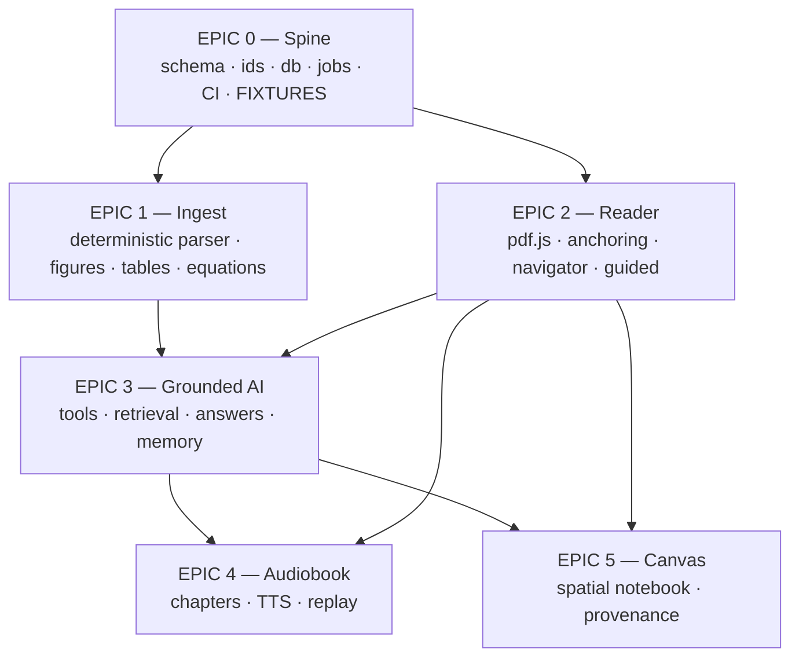

# PaperTree v2 — Build Plan

Six epics. Each is a GitHub tracking issue **and** a self-contained prompt for one
dynamic-workflow session. Run them in wave order; within a wave they are parallel-safe
because their file ownership is disjoint.

> **Current work: issue [#78](https://github.com/Legend101Zz/PaperTree/issues/78)** — a
> three-session phase that finishes Epics 1–3. Epics 4 and 5 do not start until it closes.

### Deleted docs, and why a stale reference is not a broken link

The **one-shot session prompts are deleted** now that their sessions have run:
`WAVE-0-PROMPT.md`, `WAVE-1-EPIC-01-PROMPT.md`, `WAVE-1-EPIC-02-PROMPT.md`,
`EPIC-00.1-HARDENING-PROMPT.md`, `ISSUE-28-WORKSPACE-PROMPT.md`, `create-issues.sh`, and
the root `task_plan.md` and `progress.md`.

The `EPIC-0N-RESULT.md` files still name them, and that is correct — a record of what
happened refers to what existed at the time. **Do not go looking for them.**

Deleting them is not tidying. Three of those prompts carried instructions that were
measured and found wrong — the "reject spans over 1.3× size" rule that would delete the
arXiv stamp from every arXiv paper (#48), the `doc_order` choice that had only one legal
answer (#49), and the F1.3/F1.5 dependency stated backwards (#50). Leaving a corrected
instruction in the tree is an invitation to follow it again. The measurements that
corrected them are in `AGENTS.md` §4, which is the file every session actually reads.

**Kept:** every `EPIC-0N-RESULT.md` (the record), every epic brief (the acceptance
criteria), `EPIC-00-GATE.md` and `EPIC-GATE-PROMPT.md` (the reusable between-epic review).

---

## Constraints that shape everything

Set by the project owner, 2026-07-29:

| Constraint | Consequence |
|---|---|
| **Open source, hobby project** | Licences are not a filter. PyMuPDF (AGPL) is back on the table and is the core geometry library. |
| **Cheap, local, low resource** | No self-hosted LLM. No GPU. Ingest must run on a laptop in seconds, not minutes. |
| **Zero-ML preferred, must be earned** | Deterministic parser is the default path. Docling is an **opt-in** adapter. The benchmark decides — if zero-ML loses badly on figures/tables, a small local model is permitted as a third tier. |
| **SQLite + sqlite-vec** | No Postgres, no Docker requirement for the datastore. `git clone && install && run`. |
| **Rewrite, not repair** | The existing multi-tenancy bugs are not patched — but ownership is built into the data layer from day one. |
| **No AI slop** | Every issue carries acceptance criteria as **tests that must pass**. Review = "CI green + diff is sane", not "re-derive whether this is right". |

Superseded from the earlier report: Postgres/pgvector (→ SQLite/sqlite-vec), DBOS
Transact (→ a jobs table with steps), and the licence-based elimination of parsers
(no longer binding). Everything else in `../REPORT.md` stands.

---

## Dependency graph



| Wave | Epics | Parallel? |
|---|---|---|
| **0** | Epic 0 | No — sequential, blocks everything |
| **1** | Epic 1 ‖ Epic 2 | Yes — Epic 2 builds against Epic 0's fixtures, not against Epic 1 |
| **2** | Epic 3 | No — needs both 1 and 2 |
| **3** | Epic 4 ‖ Epic 5 | Yes |

### The one decision that makes Wave 1 parallel

**Epic 0 must ship golden fixture PaperIR files** for 3 papers, hand-checked and
committed. Epic 2 (Reader) then builds entirely against those fixtures and never waits
for Epic 1 (Parser). Without fixtures the waves collapse into a sequential chain and the
whole parallel plan is theatre.

This is non-negotiable and is Epic 0's most important deliverable.

---

## Anti-slop rules (apply to every epic)

1. **File ownership is exclusive.** Each epic declares the paths it owns. An agent that
   needs to change a file outside its list opens an issue instead of editing it. This is
   what makes parallel worktrees mergeable.
2. **Acceptance criteria are tests.** "Done" means a named test passes, not that an agent
   believes it works. Every issue lists its tests by name.
3. **The schema is frozen after Epic 0.** Changing PaperIR later requires a migration and
   an ADR. This prevents the exact failure already in the repo — two `Highlight` types,
   two canvas type systems, three extractors.
4. **No new dependency without justification in the PR body.** This project's failure mode
   is accumulated abandoned code, not missing libraries.
5. **Never fabricate content that renders as source.** No LLM writes into PaperIR. No
   generated diagram renders like a paper figure. Enforced by schema, tested by a lint.
6. **Delete as you go.** Each epic lists files it must delete. A PR that adds the
   replacement without removing the original is incomplete.
7. **Small PRs.** One issue = one PR. If a PR exceeds ~600 changed lines, split it.

---

## How to run an epic

```bash
# 1. authenticate once
gh auth login

# 2. in a new Claude Code session, ultracode mode:
#    paste the session prompt from the tracking issue
```

> The tracking issues exist; `create-issues.sh` was a one-shot and is deleted.
> **For the current phase the work contract is issue #78, not an epic file** — it carries
> the backlog, the three session prompts, the design prompt and the handoff protocol.

Within an epic the agent is expected to spawn parallel sub-agents per feature, using
worktrees where features touch disjoint files. The epic prompt states which features are
parallel-safe.

---

## Epics

| # | Epic | Wave | Features | Status | Owns |
|---|---|---|---|---|---|
| 0 | [Spine](EPIC-00-spine.md) | 0 | 7 | **merged, closed** | `packages/document-ir`, `packages/db`, `packages/jobs`, CI, fixtures |
| 1 | [Ingest & document intelligence](EPIC-01-ingest.md) | 1 | 9 | **merged**, INCOMPLETE — 5/10 MET, 4 PARTIAL, 1 NOT MET | `services/document-worker`, `packages/evaluation` |
| 2 | [Reader & anchoring](EPIC-02-reader.md) | 1 | 8 | **merged, closed** — 9/9 MET | `apps/web` reader, `packages/anchoring`, `packages/ui` |
| 3 | [Grounded AI](EPIC-03-grounded-ai.md) | 2 | 8 | **merged**, INCOMPLETE — 6/8 features, 4/7 MET | `packages/retrieval`, `packages/agent-tools`, `packages/prompts`, `packages/memory` |
| — | **[Epic 1–3 completion](https://github.com/Legend101Zz/PaperTree/issues/78)** | **2.5** | 3 sessions | **← the current target** | the gaps between the epics above |
| 4 | [Audiobook & Replay](EPIC-04-audiobook.md) | 3 | 7 | **blocked on #78** | `services/audio-worker`, `apps/web` audio |
| 5 | [Canvas](EPIC-05-canvas.md) | 3 | 8 | **blocked on #78** | `apps/web` canvas, `packages/canvas` |

**47 features total.** That is the honest size of "everything". Waves 1 and 3 are where
parallelism pays; waves 0 and 2 are throughput-limited by dependency, not by agents.

**Wave 2.5 is not in the original plan, and that is the point.** The plan assigned every
path to an epic and assigned the *seams between them* to nobody — so nothing serves PaperIR
over HTTP (#74), because neither Epic 1's nor Epic 3's "Owns (exclusive)" list claims that
layer. Three epics of measured, tested libraries exist and a user can reach none of them.
#78 is the correction, and it runs before Wave 3 rather than after.

---

## Definition of done for the whole build

The first milestone from `../ROADMAP-AND-CHANGE-MAP.md` §27 remains the architectural
gate, and it is satisfied at the end of **Wave 2**.

**Status as of 2026-08-03, `main` at `dff69e5`.** Every number re-measured, not quoted.

| # | Criterion | | Evidence |
|---|---|---|---|
| 1 | Re-parsing produces byte-identical PaperIR and identical block IDs | ✅ **MET** | 20 runs byte-identical, `test_pipeline_end_to_end.py` |
| 2 | A highlight survives reload, zoom 50→400%, 5 viewport widths, drift <1pt | ✅ **MET** | Epic 2, `EPIC-02-RESULT.md` |
| 3 | A highlight re-anchors under a different parser config, **or fails loudly** | ✅ **MET** | **100.00%, 0 orphans**, 21 fixture × perturbation combinations — including one retiring 89.5% of ids |
| 4 | An answer's citation navigates to the correct polygon | ✅ **MET** | Resolution **100%** page and polygon; the scroll now fires — #64 closed in #78 Session A (PR #93), asserted click-to-scroller by `apps/web/test/citation-scroll.spec.tsx` |
| 5 | Figures from an all-vector paper (ResNet) present with captions linked | 🟡 **PARTIAL** | ≥5 figures ✅ (9, all vector); `is_vector` correct ✅; captions **68.2%** (58/85 over figures, 142/226 = 62.8% over floats) against an 80% bar — moved from 58% by #51/#102, **still short**. #51 is closed and the residual is figure-region *extents*, not linking: neural-odes 1/22 and resnet 5/29 type-blind float recall (#103) |
| 6 | Parse runs as a background job with observable progress, surviving a worker restart | ✅ **MET** | `jobs/durability.spec`, `test_a_job_killed_mid_step_resumes_at_that_step` |

*"If criterion 3 fails, stop and fix the anchoring design before Wave 3 — everything
downstream inherits it."* **It did not fail**, and it is the strongest measurement in the
repo: the control shows a bare `block_id` surviving the same re-parse at **3.3%**.

Wave 3 is therefore not blocked on correctness. It is blocked on **4**, on **5**, and on
there being a product a person can use — which is what **#78** exists to deliver.
