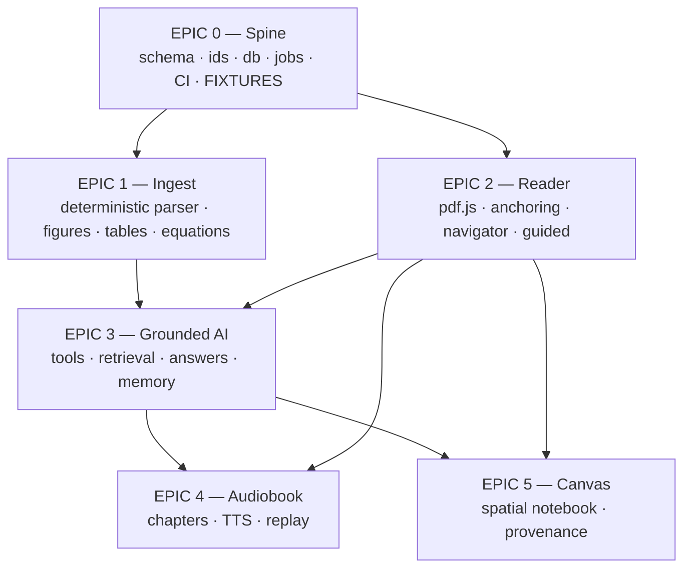

# PaperTree v2 — Build Plan

Six epics. Each is a GitHub tracking issue **and** a self-contained prompt for one
dynamic-workflow session. Run them in wave order; within a wave they are parallel-safe
because their file ownership is disjoint.

---

## Constraints that shape everything

Set by the project owner, 2026-07-29:

| Constraint | Consequence |
|---|---|
| **Open source, hobby project** | Licences are not a filter. PyMuPDF (AGPL) is back on the table and is the core geometry library. |
| **Cheap, local, low resource** | No self-hosted LLM. No GPU. Ingest must run on a laptop in seconds, not minutes. |
| **Zero-ML preferred, must be earned** | Deterministic parser is the default path. Docling is an **opt-in** adapter. The benchmark decides — if zero-ML loses badly on figures/tables, a small local model is permitted as a third tier. |
| **SQLite + sqlite-vec** | No Postgres, no Docker requirement for the datastore. `git clone && install && run`. |
| **Rewrite, not repair** | The existing multi-tenancy bugs are not patched — but ownership is built into the data layer from day one. |
| **No AI slop** | Every issue carries acceptance criteria as **tests that must pass**. Review = "CI green + diff is sane", not "re-derive whether this is right". |

Superseded from the earlier report: Postgres/pgvector (→ SQLite/sqlite-vec), DBOS
Transact (→ a jobs table with steps), and the licence-based elimination of parsers
(no longer binding). Everything else in `../REPORT.md` stands.

---

## Dependency graph



| Wave | Epics | Parallel? |
|---|---|---|
| **0** | Epic 0 | No — sequential, blocks everything |
| **1** | Epic 1 ‖ Epic 2 | Yes — Epic 2 builds against Epic 0's fixtures, not against Epic 1 |
| **2** | Epic 3 | No — needs both 1 and 2 |
| **3** | Epic 4 ‖ Epic 5 | Yes |

### The one decision that makes Wave 1 parallel

**Epic 0 must ship golden fixture PaperIR files** for 3 papers, hand-checked and
committed. Epic 2 (Reader) then builds entirely against those fixtures and never waits
for Epic 1 (Parser). Without fixtures the waves collapse into a sequential chain and the
whole parallel plan is theatre.

This is non-negotiable and is Epic 0's most important deliverable.

---

## Anti-slop rules (apply to every epic)

1. **File ownership is exclusive.** Each epic declares the paths it owns. An agent that
   needs to change a file outside its list opens an issue instead of editing it. This is
   what makes parallel worktrees mergeable.
2. **Acceptance criteria are tests.** "Done" means a named test passes, not that an agent
   believes it works. Every issue lists its tests by name.
3. **The schema is frozen after Epic 0.** Changing PaperIR later requires a migration and
   an ADR. This prevents the exact failure already in the repo — two `Highlight` types,
   two canvas type systems, three extractors.
4. **No new dependency without justification in the PR body.** This project's failure mode
   is accumulated abandoned code, not missing libraries.
5. **Never fabricate content that renders as source.** No LLM writes into PaperIR. No
   generated diagram renders like a paper figure. Enforced by schema, tested by a lint.
6. **Delete as you go.** Each epic lists files it must delete. A PR that adds the
   replacement without removing the original is incomplete.
7. **Small PRs.** One issue = one PR. If a PR exceeds ~600 changed lines, split it.

---

## How to run an epic

```bash
# 1. authenticate once
gh auth login

# 2. create the tracking issues (after auth)
./research/build/create-issues.sh

# 3. in a new Claude Code session, ultracode mode:
#    paste the contents of EPIC-0N-*.md  §"WORKFLOW PROMPT"
```

Within an epic the agent is expected to spawn parallel sub-agents per feature, using
worktrees where features touch disjoint files. The epic prompt states which features are
parallel-safe.

---

## Epics

| # | Epic | Wave | Features | Owns |
|---|---|---|---|---|
| 0 | [Spine](EPIC-00-spine.md) | 0 | 7 | `packages/document-ir`, `packages/db`, `packages/jobs`, CI, fixtures |
| 1 | [Ingest & document intelligence](EPIC-01-ingest.md) | 1 | 9 | `services/document-worker`, `packages/evaluation` |
| 2 | [Reader & anchoring](EPIC-02-reader.md) | 1 | 8 | `apps/web` reader, `packages/anchoring`, `packages/ui` |
| 3 | [Grounded AI](EPIC-03-grounded-ai.md) | 2 | 8 | `packages/retrieval`, `packages/agent-tools`, `packages/prompts`, `packages/memory` |
| 4 | [Audiobook & Replay](EPIC-04-audiobook.md) | 3 | 7 | `services/audio-worker`, `apps/web` audio |
| 5 | [Canvas](EPIC-05-canvas.md) | 3 | 8 | `apps/web` canvas, `packages/canvas` |

**47 features total.** That is the honest size of "everything". Waves 1 and 3 are where
parallelism pays; waves 0 and 2 are throughput-limited by dependency, not by agents.

---

## Definition of done for the whole build

The first milestone from `../ROADMAP-AND-CHANGE-MAP.md` §27 remains the architectural
gate, and it is satisfied at the end of **Wave 2**:

1. Re-parsing produces byte-identical PaperIR and identical block IDs.
2. A highlight survives reload, zoom 50→400%, and 5 viewport widths, drift <1pt.
3. A highlight created under parser config A re-anchors under config B, **or fails loudly**.
4. An answer's citation navigates to the correct polygon.
5. Figures from an all-vector paper (ResNet) are present with captions linked.
6. Parse runs as a background job with observable progress and survives a worker restart.

If criterion 3 fails, stop and fix the anchoring design before Waves 3 — everything
downstream inherits it.
