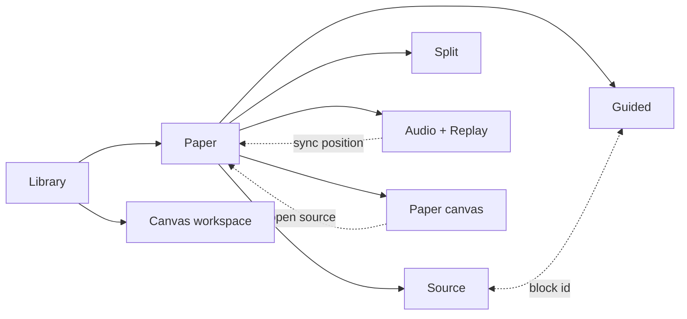

# PaperTree — Information Architecture, Text Wireframes, and Claude Design Brief

Report sections 18, 19 and 20.

---

# 18. Product information architecture

## 18.1 The diagnosis this must fix

The current reader has **twelve** surfaces competing for the same screen: `PDFViewer`,
`BookViewer`, `ReaderToolbar`, `OutlinePanel`, `SmartOutlinePanel`, `HighlightsPanel`,
`ExplanationPanel`, `ExplanationModal`, `InlineExplanation`, `HighlightPopup`,
`PDFMinimap`, `FigureViewer`, `SearchResults`. Two of them are dead
(`OutlinePanel` has zero importers; `SearchResults` would throw on mount). Three mount
independent `<Document>` instances of the same PDF. Panel positions are hardcoded
viewport coordinates (`HighlightsPanel.tsx:279`).

That is not an information architecture. It is an accumulation.

## 18.2 The organising rule

> **One document. One navigator. One inspector. One transport.**
> Everything else is summoned, does its job, and leaves.

The paper is the only permanent object on screen. Every other surface is *transient*
(appears on demand, dismissed by Escape/tap-away) or *docked* (user-pinned, remembered
per paper). Nothing is permanently visible by default except the document and a thin
toolbar.

### The four regions

| Region | Contains | Default | Persistence |
|---|---|---|---|
| **Document** | Source / Guided / Split | always visible, dominant | scroll + zoom + mode saved **per paper** |
| **Navigator** (left) | Outline · Pages · Highlights · Notes · Questions · Chapters | hidden; summoned | last-used tab remembered |
| **Inspector** (right) | contextual — selection, equation, figure, table, citation, answer | hidden; opens on selection | closes on deselect unless pinned |
| **Transport** (bottom) | audio player + Paper Replay | only when audio exists | survives navigation within a paper |

The Navigator is **one panel with tabs**, not six panels. This is the single biggest
simplification: it collapses `OutlinePanel` + `SmartOutlinePanel` + `HighlightsPanel` +
`PDFMinimap` into one surface with a segmented header.

## 18.3 Reading modes

A segmented control in the toolbar, not separate routes (today `/read` and `/canvas` are
separate pages and the canvas "go to source" deep link is dead —
`canvas/page.tsx:115-123`).

| Mode | Shows | Guarantee |
|---|---|---|
| **Source** | the PDF, rendered faithfully | pixel-faithful; the ground truth |
| **Guided** | reflowed, readable prose derived from PaperIR | **every paragraph carries `derived_from` block IDs** and is visually marked as derived |
| **Split** | Source ‖ Guided, scroll-linked by block ID | linking is by block, never by page or scroll ratio |

**Guided is not "the book".** It never replaces the paper. Its visual register is
deliberately different — different type family, a subtle left rule, and an always-present
"Source" affordance on every block. This is the UI half of ADR-001's
source/derivation separation; the schema half makes it enforceable.

## 18.4 Library

Papers · Collections · Recent · Search. A paper card shows: title, authors, page count,
reading progress, **processing state**, audio state, and highlight count.

Processing state is first-class because parsing is now a background job that can be
`pending | parsing | partial | complete | failed`. The current product has none of this
— upload blocks the request and the user gets no feedback (`PaperList.tsx:32-46`).

## 18.5 Canvas

Reached from a paper (a mode, contextually) *and* from the library (a standalone
workspace that can hold several papers). Every source-backed node keeps a live PaperIR
reference, so "open source" always works — the property the current canvas lacks.

## 18.6 Navigation map



Every dotted edge is a *return path*. The rule: **no view is a dead end** — anything
derived can always navigate back to the exact region it came from.

---

# 19. Text wireframes

Notation: `▸` collapsed · `▾` expanded · `⟨⟩` transient · `▊` selection · `⊙` AI-derived marker

## 19.1 Desktop — Source mode, nothing selected (the calm default)

```
┌───────────────────────────────────────────────────────────────────────────────────┐
│ ☰  Deep Residual Learning for Image Recognition          ⌕     ⟨Source│Guided│Split⟩│
│                                                                    ♪  ⌗  ⋯        │
├───────────────────────────────────────────────────────────────────────────────────┤
│                                                                                   │
│                        ┌─────────────────────────────────┐                        │
│                        │                                 │                        │
│                        │      page 4 of 12               │                        │
│                        │                                 │                        │
│                        │   [ the PDF, faithfully ]        │                        │
│                        │                                 │                        │
│                        │                                 │                        │
│                        └─────────────────────────────────┘                        │
│                                                                                   │
│                                                                                   │
└───────────────────────────────────────────────────────────────────────────────────┘
   ☰ navigator   ⌕ search   ♪ audio   ⌗ canvas   ⋯ settings
```

Nothing but the paper and seven affordances. No panels. No minimap. No sidebars.
Compare with today: three panels open by default plus a minimap.

## 19.2 Desktop — text selected (contextual, transient)

```
┌───────────────────────────────────────────────────────────────────────────────────┐
│ ☰  Deep Residual Learning…                               ⌕     ⟨Source│Guided│Split⟩│
├───────────────────────────────────────────────────────────────────────────────────┤
│                        ┌─────────────────────────────────┐   ⟨ Inspector ⟩ ✕  📌  │
│                        │  …we explicitly reformulate     │   ┌──────────────────┐ │
│                        │  ▊the layers as learning        │   │ SELECTION        │ │
│                        │  ▊residual functions▊…          │   │ §3.1 Residual    │ │
│                        │   ⟨ ✎  ⊙ Ask  ⌗  ⇱ ⟩            │   │ Learning · p.4   │ │
│                        │                                 │   ├──────────────────┤ │
│                        │  F(x) := H(x) − x         (2)   │   │ ⊙ Explain        │ │
│                        │                                 │   │ ⊙ Define terms   │ │
│                        └─────────────────────────────────┘   │ ⊙ Why does this  │ │
│                                                              │    matter?       │ │
│                                                              ├──────────────────┤ │
│                                                              │ Ask anything…    │ │
│                                                              └──────────────────┘ │
└───────────────────────────────────────────────────────────────────────────────────┘
```

The selection toolbar (`✎ highlight · ⊙ Ask · ⌗ to canvas · ⇱ copy`) floats **at the
selection**, four items, no labels. The Inspector slides in showing *where you are*
(section + page, from PaperIR — not "page 4" but "§3.1 Residual Learning · p.4") and
offers three contextual actions plus free-form ask.

Every AI affordance carries `⊙`. That mark is used nowhere else in the product.

## 19.3 Desktop — answer with provenance

```
│   ⟨ Inspector ⟩                        ✕  📌 │
│  ┌────────────────────────────────────────┐  │
│  │ ⊙ ANSWER            ▸ how we got this  │  │
│  │                                        │  │
│  │ The residual formulation lets the      │  │
│  │ network learn F(x) = H(x) − x instead  │  │
│  │ of H(x) directly, so an identity       │  │
│  │ mapping is reachable by driving the    │  │
│  │ weights to zero. ⟦p.4 §3.1⟧ ⟦eq 2⟧     │  │
│  │                                        │  │
│  │ ── grounded in ──────────────────────  │  │
│  │  ⟦1⟧ ¶ "we explicitly reformulate…"    │  │
│  │      §3.1 · p.4          [show me →]   │  │
│  │  ⟦2⟧ Equation (2)                      │  │
│  │      §3.1 · p.4          [show me →]   │  │
│  │                                        │  │
│  │ ⚠ Interpretation: "reachable by        │  │
│  │   driving weights to zero" is our      │  │
│  │   reading; the paper does not state    │  │
│  │   it in these words.                   │  │
│  └────────────────────────────────────────┘  │
```

Three trust mechanisms, all required by the brief:
1. **Inline citations** `⟦p.4 §3.1⟧` — click scrolls the document and outlines the exact
   polygon.
2. **A grounding list** — the block-level evidence, each with `[show me →]`.
3. **An explicit interpretation flag** — the model must separate what the paper says
   from what it is inferring. When `verify_answer_grounding` cannot support a claim, the
   claim is marked, not deleted.

`▸ how we got this` expands the tool trace — which blocks were retrieved and why.

## 19.4 Desktop — Split mode

```
┌───────────────────────────────────────────────────────────────────────────────────┐
│ ☰  Deep Residual Learning…                    ⌕      ⟨Source│Guided│▮Split▮⟩       │
├────────────────────────────────────┬──────────────────────────────────────────────┤
│  SOURCE                            │  GUIDED  ⊙ derived from this paper           │
│  ┌──────────────────────────────┐  │  ┌────────────────────────────────────────┐  │
│  │                              │  │  │ │ 3.1 Residual Learning                │  │
│  │  ▊we explicitly reformulate  │◄─┼──┤ │                                      │  │
│  │  ▊the layers as learning     │  │  │ │ Rather than asking each block of     │  │
│  │  ▊residual functions…        │  │  │ │ layers to learn the whole mapping,   │  │
│  │                              │  │  │ │ ResNet asks it to learn only the     │  │
│  │  F(x) := H(x) − x      (2)   │  │  │ │ *difference* from the input.         │  │
│  │                              │  │  │ │                     ⟦source: ¶4, eq2⟧│  │
│  └──────────────────────────────┘  │  └────────────────────────────────────────┘  │
└────────────────────────────────────┴──────────────────────────────────────────────┘
```

Scroll-linking is **by block ID**, so it stays correct across the two-column→single-column
reflow. The Guided column has a visible left rule and a header stating it is derived.

## 19.5 iPad landscape (1194×834)

Same as desktop, three changes:
- Navigator is an overlay sheet, not a push — the document never reflows when it opens.
- Inspector is 380pt and can be dragged to full-width.
- Selection toolbar targets are **44×44pt minimum** and appear *above* the selection so
  the thumb does not occlude them.

```
┌─────────────────────────────────────────────────────────────────────────┐
│ ☰  Deep Residual Learning…            ⌕   ⟨Source│Guided│Split⟩  ♪ ⌗ ⋯  │
├─────────────────────────────────────────────────────────────────────────┤
│                    ┌───────────────────────┐      ⟨ Inspector ⟩  ✕      │
│                    │                       │      ┌──────────────────┐  │
│                    │   ⟨ ✎  ⊙  ⌗  ⇱ ⟩      │      │ §3.1 · p.4       │  │
│                    │   ▊selected text▊     │      │ ⊙ Explain        │  │
│                    │                       │      │ Ask anything…    │  │
│                    └───────────────────────┘      └──────────────────┘  │
├─────────────────────────────────────────────────────────────────────────┤
│ ♪  ch.3 Deep Residual Learning    ◀◀ ▶ ▶▶   ──●────────────  12:04/18:22│
└─────────────────────────────────────────────────────────────────────────┘
```

## 19.6 iPad portrait (834×1194)

Inspector becomes a **bottom sheet** at three detents (peek 120pt / half / full). The
document stays visible above it — critical, because the user is reading *about* something
they must still be able to see.

```
┌───────────────────────────────────────────────┐
│ ☰  Deep Residual Learning…    ⌕  ⟨S│G│Sp⟩ ⋯   │
├───────────────────────────────────────────────┤
│              ┌─────────────────┐              │
│              │                 │              │
│              │  ⟨ ✎ ⊙ ⌗ ⇱ ⟩    │              │
│              │  ▊selected▊     │              │
│              │                 │              │
│              │   page 4 / 12   │              │
│              └─────────────────┘              │
│                                               │
├───────────────────────────────────────────────┤
│ ▁▁▁▁▁▁▁▁▁  ⌃ drag                            │
│ ⊙ ANSWER                    §3.1 · p.4        │
│ The residual formulation lets the network…    │
│ ⟦1⟧ ¶ "we explicitly…"        [show me →]     │
└───────────────────────────────────────────────┘
```

## 19.7 Narrow mobile (fallback, ≤480)

Single column. Source mode only by default (Guided reachable via the mode switch).
Navigator and Inspector are both full-screen sheets. Canvas is **view-and-navigate only**
— editing a spatial canvas on a phone is a worse experience than not offering it, and
pretending otherwise costs more than it earns.

## 19.8 System states

Every state below is a designed screen, not an afterthought — the current product has
none of them.

| State | Treatment |
|---|---|
| **Parsing** | Page thumbnails fill in progressively as pages complete. The paper is **readable in Source mode immediately** — parsing only gates Guided/audio/questions. |
| **Partial success** | Banner: "Pages 12–14 need a closer look." Those pages get a subtle hatch in the Pages tab. Reading continues. |
| **Parsing uncertainty** | Low-confidence blocks carry a dotted underline; tapping shows "we're unsure of this region" with the page crop and a Report button. |
| **AI uncertainty** | Answer shows a confidence chip; unsupported claims are flagged inline (§19.3) rather than suppressed. |
| **Failed chapter** | The chapter row shows the failure and a Retry that resumes from the last good step — not from scratch. |
| **Offline** | Downloaded papers and generated audio remain available; AI actions are visibly disabled with the reason, not silently broken. |
| **Empty library** | One action: "Add your first paper." Plus three sample papers, so the product can be evaluated before committing a PDF. |

---

# 20. Claude Design brief

*This is the exact brief to hand to Claude Design. It is deliberately self-contained.*

---

## Product

**PaperTree** — a premium environment for reading, understanding, annotating, exploring
and listening to research papers.

Feeling to achieve: *"Goodnotes for understanding research papers"* — calm, document-first,
tactile, trustworthy. Not another chat-with-your-PDF tool.

Do **not** copy Goodnotes' branding, assets or exact visuals. Adopt only the principles:
document-first, low visual noise, compact tools, contextual actions, touch-friendly,
persistent document state, excellent iPad layout.

## Target user

A graduate student, researcher or engineer reading 3–15 papers a week, often on iPad,
frequently outside their exact specialism. They need to *understand* papers, not just
search them. They are sceptical of AI summaries and will abandon a tool that makes
confident claims they cannot verify against the source.

## Primary journeys

1. **Read** — open a paper, read it, highlight, come back tomorrow exactly where they left off.
2. **Understand** — select something confusing, ask, get an answer *with its source*, jump to the source.
3. **Explore** — take an excerpt onto a canvas, branch questions, build an argument map.
4. **Listen** — generate an audiobook, listen while commuting, tap to jump into the paper at the spot being read.
5. **Return** — find that highlight from three weeks ago and what it connected to.

## Information architecture

**One document. One navigator. One inspector. One transport.** (Full IA in §18 above;
wireframes in §19.)

- Document region: Source / Guided / Split modes.
- Navigator (left, summoned): Outline · Pages · Highlights · Notes · Questions · Chapters — **one panel, tabs**.
- Inspector (right on desktop/landscape, bottom sheet on portrait): contextual only.
- Transport (bottom): audio + Paper Replay, only when audio exists.

## Interaction principles

1. **The paper is the only permanent object.** Everything else is summoned and leaves.
2. **Progressive disclosure.** Tools appear on selection, at the selection.
3. **No dead ends.** Anything derived returns to its exact source region.
4. **AI is always marked.** A single reserved marker (`⊙`) and a distinct type register.
5. **Uncertainty is shown, not hidden.**
6. **Touch first.** 44×44pt minimum targets; nothing hover-only. (Current product: zero touch handlers, all node actions hover-only.)
7. **Calm.** No badges, no notification dots, no gratuitous motion, no rainbow.

## AI trust and provenance rules — non-negotiable

- AI-generated content must **never** look like source content. Different type register, the `⊙` marker, and a visible "derived from" affordance.
- Every answer shows its supporting blocks, pages and regions; every citation is clickable and navigates to the exact polygon.
- Interpretation is visually separated from what the paper states.
- When grounding verification fails, the claim is **flagged**, not silently dropped.
- Never render a fabricated diagram as if it were the paper's figure. (The current product instructs the model to invent Mermaid architecture diagrams and renders them identically to real figures. This must be impossible in the new design.)

## PaperIR capabilities the design can rely on

Every element has: a stable ID, a page, a polygon in PDF space, a type, a section parent,
a reading-order position, and a confidence. Equations have LaTeX + MathML + a source
crop. Figures have captions, panels, detected labels, and a vector/raster flag. Tables
have addressable rows and cells. Relations exist for caption-of, references, defines,
continues-on-next-page.

So the design may assume: highlight an equation, part of an equation, a figure region, a
table cell, or a citation; navigate from any derived artefact to its source polygon;
show a section-level semantic outline (**not** a page list).

## Audiobook behaviour

Chapters follow the **semantic section tree**, never PDF pages. A persistent transport
survives navigation. Paper Replay: audio position ↔ Guided view ↔ outline ↔ PDF page ↔
current source region, bidirectionally — tapping a paragraph jumps the audio there.
Equations are spoken via accessibility speech rules. Figure descriptions are announced as
AI-generated.

## Canvas behaviour

A spatial research notebook, not a graph demo. Nodes are placed by user intent — **never**
auto-generated in bulk. Every source-backed node shows provenance and returns to source.
Edges carry meaning and are labelled. (Full spec: report §23.)

## Requirements

**Desktop:** 1280–1920. Keyboard-first navigation. Multi-select. Dense but not cramped.

**iPad:** landscape 1194×834 and portrait 834×1194 are first-class, not adaptations.
Pointer Events; Apple Pencil pressure/tilt where available (Safari 18.2+, feature-detected);
`touch-action` discipline so document pan never fights canvas pan; `visualViewport` for
keyboard avoidance; custom selection handles over the native text layer.

**Accessibility:** WCAG 2.2 AA. 4.5:1 body contrast. Full keyboard operation. Focus
visible everywhere. Respect `prefers-reduced-motion` and `prefers-color-scheme`.
Screen-reader labels on every AI-derived region stating that it is AI-derived.
Highlight colours must be distinguishable **without relying on hue alone** — the current
six-category colour scheme fails this.

## Components that must exist

Document viewer · mode switch · selection toolbar · navigator (6 tabs) · inspector
(6 contextual variants: selection, equation, figure, table, citation, answer) · answer
card with provenance · highlight system · audio transport · chapter list · canvas
surface + node family · library grid/list · upload + processing states · system-state
screens.

## Components that must disappear

`SmartOutlinePanel` (a list of LLM-invented page titles) · `PDFMinimap` (a fourth
document instance for marginal value) · `ExplanationModal` (modals over a reading surface
are wrong) · `InlineExplanation` popovers positioned at hardcoded viewport coordinates ·
the permanent multi-panel layout · six-colour category highlighting as the primary
mechanism.

## Technical constraints the design must respect

- Rendering is pdf.js canvas + text layer with a custom overlay. Highlights are polygons in PDF user space painted through a `transform: scale(z)` overlay — so highlight shapes must be expressible as polygons, not CSS boxes.
- Canvas is `@xyflow/react` with DOM nodes — nodes can contain markdown, KaTeX and image crops, but 500+ nodes must stay smooth, so node chrome should be light and detail revealed on zoom/selection.
- Math renders with KaTeX (`throwOnError: false`) — the design needs a defined fallback for an equation that fails to render: show the source crop.
- Parsing takes ~5–19 s/page on CPU and is a background job. Processing states are real, frequent, and must be designed, not hidden behind a spinner.

## Deliverables

Three genuinely distinct directions — **Academic Notebook** (warm, paper-oriented,
scholarly, tactile), **Precision Research Workspace** (clean, technical, high information
clarity, neutral), **Spatial Knowledge Studio** (stronger paper↔notes↔canvas connection,
expressive without clutter).

Each must differ in navigation, toolbar structure, sidebar behaviour, typography,
density, paper presentation, AI interaction, audio integration and canvas relationship —
**not merely in colour**.

Evaluate each against: reading focus · ease of learning · iPad usability · desktop
usability · discoverability · accessibility · implementation feasibility · scalability ·
and distinction from generic AI-PDF tools.
