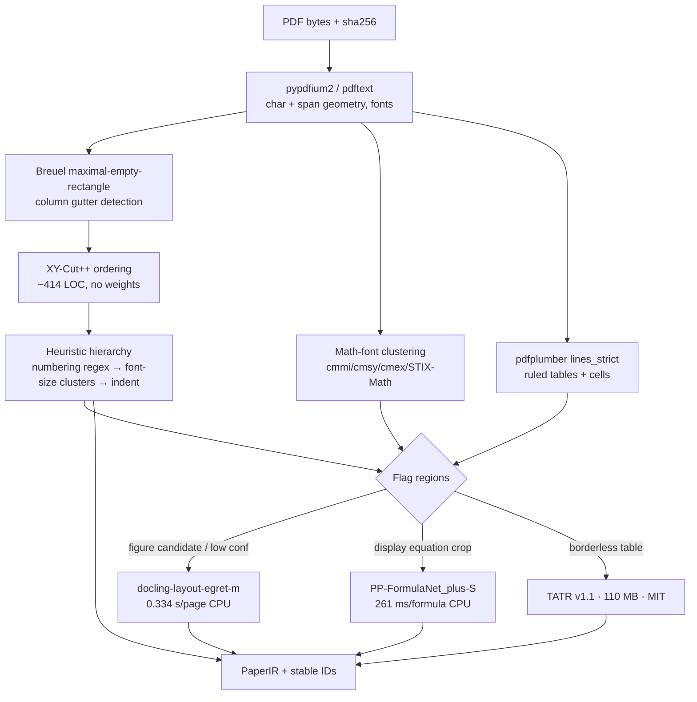
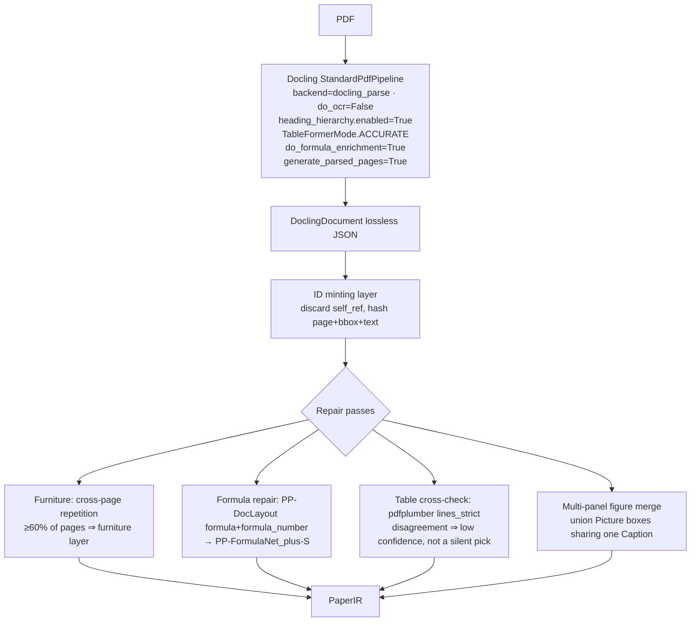
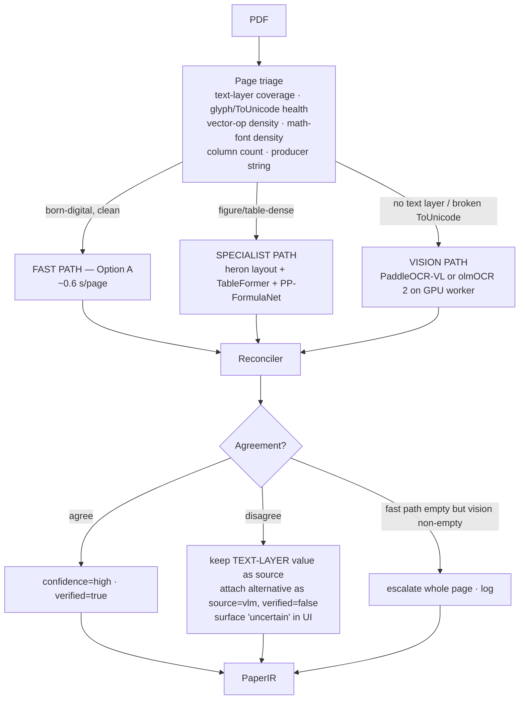
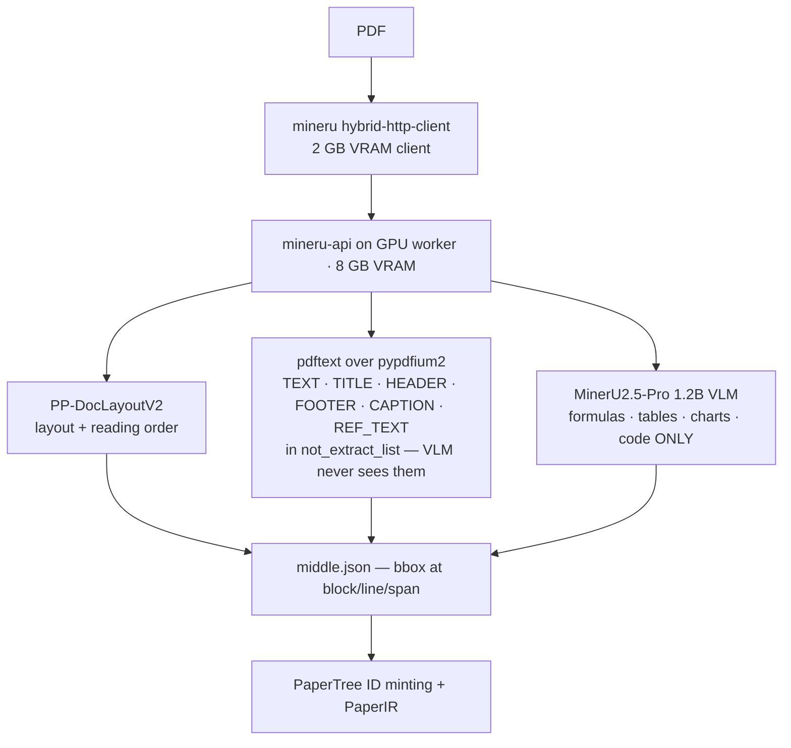

# 5 · 8 · 9 — Parser Comparison, Pipeline Architectures, and the Recommendation

**Status:** provisional. Tier B gold annotations do not exist yet (`benchmarks/README.md` §7: *"No parser selection is authorised until Tier B gold exists"*). Everything below is a direction with a stated falsification condition, not a ratified decision.

**Reading key for all tables:** ✅ = does this natively and well · ⚠️ = partial, or needs PaperTree-side work · ❌ = does not do this · **(v)** = vendor- or author-self-reported figure · **(m)** = measured on this machine, CPU-only, Apple Silicon (`experiment-results/ptub-capability-matrix.json`) · **(e)** = my estimate, extrapolated, not measured.

---

## 5. THE COMPARISON MATRIX

Thirteen candidates. Two of them are PaperTree's own code, included because a comparison without the incumbent is marketing. Note the split throughout between **code licence** and **weight licence** — that distinction eliminates more candidates than accuracy does.

### 5A. Approach, output shape, and structural capability

| # | Candidate | Approach | Lang | Output representation | Digital-born | Scanned | Reading order (2-col) | Hierarchy |
|---|---|---|---|---|---|---|---|---|
| 1 | **Docling** (standard pipeline) | RT-DETR layout on page raster → TableFormer → assembly; text lifted from PDF token stream, never re-transcribed | Python | `DoclingDocument` lossless JSON: `body` tree + `groups` + `prov[{page_no,bbox,charspan}]` | ✅ | ⚠️ via EasyOCR/RapidOCR, ~13 s/page CPU **(v)** | ⚠️ deterministic R-tree + 0.15×page-width dilation + DFS (MIT, `reading_order_rb`). FocalOrder Table 2 puts Docling at **0.313 EN edit-distance — worst pipeline tool tested**, but that snapshot predates 2026-01 and is possibly stale (see `10-reading-order-hierarchy.md`) | ⚠️ tree exists but `heading_hierarchy_options.enabled` defaults **False** → every heading flattens to level 1 (`02-docling.md`) |
| 2 | **MinerU ≥3.1** hybrid | PP-DocLayoutV2 layout+order → native text via `pdftext` → 1.2B VLM **only** for formulas/tables/charts | Python | `middle.json` (block→line→span, bbox at every level) + `content_list.json` | ✅ | ✅ PP-OCRv6 | ✅ PP-DocLayoutV2 pointer net, **0.043 edit-dist OmniDocBench v1.5 (v)** | ⚠️ `title` blocks with `text_level`; tree is yours to assemble |
| 3 | **Marker v2 / Surya 2** | `pdftext` → rf-detr or 650M Surya VLM layout → per-page usability decision → VLM OCR | Python | JSON block tree + `section_hierarchy` + `table_of_contents` | ✅ | ✅ | ✅ 76.6 multi-column olmOCR-bench **(v)** | ✅ **best-in-class**, but heading levels come from document-global KMeans (k=4) on line heights — one extra page can re-level every heading |
| 4 | **GROBID 0.9.0** | CRF/BiLSTM cascade over pdfalto Layout Tokens; 55+ labels | Java | TEI XML, nested `div`/`head`, `@coords="page,x,y,w,h"` | ✅ | ❌ | ✅ layout-feature segmentation | ✅ **real TEI section tree** — section-title F1 0.74–0.81 **(v)**, DocBank section 0.74 (3rd party) |
| 5 | **PyMuPDF 1.28** | Deterministic C engine (MuPDF) | C/Python | block/line/span/char dicts + `get_drawings()` vector paths | ✅ | ❌ | ❌ `sort=True` sorts by `(y1,x0)` → interleaves columns. **Measured: 44 L/R alternations on ResNet p4** (`findings.md` B5) | ❌ `get_toc()` only, usually absent on arXiv |
| 6 | **pdfplumber 0.11.10** | pdfminer.six interpreter, pure Python | Python | char/line/rect/curve objects; `Table.cells` with bboxes | ✅ | ❌ | ❌ content-stream order + LAParams | ❌ none |
| 7 | **unstructured.io** (OSS) | `fast` = pdfminer + heuristics; `hi_res` = Detectron2/YOLOX | Python | flat `Element[]` with `metadata.coordinates`, `parent_id` | ✅ | ⚠️ `ocr_only` Tesseract | ⚠️ strategy-dependent | ❌ `parent_id` only, no depth semantics |
| 8 | **Nougat** (Meta) | Swin+mBART, page raster → Mathpix-Markdown | Python | `.mmd` text blob | ✅ | ✅ | n/a (linearised) | ⚠️ markdown heading levels only |
| 9 | **olmOCR 2** (AI2) | Qwen2.5-VL-7B, page raster + `pypdf` anchor text in prompt | Python | YAML front-matter + linearised markdown | ✅ | ✅ **best published** (old-scans 47.7, old-scans-math 82.3) | ✅ 83.7 multi-col olmOCR-bench **(v)** | ⚠️ markdown heading levels only |
| 10 | **DocLayout-YOLO + specialist stack** | Detector → per-region specialists (UniMERNet / TATR / pdfplumber) | Python | whatever PaperTree defines | ✅ | ✅ (detector on raster) | ⚠️ you supply it (XY-Cut++) | ⚠️ you supply it |
| 11 | **MathPix Convert API** | Closed VLM service | API | Mathpix Markdown / LaTeX; line data with geometry | ✅ | ✅ | ✅ **(v)** | ⚠️ markdown |
| 12 | **PaperTree LIVE** (`routes.py:25-37`, 13 lines) | `page.get_text('text', sort=True)` joined with `[Page N]` markers | Python | **one flat string** | ⚠️ text only | ❌ | ❌ | ❌ |
| 13 | **PaperTree structured (dead)** (`extraction.py` 1,016 + `services.py` 682 = 1,698 lines) | PyMuPDF spans → font-based math/heading heuristics | Python | blocks + bbox + `SourceLocation` | ⚠️ | ❌ | ❌ paragraphs merge across columns (largest observed block **4,673 chars**) | ❌ flat outline, 58 items on a paper with ~10 sections |

### 5B. Fidelity — geometry, math, tables, figures, uncertainty

| # | Candidate | Bboxes | Page prov. | Confidence | Equations | LaTeX quality | Tables | Table cells | Figures | Caption link | Vector diagrams |
|---|---|---|---|---|---|---|---|---|---|---|---|
| 1 | **Docling** | ✅ float bbox, PDF bottom-left, **+ charspan** — best geometry model reviewed | ✅ on every `DocItem` | ✅ `ConfidenceReport` per page (`ocr/table/layout/parse_score`) + per-cluster float | ⚠️ **detection weak by default: 2 and 5 found against ~10 real equations (m)** | ⚠️ CodeFormulaV2 (0.3B, CDLA-Perm-2.0) — **off by default**, `eq+LaTeX = 0 (m)` | ✅ **15 / 4 (m)** | ✅ **342 / 222 cells with bbox, span, header flags (m)** — only candidate that does this | ✅ **7 / 6 (m)**, where both PaperTree extractors find **0** on all-vector ResNet | ✅ **18 / 9 (m)** via `FloatingItem.captions` | ✅ detected on the raster, so vector = raster; in-figure text assumed lost |
| 2 | **MinerU hybrid** | ✅ block/line/span, PDF points | ✅ `page_idx` | ⚠️ span `score` only | ✅ interline + inline first-class | ✅ UniMERNet-class, CDM 0.968 UniMER-Test **(v)** | ✅ HTML w/ colspan | ❌ **no per-cell bboxes** | ✅ 200-DPI crops from `pypdfium2` | ✅ structural `image_caption` blocks | ✅ rasterised at 200 DPI; bbox lets you re-clip |
| 3 | **Marker v2** | ✅ polygon + bbox in PDF points, block level | ✅ | ❌ **computed but never serialised by any renderer** | ✅ | ✅ arXiv-math **83.9 balanced / 23.4 fast / 0.0 CPU-no-OCR (v)** | ✅ | ⚠️ cell polygons only via Python API, lost in JSON | ✅ | ⚠️ proximity heuristic, no "Figure 3:" matching | ✅ page-raster crop |
| 4 | **GROBID** | ⚠️ opt-in `teiCoordinates`, only on `ref, biblStruct, persName, figure, formula, head, s, p, note, title, affiliation`. **Sentence-level (`s`) coords are a genuine differentiator** | ✅ 1-indexed | ❌ | ⚠️ `<formula>` region + bbox; **inline formulas get no markup at all** | ❌ Unicode text, no LaTeX. **5.70/10, lowest of 21 systems** (arXiv:2512.09874) | ⚠️ DocBank table F1 **0.23** | ❌ | ⚠️ figure regions, caption F1 swings **13.1%–61.4%** across PLOS/eLife **(v)** | ⚠️ unreliable (see above) | ❌ (pdfalto can dump SVG separately) |
| 5 | **PyMuPDF** | ✅ **best in class** — char-level `rawdict` | ✅ | ❌ | ❌ | ❌ | ⚠️ `find_tables()` heuristic | ⚠️ | ❌ `get_images()` = embedded rasters only. **ResNet: 0 rasters, 60 significant vector ops** | ❌ | ✅ **`get_drawings()` is the only real vector-primitive answer in the field** — paths, Béziers, clip/group hierarchy |
| 6 | **pdfplumber** | ✅ char-level | ✅ | ❌ | ❌ | ❌ | ✅ **best classical** — `lines`/`lines_strict`/`text` strategies | ✅ **`Table.cells` with per-cell bbox in PDF space** | ❌ | ❌ | ⚠️ curve objects exposed, not composed into regions |
| 7 | **unstructured** | ✅ `metadata.coordinates` | ✅ | ❌ | ⚠️ `Formula` element type, text only | ❌ | ⚠️ `hi_res` only, `text_as_html` | ❌ | ⚠️ `hi_res` | ⚠️ `FigureCaption` type, no link | ❌ |
| 8 | **Nougat** | ❌ **none anywhere** | ❌ | ❌ | ✅ math F1 76.5 **(v)** | ✅ genuinely good | ⚠️ weakest modality, F1 78.0 | ❌ | ❌ | ❌ | ❌ |
| 9 | **olmOCR 2** | ❌ **none** — it *consumes* `pypdf` coordinates in the prompt and emits none | ❌ | ❌ | ✅ | ✅ | ✅ 84.9 olmOCR-bench **(v)** | ❌ | ❌ | ❌ | ❌ |
| 10 | **Detector + specialists** | ✅ by construction — detector emits the box *before* recognition runs | ✅ | ✅ per-box detector score | ✅ PP-DocLayout emits `formula` **and `formula_number`** as separate classes | ✅ PP-FormulaNet_plus-S En-BLEU 88.71% **(v)** / UniMERNet-B CDM 0.9680 | ✅ TATR / TableFormer | ✅ TATR GriTS-Loc **0.9786 (v)**; pdfplumber exact for ruled | ✅ `Picture` on raster | ⚠️ your geometry heuristic; **multi-panel figures fragment** (arXiv:2606.06242) | ✅ region box + re-clip original content stream |
| 11 | **MathPix** | ✅ line-level | ✅ | ⚠️ | ✅ | ✅ CDM 0.9510 **(v)**; **omits trailing punctuation → ExpRate@CDM 2.8 on OmniDocBench** | ✅ | ❌ | ⚠️ | ⚠️ | ❌ |
| 12 | **PaperTree LIVE** | ❌ **0 (m)** | ❌ 0 | ❌ | ❌ 0 | ❌ | ❌ 0 | ❌ 0 | ❌ 0 | ❌ 0 | ❌ |
| 13 | **PaperTree structured (dead)** | ✅ 233 / 181 **(m)** | ✅ | ❌ | ❌ 86 / 60 "equations" — **100% font-driven, 0% symbol-driven**; `MATH_FONTS` contains `cmr`, the *body* font of LaTeX papers | ❌ `√dk → \sqrt dk`; `re.sub(r'(\w+)/(\w+)')` turns `and/or` into `\frac{and}{or}`; 26/86 and 12/60 blocks get any LaTeX at all | ❌ 0 | ❌ 0 | ❌ **0 / 3 (m)** | ❌ **0 / 1 (m)** | ❌ `get_drawings()` never called |

### 5C. Licence, operations, maintenance

| # | Candidate | Code licence | **Weight licence** | Commercial restriction | Privacy | GPU req. | CPU viable | Memory | Latency | Batch | Streaming | Extensibility | Maintenance | Deploy complexity |
|---|---|---|---|---|---|---|---|---|---|---|---|---|---|---|
| 1 | **Docling** | MIT | Apache-2.0 (heron) / CDLA-Perm-2.0 (TableFormer, CodeFormulaV2) / MIT (fig classifier) | **none** ✅ | self-host | optional | ✅ | ~6.2 GB RSS (`docling-parse`), ~2.5 GB (pypdfium2) **(v)** | **19.0 s/page ResNet, 5.0 s/page Attention (m)**; 3.1 s/page x86, 1.26 s/page M3 Max, 0.48 s/page L4 **(v)** | ✅ `docling-jobkit` | ✅ per-page error isolation, bounded-memory threaded parser (v6) | ✅ swappable layout specs, opt-in enrichments | ✅ **15 releases 2026-06-15→07-29**; LF AI & Data incubation; 18.36M PyPI downloads/30d; 886 open issues | pip install; ~1–2 GB weights |
| 2 | **MinerU ≥3.1** | MinerU OSS Licence (Apache-2.0 + terms) | VLM Pro Apache-2.0; **pipeline bundle `PDF-Extract-Kit-1.0` still carries a stale `agpl-3.0` card** ⚠️ | 100M MAU / $20M **monthly** revenue cap — irrelevant. **Mandatory visible attribution — a real product constraint** | self-host | hybrid: **yes, 8 GB VRAM min** | pipeline only (86.47 v1.6) | 20 GB disk; 2.6 GB pipeline + 2.33 GB VLM weights | **no vendor CPU figure exists for the pipeline backend** ⚠️; GPU 1.70 pg/s RTX 4090, 2.12 A100 **(v)** | ✅ `mineru-router` | ✅ sliding window + streaming writes | ✅ | ✅ fortnightly releases, push 2026-07-29 | Docker + vLLM 0.11.2 + torch 2.9 |
| 3 | **Marker / Surya** | Apache-2.0 | **modified AI Pubs OpenRAIL-M** ❌ | **$5M revenue AND $5M funding caps; §2(c) non-compete; §8 share-alike reaches the *Output* itself** — i.e. every parsed paper and every derivative | self-host | effectively yes | 23.7 pg/s but **0.0 on arXiv math** | not published | 2.9 pg/s B200 **(v)**; Apple Silicon llama.cpp **0.108 pg/s, p95 129 s/page (v)** | ✅ | ⚠️ | ✅ | ⚠️ v2.0.0 is a rewrite 9 days old; 439 open issues; **#1069: markdown renderer silently drops 90% of a 219-page PDF and exits 0** | vLLM Docker or llama.cpp |
| 4 | **GROBID** | Apache-2.0 (models too) | Apache-2.0 (inferred) | none, **but shells out to `pdfalto`, GPL-2.0** — separate process, fine for SaaS, a question for a desktop binary | self-host | no (CRF) | ✅ **best of any candidate** | <2 GB header-only, ~4 GB full | **~2.5 PDF/s full structure on 16 CPU; 10.6 PDF/s sustained (v)** | ✅ excellent | ❌ document-level | ⚠️ retraining CRFs is specialist work | ✅ commits 2026-07-29; ~annual majors | **500 MB CRF Docker image** — the lightest real deployment here |
| 5 | **PyMuPDF** | **AGPL-3.0 or paid Artifex** ❌ | n/a | AGPL §13 network clause: serving PaperTree over a network obliges offering the **entire server source** under AGPL | self-host | no | ✅ | small | **0.56 s / 12pp, 0.93 s / 15pp (m)** ≈ 47–62 ms/page | ✅ | ✅ | ✅ | ✅ 1.28.0, 2026-06-29 | library |
| 6 | **pdfplumber** | **MIT** ✅ | n/a | none | self-host | no | ✅ | small | slower (pure Python); no published head-to-head vs PyMuPDF | ✅ | ✅ | ✅ | ✅ 0.11.10, 2026-06-15 | library |
| 7 | **unstructured** | Apache-2.0 | **YOLOX/Detectron2 checkpoint terms not stated** ⚠️ | open-core; SaaS 15k free pages then $0.03/page | self-host or SaaS | `hi_res` yes | `fast` yes | — | 4.2 s/page x86 **(v)** | ✅ | ⚠️ | ✅ | ✅ commits 2026-07-26 | pip |
| 8 | **Nougat** | MIT | **CC-BY-NC-4.0** ❌ | non-commercial, full stop | self-host | **yes** | ❌ | 24 GB A10G tested | **0.31 pages/s (v)** | ✅ | ⚠️ | ⚠️ | ❌ **2 releases ever, both 2023-08-22; one commit since Oct 2023; 143 open issues** | dead |
| 9 | **olmOCR 2** | Apache-2.0 | **Apache-2.0** ✅ — best-licensed VLM in the field | none (card states research *intent*, not a licence term) | self-host | **yes, ≥12 GB VRAM** | ❌ no honest CPU path for a 7B VLM | 30 GB disk | $176–200 per **million** pages **(v)** | ✅ purpose-built | ✅ page-independent | ✅ | ✅ v0.4.27, 2026-03-12 | vLLM |
| 10 | **DocLayout-YOLO + specialists** | **DocLayout-YOLO code is AGPL-3.0** ❌ → substitute `docling-layout-heron` (Apache-2.0) or PP-DocLayout (Apache-2.0) | heron Apache-2.0; PP-FormulaNet Apache-2.0; TATR MIT; UniMERNet Apache-2.0 | **none, once DocLayout-YOLO is swapped out** ✅ | self-host | optional | ✅ heron 0.643 s/img, egret-m **0.334 s/img** on 4 EPYC threads **(v)** | modest, per-model | composable — you pay only for what you invoke | ✅ | ✅ | ✅ **maximum** — every stage swappable | ⚠️ **you** maintain the glue; DocLayout-YOLO itself dormant since 2025-04-14 | highest — N models, N versions |
| 11 | **MathPix** | closed | closed | vendor lock-in | ❌ **PDFs leave the building** | n/a | n/a | n/a | **$0.005/PDF-page**; $19.99 setup | ✅ | n/a | ❌ | commercial | trivial |
| 12 | **PaperTree LIVE** | AGPL (PyMuPDF) ❌ | n/a | inherits AGPL | self-host | no | ✅ | small | **1.99 s / 12pp, 0.82 s / 15pp (m)** | n/a | n/a | n/a | it is 13 lines | trivial |
| 13 | **PaperTree structured (dead)** | AGPL (PyMuPDF) ❌ | n/a | inherits AGPL | self-host | no | ✅ | small | **4.09 s / 3.68 s (m)** | n/a | n/a | ❌ | **never executed in production — zero importers** | n/a |

### 5D. Fitness for PaperTree's three surfaces

| # | Candidate | Interactive highlighting | RAG / grounded answers | Audiobook (Paper Replay) | **Overall PaperTree suitability** |
|---|---|---|---|---|---|
| 1 | **Docling** | ✅ **best** — page + float bbox + charspan on every item; ❌ `self_ref` (`#/texts/47`) is a positional JSON pointer, **not re-parse stable** | ✅ hierarchical + hybrid chunkers carry page/bbox metadata | ✅ furniture separated via `ContentLayer`; ⚠️ formula→speech needs the enrichment on | **Strongest overall. Adopt its models; do not necessarily adopt its whole pipeline.** |
| 2 | **MinerU hybrid** | ✅ span-level bbox; ❌ no stable IDs; ❌ no cell bboxes | ✅ | ✅ | **Strong, GPU-gated. Attribution obligation + stale AGPL weight card are live risks.** |
| 3 | **Marker / Surya** | ✅ architecturally the best fit of any OSS pipeline | ✅ | ✅ | ❌ **Eliminated on licence.** §8 share-alike over Output is incompatible with a commercial ToS. Reference implementation only. |
| 4 | **GROBID** | ⚠️ sentence-level coords are excellent; coverage is partial | ✅ **unmatched for references and citation contexts** (0.87–0.90 F1) | ✅ clean body/furniture split | ⚠️ **Adopt as a cross-check oracle for section tree + bibliography, never as the primary parser.** |
| 5 | **PyMuPDF** | ✅ char-level geometry is the ceiling | ❌ no semantics | ❌ no structure | ⚠️ **Excellent engine, wrong licence.** |
| 6 | **pdfplumber** | ✅ char-level + cell-level | ❌ no semantics | ❌ | ✅ **Adopt as the MIT geometry + ruled-table oracle.** |
| 7 | **unstructured** | ⚠️ | ⚠️ | ⚠️ | ❌ `fast` is pdfminer wearing a hat; call pdfminer directly. |
| 8 | **Nougat** | ❌ **impossible** — no coordinates | ⚠️ text only | ⚠️ | ❌ **Reject: NC weights, dead project, no geometry.** |
| 9 | **olmOCR 2** | ❌ **impossible** | ⚠️ | ✅ text quality is excellent | ⚠️ **Keep as a scanned-PDF fallback and as an evaluation oracle whose output users never see.** |
| 10 | **Detector + specialists** | ✅ box exists *before* recognition → anchor survives even when the LaTeX is wrong | ✅ | ✅ | ✅ **Maximum control, maximum glue cost.** |
| 11 | **MathPix** | ⚠️ | ⚠️ | ⚠️ | ⚠️ **Escalation only — scans and historical PDFs, at $0.005/page.** |
| 12 | **PaperTree LIVE** | ❌ | ❌ | ❌ reads a string | ❌ **Scores zero on every column of the measured matrix. That is the finding.** |
| 13 | **PaperTree structured (dead)** | ⚠️ has bbox, but 36.9% of ResNet blocks are false-positive "math" and headings include `'Kaiming He'` and `'arXiv:1706.03762v7 [cs.CL]'` | ❌ | ❌ | ❌ **Nothing of value is lost by deleting all 1,698 lines.** |

**Three matrix-level readings worth stating plainly.**

1. **No candidate supplies re-parse-stable block identity.** Docling (`#/texts/47`), Marker (`/page/10/SectionHeader/0`), MinerU (none), unstructured (content+position SHA-256 that shifts when segmentation shifts), GROBID (`generateIDs` emits *random* xml:ids per run). This is PaperTree-side work under every architecture — see §8.0.
2. **The generative/geometric split is the real axis, not the accuracy leaderboard.** olmOCR 2 leads olmOCR-bench at 82.4 and cannot anchor a single highlight. olmOCR extracts block coordinates with `pypdf`, feeds them to the model, and emits none of them — for a born-digital arXiv PDF that is discarding verified geometry to obtain a *guess* at the same text.
3. **Equations are three problems, not one** (`07-formula-recognition.md`): region detection (cheap, permissive, solved-enough), crop→LaTeX (~0.92 BLEU / ~0.96 CDM, solved for display math), and inline math (genuinely unsolved — OmniDocBench annotates `equation_inline` and then **evaluates only `equation_isolated`**, and the 2026 benchmark corpus is **1,411 inline vs 641 display**, i.e. inline is the majority of real math). Any architecture that conflates these will fail on the third.

---

## 8. VIABLE PIPELINE ARCHITECTURES

### 8.0 What every option shares (non-negotiable)

All four options emit the same **PaperIR**, and all four mint PaperTree's own IDs. This is the layer that makes parsers swappable.

```python
# libs/papertree-doc — the durable asset. doctree_version is explicit and migrated, never drifted.
class Prov(BaseModel):
    page: int                                  # 0-indexed
    bbox: tuple[float, float, float, float]    # PDF user space, origin BOTTOM-LEFT, points
    charspan: tuple[int, int] | None           # into this block's own text

class Block(BaseModel):
    id: str                                    # content-derived, see below
    type: Literal["title","heading","paragraph","list","equation","inline_equation",
                  "figure","table","table_cell","algorithm","code","caption",
                  "footnote","citation","reference_entry","header","footer",
                  "page_number","margin_note","unknown"]
    flow: Literal["body","caption","footnote","furniture","float"]
    prov: list[Prov]                           # >1 when a paragraph spans column/page
    text: str | None
    latex: str | None
    parent: str | None                         # LCRS tree: one child + sibling chain
    sibling: str | None
    source: Literal["textlayer","ocr","model","vlm"]   # NEVER collapsed
    model_id: str | None
    confidence: float | None
    verified: bool = False
```

```python
def block_id(page: int, bbox: tuple, text: str) -> str:
    qb = tuple(round(v * 2) / 2 for v in bbox)                 # 0.5 pt quantisation
    norm = re.sub(r"\s+", " ", unicodedata.normalize("NFC", text)).strip()[:160]
    return base64.b32encode(
        hashlib.sha256(f"{page}|{qb}|{norm}".encode()).digest()
    )[:16].decode().lower()
```

Rules encoded in the schema itself: `source` and `verified` mean an AI-written string can never be rendered as source (`findings.md` C5 — the current system instructs the model to *invent* Mermaid architecture diagrams and renders them identically to real figures). `flow` keeps footnotes and running heads out of the body stream — PDF-to-Tree's "independent reading orders" idea, which is the single most transferable finding from that paper. `prov: list[Prov]` means a cross-column paragraph join is a **link, not a concatenation** — concatenating destroys the geometry.

---

### Option A — "Fast path first"

Native PDF objects, deterministic geometry, heuristic hierarchy. Specialist models only on flagged regions.



| Stage | Library / model | Licence |
|---|---|---|
| Byte + geometry | `pypdfium2` 5.12.1 | BSD-3-Clause + Apache-2.0 |
| Char/table geometry | `pdfplumber` 0.11.10 | MIT |
| Gutter detection | Breuel whitespace cover (DAS 2002), ~100 LOC, own code | n/a |
| Ordering | XY-Cut++ (arXiv:2504.10258), reimplemented from MinerU's 414-line vendored copy | Apache-2.0 spec, own code |
| Hierarchy | own: numbering regex → font-size cluster → x-indent | n/a |
| Layout (flagged pages only) | `docling-layout-egret-medium` (D-FINE, 19.5M) | Apache-2.0 |
| Formula | PP-FormulaNet_plus-S (248 MB) | Apache-2.0 |
| Table structure (borderless) | TATR v1.1-all (28.8M) | MIT |

**Licence position: fully clean.** No AGPL, no NC, no revenue cap, no attribution obligation.

**Cost, 20-page paper (all estimates extrapolated from the cited per-unit figures, not measured end-to-end):**

| | CPU | GPU (L4-class) |
|---|---|---|
| Geometry + ordering + hierarchy | ~1.5 s **(e)**, from measured 47–62 ms/page raw extraction + XY-Cut++ at 514 FPS **(v)** | same (CPU-bound) |
| Layout on ~8 flagged pages | 8 × 0.334 = **2.7 s (v-derived)** | 8 × 0.024 = 0.2 s |
| ~30 display equations | 30 × 0.261 = **7.8 s (v-derived)** | ~2 s |
| Tables | ~free (pdfplumber) | — |
| **Total** | **~12 s (0.6 s/page)** | **~4 s** |

**Failure modes.** (1) XY-Cut++'s 0.988 BLEU-4 headline is on DocBench-100, a benchmark its own authors introduced; no third-party reproduction exists. (2) Heuristic hierarchy is exactly what `extraction.py` attempted and it produced `'Kaiming He'` and `'arXiv:1706.03762v7'` as headings — the difference must be numbering-regex-first plus furniture stripping via cross-page repetition, not font size alone. (3) Math-font clustering will misfire on papers whose *body* font is `cmr`, which is how the dead extractor reached 36.9% false-positive math on ResNet. (4) Column-gutter detection fails on full-width floats — the classic L-shape RXYC failure that XY-Cut++'s pre-mask stage targets but does not eliminate.

**What it cannot do.** Scanned pages (no text layer → nothing to cluster). In-figure text. Multi-panel figure grouping without a detector pass. Sub-figure panels. It has no notion of "this page looks wrong" beyond hand-written thresholds.

---

### Option B — "Docling-primary"

Docling's standard pipeline as the backbone, PaperTree-owned stable IDs layered on top, targeted repair for its known gaps.



| Stage | Component | Licence |
|---|---|---|
| Backend | `docling-parse` (qpdf) | MIT |
| Layout | `docling-layout-heron`, RT-DETRv2-r50vd 42.9M, DocLayNet mAP 0.776 **(v)** | Apache-2.0 |
| Tables | TableFormer + OTSL, `do_cell_matching=True` | CDLA-Permissive-2.0 |
| Formula | CodeFormulaV2 0.3B | CDLA-Permissive-2.0 |
| Figure classes | DocumentFigureClassifier-v2.5 | MIT |
| Repair | PP-FormulaNet_plus-S · pdfplumber · own code | Apache-2.0 / MIT |

**Licence position: fully clean.**

**Cost, 20-page paper:**

| | CPU | GPU (L4) |
|---|---|---|
| Measured default cfg | **19.0 s/page (ResNet, OCR path triggered) and 5.0 s/page (Attention) (m)** → 100–380 s | — |
| With `do_ocr=False` (vendor: saves ~60% CPU) | **~5–8 s/page ⇒ 100–160 s (v-derived)** | 0.48 s/page mean ⇒ ~10 s **(v)** |
| + TableFormer ACCURATE, ~15 tables × 2–6 s **(v)** | +30–90 s | +6 s |
| + formula enrichment, ~30 formulas | +30–60 s **(e)** | +8 s **(e)** |
| **Total** | **~3–5 minutes** | **~25–40 s** |

**Failure modes.** (1) **Latency is the disqualifier for a synchronous path** — 19 s/page on ResNet means the 55-page Shannon paper in the corpus takes ~17 minutes; this settles the job-queue question independently of everything else. (2) Peak RSS ~6.2 GB with `docling-parse` — size workers at ≥8 GB. (3) Default formula detection found **2 and 5 regions against ~10 numbered equations (m)** — the enrichment recognises what the detector found, and the detector is the weak link. (4) Docling's own open issues sit exactly in a reader's blast radius: caption words losing spaces into CamelCase, hyphen continuations retaining a space, drop-caps emitted as standalone mid-paragraph blocks. (5) No cross-page header/footer repetition check (issue #2037, open ~9 months). (6) Multi-page tables are not merged (#2976).

**What it cannot do.** Give stable IDs. Preserve in-figure text. Merge multi-page tables. De-rotate rotated tables (#2343). Run fast enough to be interactive on CPU.

---

### Option C — "Hybrid adaptive with confidence-gated escalation"

Classify each page, route it, reconcile disagreements, never let a VLM silently overwrite source.



**Triage signals (all cheap, all from the fast path's own first read):** ratio of glyphs with valid ToUnicode; `page.get_drawings()`-equivalent vector-op count (ResNet: **60 significant vector ops, 0 rasters (m)** — that single signal would have caught the current extractor's total figure blindness); math-font glyph share; number of detected column gutters; whether XY-Cut++ and Docling's `reading_order_rb` produce the same ordering. **Disagreement between two deterministic orderers is a free uncertainty signal** — the two are independent implementations, so agreement is meaningful evidence and disagreement is a flag, at zero model cost.

| Stage | Component | Licence |
|---|---|---|
| Triage | own code over `pypdfium2` | BSD/Apache |
| Fast path | Option A stack | permissive |
| Specialist | `docling-layout-heron` + TableFormer (via `docling-ibm-models`, without the full pipeline) + PP-FormulaNet_plus-S + TATR | Apache-2.0 / CDLA-Perm-2.0 / MIT |
| Vision (GPU worker, optional) | PaddleOCR-VL (~0.9B, Apache-2.0 both) or olmOCR 2 (Apache-2.0 both) | Apache-2.0 |
| Cross-check oracle | GROBID 0.9.0-crf Docker, 500 MB, `teiCoordinates` + `segmentSentences=1` | Apache-2.0 (+ pdfalto GPL-2.0, process-isolated) |

**Cost, 20-page paper (assuming ~85% of pages take the fast path — the modal arXiv paper):**

| | CPU | GPU (L4) |
|---|---|---|
| 17 fast-path pages | 17 × 0.6 = **10 s (e)** | 10 s |
| 3 specialist pages | 3 × ~6 s = **18 s (e)** | ~2 s |
| Vision path (scans only) | n/a — not CPU-viable | ~3 s/page **(v-derived)** |
| Reconciler | <1 s | <1 s |
| **Total, born-digital** | **~30 s (1.5 s/page)** | **~13 s** |
| **Total, fully scanned 20pp** | **not viable — must queue to GPU** | **~60 s (e)** |

**Failure modes.** (1) **Triage miscalibration is the whole risk** — a page routed to the fast path that needed the specialist path produces confidently wrong output, which is worse than slow output. Thresholds must be fitted on Tier B, and until Tier B exists they are guesses. (2) The reconciler is new code with no upstream reference implementation; its bug surface is exactly the "silently prefers the wrong source" class. (3) Three code paths means three sets of failure modes and a combinatorial test matrix. (4) Escalation cost is unbounded on adversarial input unless a per-paper budget is enforced.

**What it cannot do.** Be simple. Be finished in one sprint. It also cannot repair a page where *both* paths are wrong in the same direction — agreement is evidence, not proof.

---

### Option D — "MinerU hybrid on a GPU worker" (the fourth, evidence-supported)

Included because it is the only option that scores near the top of an independent-ish benchmark *and* structurally guarantees that body text is never generated.



**Licence position: usable with two live conditions.** Code is the MinerU OSS Licence (Apache-2.0 + a 100M MAU / $20M-monthly-revenue cap that PaperTree will never approach) **plus a mandatory, visible attribution obligation** — a product requirement, not a footnote. VLM Pro weights are Apache-2.0. But the pipeline weights bundle `opendatalab/PDF-Extract-Kit-1.0` still declares `agpl-3.0` on its model card even though the three specific AGPL/NC models were removed in 3.0.0. Running hybrid/VLM-only avoids shipping that bundle; pin every model by revision SHA.

**Cost, 20-page paper:** GPU **~10–12 s (v-derived** from 1.70–2.12 pages/s on RTX 4090 / A100 for the *full* VLM path; hybrid should be faster since only formula/table/chart crops go to the VLM). **CPU: uncostable — no vendor pages/second figure for the pipeline backend exists in the README, docs, or any paper reviewed.** That gap alone makes it unplannable for a CPU-first launch.

**Failure modes.** No per-cell table bboxes (tables come back as HTML). Open bugs directly in scope: *"author order recognised incorrectly when analysing research papers"*, CNKI PDFs losing ~52% of inline digits in text mode, RSS growing unbounded across documents until OOM. All OmniDocBench figures are run by the same lab that authored OmniDocBench.

**What it cannot do.** Run without a GPU at a known cost. Give cell-level geometry. Ship without a visible "Powered by MinerU" credit.

---

## 9. THE RECOMMENDATION

**Adopt Option C, implemented so that Option A *is* its fast path and Docling's *models* — not Docling's pipeline — are its specialist tier.**

Concretely: `pypdfium2` + `pdfplumber` for geometry; XY-Cut++ for ordering with Docling's `reading_order_rb` as a second opinion; numbering-first heuristic hierarchy; `docling-layout-heron`/`egret-medium` and TableFormer invoked **per flagged region**, via `docling-ibm-models` rather than the full `StandardPdfPipeline`; PP-DocLayout's `formula` + `formula_number` classes plus PP-FormulaNet_plus-S for math; GROBID-CRF as a bibliography and section-tree oracle; a GPU vision path (PaddleOCR-VL or olmOCR 2) reserved for scans. Everything Apache-2.0, MIT, BSD or CDLA-Permissive-2.0.

**Why this and not Option B.** Four pieces of evidence converge:

1. **The PDF-to-Tree ablation says layout beats vision for hierarchy.** Removing layout features costs **3.25 UAS / 2.52 LAS**; adding vision on top of text+layout buys only **~2.3 UAS**. Font size, indentation and relative bbox offsets do most of the work. That is direct evidence that a cheap deterministic CPU pass captures most of the hierarchy signal — and it is exactly the pass Option B skips paying for and then pays a model for anyway.
2. **Docling's measured cost forbids it as an unconditional backbone.** **19.0 s/page on ResNet and 5.0 s/page on Attention (m)**, CPU-only. Even the optimistic 5 s/page puts a 20-page paper at 100 s and the 55-page Shannon paper at ~4.5 minutes; the ResNet rate puts Shannon at ~17 minutes. Paying that on *every* page, including the 85% that a deterministic reader handles in 60 ms, is indefensible.
3. **Docling's formula path is the weakest part of its default configuration, and formulas are PaperTree's differentiator.** `do_formula_enrichment` is **off by default**, and its default detection found **2 and 5 formula regions against ~10 numbered equations per paper (m)**. Enrichment cannot recognise what detection never proposed. So PaperTree must own the equation-region layer regardless of which backbone wins — at which point one of Option B's main attractions is gone.
4. **Docling's genuine wins are model-shaped, not pipeline-shaped.** It is the only candidate that recovered **342 and 222 addressable table cells (m)**, the only one that found figures in the all-vector ResNet paper (**7, versus 0 for both PaperTree extractors (m)**), and the only one producing a nested section tree. Those wins come from TableFormer and heron — both separately importable under permissive licences.

**Why not Option A alone.** It cannot see a scanned page, cannot detect a figure region without a detector, and has no principled escalation. Option C *is* Option A plus an honest answer to "what happens when the fast path is wrong".

**Why not Option D.** No published CPU throughput number for its CPU-capable backend, plus a mandatory in-product attribution and an unresolved AGPL label on the weights the CPU path downloads. Revisit if a GPU worker becomes standing infrastructure.

### 9.1 The PyMuPDF AGPL decision

PyMuPDF is currently the *entire* extraction stack of an intended commercial product, under AGPL-3.0. It is also **not declared in `requirements.txt` or `pyproject.toml`** while `fitz` is imported in three modules (`findings.md` D7) — a clean install per the documented instructions cannot start. Three options:

| Option | Analysis | Verdict |
|---|---|---|
| **Buy the Artifex commercial licence** | Price is not published; Artifex states only *"per-copy cost with a quarterly minimum fee."* A secondary blog quotes $10k–50k/year — **uncorroborated from any Artifex source; do not budget from it.** What the money buys that is genuinely unique: `get_drawings(extended=True)` — composed vector paths with clip/group hierarchy, the only real vector-primitive answer in the field. Everything else PyMuPDF does, `pypdfium2` does under BSD. | ❌ Not now. Real recurring cost + a negotiation, for one capability we can approximate. |
| **Move to `pypdfium2` (BSD-3-Clause + Apache-2.0) + `pdfplumber` (MIT)** | `pypdfium2` 5.12.1 is a thin binding over PDFium — a C library, so the honest speed comparison is C-via-Python vs C-via-Python, not Python vs C. It is already the substrate MinerU uses (via `pdftext`) and one of Docling's two supported backends, so the ecosystem is aligned. `pdfplumber` supplies char-level geometry, `Table.cells` with per-cell bboxes, and `curves` as raw path objects. **Loss: composed vector paths with clip/group nesting.** Mitigation: detect figure regions on the rendered raster (which is how heron, TableFormer, Marker and MinerU all do it anyway) and re-render/clip the region from the original content stream at display resolution. | ✅ **Recommended.** Highest-value single change in the stack, and it is a library swap, not an architecture change. |
| **Isolate the AGPL component as a separate service** | The GROBID/pdfalto precedent does not transfer: pdfalto is **GPL-2.0**, which has no network clause. AGPL **§13 is specifically written to reach users interacting with the software over a network**. A service that exists solely to serve PaperTree, without which PaperTree does not function, is a weak candidate for the "mere aggregation" argument — and the question would be litigated against Artifex, a company whose business model *is* dual licensing and which has historically enforced it. | ❌ Reject. Buying legal risk to avoid a library swap is a bad trade. *(Not legal advice; if pursued, counsel first.)* |

**Decision: purge PyMuPDF.** Replace with `pypdfium2` + `pdfplumber`. Do it before any new parser code is written, so AGPL never re-enters the dependency graph.

### 9.2 Remaining uncertainty and falsification conditions

**The recommendation is provisional because the evidence base is capability data, not accuracy data.** The measured matrix answers *"which of PaperTree's hard requirements can each parser even express?"* It does not answer *"is the output correct?"* — that needs Tier B, which is **12 papers × 10 stratified pages = 120 pages, ~60 expert-hours, not started** (`benchmarks/README.md` §7). Every accuracy claim above is either third-party-benchmarked on a non-PaperTree corpus or vendor self-reported, and **no published benchmark measures per-class Caption/Formula/Picture mAP restricted to two-column academic PDFs** for any of the recommended detectors (`09-layout-detection.md` §8).

Falsification conditions — each one flips a specific decision:

| # | If this is measured on Tier B… | …then |
|---|---|---|
| 1 | Deterministic hierarchy (numbering + font + indent) scores **>10 LAS points below** Docling's `heading_hierarchy` on 2-column papers | Abandon heuristic hierarchy; adopt Option B's backbone for structure and keep the fast path only for geometry. |
| 2 | Triage routes **>25% of born-digital pages** to the specialist path, or the specialist path is invoked on **>40% of total page-seconds** | Option C's cost model collapses into Option B's. Simplify to Option B and accept the queue latency. |
| 3 | Fast-path vector-figure recall (`is_vector: true` gold) is **>10pp below** the same pipeline built on PyMuPDF `get_drawings()` | Reopen the Artifex quote. Get a number before writing it off permanently. |
| 4 | PP-FormulaNet_plus-S CDM is **>8 points below** UniMERNet-B on our own corpus, or its render-failure rate exceeds ~5% | Move formula recognition to a GPU worker (UniMERNet-B or PP-FormulaNet_plus-L, both Apache-2.0) and keep the -S model as the free-tier fallback. |
| 5 | Re-parse survival of highlights under the content-derived ID scheme is **<99%** | The ID scheme, not the parser, is the problem. Fix `block_id` quantisation and the fuzzy re-anchor tiers before re-running any parser comparison. |
| 6 | Crash + timeout + empty-output on Tier A exceeds **5%** for the chosen stack | Disqualified regardless of accuracy. Reliability precedes precision when a failed upload is the user's first experience. |

Two further uncertainties I am not resolving here and will not pretend to: **(a)** Docling's 0.313 EN reading-order edit distance (worst pipeline tool in FocalOrder's Table 2) is from a pre-2026-01 snapshot and Docling is absent from the current OmniDocBench leaderboard — I could not re-verify it, and it is the single number that would most change the specialist-tier design if it is still true. **(b)** XY-Cut++'s 0.988 BLEU-4 is self-reported on a benchmark its authors introduced in the same paper, with no third-party reproduction; its 0.953 OmniDocBench figure is more trustworthy but still author-run. Both must be re-measured on PaperTree's own corpus, using the harness in `benchmarks/harness/`, before the fast path is trusted with the modal document.
