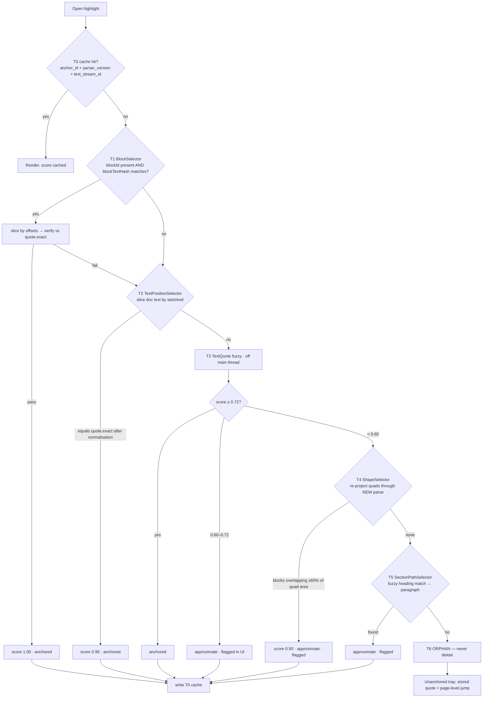
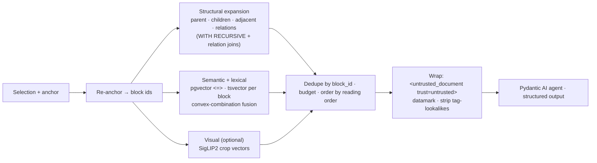

# 10. Highlight Anchoring and Contextual Q&A Architecture

**Status of the current system.** Highlights today are stored as `rects: Optional[List[dict]]` of viewport pixels divided by `window.innerWidth`/`window.innerHeight`, captured from `range.getClientRects()` and rendered as a percentage of the *page* element — so they land in the wrong place on creation, move on resize, and differ per device (`audit-backend-highlights-explanations-canvas-auth.md`). Nothing in the record — no page height, no PDF-space bbox, no character offset, no block id — permits reconstruction. Explanations are produced by naive substring search over a flat 99,210-character string with ±500 characters of context, and store no prompt, no context, no page, no token accounting (`findings.md` §A, §C4). The `TextAnchor` model with exact/prefix/suffix/section_path exists at `highlights/models.py:78` and is never populated by any client.

This section specifies the replacement. It has three parts: the persisted anchor, the evidence package assembled for a question, and the answer contract that comes back.

---

## Part 1 — The Anchor

### 10.1 Design principles

Four principles, each traceable to a source finding.

1. **No single selector is durable; the redundancy *is* the design.** The W3C Web Annotation Data Model (Recommendation, 23 Feb 2017) explicitly permits an array of alternative selectors so that "the consuming user agent will be able to use at least one." The spec deliberately defines **no priority order** — resolution order is an implementation concern (`literature/13-highlight-anchoring.md` §2).
2. **Fast selectors are hints; the quote is the judge.** Hypothesis's `maybeAssertQuote()` re-validates every Range/Position hit against `quote.exact` and throws `'quote mismatch'` on failure. This is the single most important architectural idea in their anchoring code (`13-highlight-anchoring.md` §3.1).
3. **Block IDs must be content-derived, not ordinal.** Docling's `self_ref` is a positional JSON pointer (`#/texts/47`) — stable *within* a parse, not across re-parses; insert one paragraph and every downstream pointer shifts (`literature/02-docling.md`; `findings.md` §H2). Marker uses `page/blocktype/index`; none of the surveyed parsers provide re-parse-stable identity (`literature/10-reading-order-hierarchy.md` §7). PaperTree mints its own IDs regardless of which parser wins. This is the highest-leverage decision in the whole anchoring design: if `block_id = hash(page, normalised_text, quantised_bbox)`, a new parser version that segments the same content the same way reproduces the same ID for free.
4. **Geometry is authoritative for painting; the quote is authoritative for re-anchoring.** Geometry lives in PDF user space and is parser-independent, which is why it survives a re-parse even when every text tier fails.

### 10.2 The coordinate contract

Get this wrong and every highlight is silently offset. The rules, verified against pdf.js `master` (fetched 2026-07-29):

| Concern | Rule |
|---|---|
| Space | **PDF user space, points, origin bottom-left.** Hypothesis's `ShapeSelector` (added April 2025, PR #6964) uses exactly this, with the stated rationale that it lets an annotation made in one viewer resolve in another with different zoom/rotation (`13-highlight-anchoring.md` §3.4). |
| Page box | `PDFPageProxy.view` = **`intersect(CropBox, MediaBox)`**, falling back to MediaBox if the intersection is empty. Academic PDFs from journal typesetters frequently have CropBox ≠ MediaBox. **Store the view box with the anchor**; PR #6968 (2025-04-10) is a bug fix for exactly the failure of forgetting it — Y conversion was wrong whenever the box's bottom-left was not at (0,0). |
| Rotation | `/Rotate` normalised to a multiple of 90 in [0,360). Rotation matrices: `(1,0,0,−1)` at 0°, `(0,1,1,0)` at 90°, `(−1,0,0,1)` at 180°, `(0,−1,−1,0)` at 270°. |
| `userUnit` | Folded into the scale: `s = scale × userUnit`. pdf.js's own CSS acknowledges it — `--total-scale-factor: calc(var(--scale-factor) * var(--user-unit))`. Hand-rolled implementations miss this and are silently wrong on large-format figures (`literature/32-frontend-canvas-pdf-tech.md` §1.4). |
| Capture viewport | Persist against **`page.getViewport({ scale: 1, rotation: 0 })`**. |
| Rect conversion | **`convertToViewportRectangle` no longer exists** on `PageViewport` — only `convertToViewportPoint` and `convertToPdfPoint`. Convert corners individually (`32-frontend-canvas-pdf-tech.md` §1.4, verified absent from `master` 2026-07-29; not bisected, so older `pdfjs-dist` may still have it). |
| Quad ordering | ISO 32000-1 §12.5.6.10 specifies an order that real files do not follow; pdf.js's own source calls the situation "even worse" because Adobe's applications violate it too. pdf.js discards the ordering and renormalises via min/max. **Never trust quad vertex order — store axis-aligned min/max rects.** |
| Never persist | CSS pixels, device pixels, screen-relative offsets, percentages of the rendered canvas, or DPR (`32-frontend-canvas-pdf-tech.md` §1.5). |

At rotation 0 the transform collapses to the identity to reason with:

```
s      = scale · userUnit
x_view = s · (x_pdf − viewBox[0])
y_view = s · (viewBox[3] − y_pdf)      ← bottom-left → top-left flip
```

inverse: `x_pdf = x_view/s + viewBox[0]`, `y_pdf = viewBox[3] − y_view/s`.

The zoom-independent normalised form, for cross-representation comparison:
`nx = (x − x0)/(x1 − x0)`, `ny = (y1 − y)/(y1 − y0)`.

**Parser normalisation is mandatory.** Docling constructs boxes with `CoordOrigin.BOTTOMLEFT` — already correct (`02-docling.md` §Geometry). GROBID emits `@coords="page,x,y,w,h"` with **upper-left origin, y growing downward, page index starting at 1**, and its own docs warn that CropBox/MediaBox mismatch causes offsets (`literature/05-grobid-classical.md`). Every parser adapter converts to the canonical space at ingest and records which box it converted against.

Why zoom and resize come free: pdf.js's text layer positions each `<span>` as a **percentage** of page width/height and sets font size via a CSS custom property, so the text-layer DOM does not change on zoom or resize — only CSS variables do (`13-highlight-anchoring.md` §4.3). Render the overlay sized to the scale-1 viewport and apply `transform: scale(z); transform-origin: 0 0`. Zoom then costs one composited transform, not a recompute of every rect.

### 10.3 The persisted anchor record

Stored in Postgres as `highlights(id, user_id, doc_version_id, anchors jsonb, block_id_start, block_id_end, …)` — the multi-selector array is exactly the heterogeneous payload JSONB exists for, while the *resolved* anchor gets typed columns so it can be indexed and foreign-keyed to `blocks` (`literature/30-database-and-storage.md` §1.1). **Any field retrieval filters on must be a real or generated column, not raw JSONB** — GIN does not index arbitrary JSONPath and `@?`/`@@` fall back to sequential scans.

```jsonc
{
  "anchor_version": 1,              // int  — schema version of THIS record; migration key
  "offset_unit": "utf16",           // enum — declare it. approx-string-match operates on UTF-16
                                    //   code units; W3C mandates code points. The two conflict
                                    //   and offsets drift silently if left implicit (§7).
  "doc": {
    "paper_id": "uuid",             // tenant-scoped owner
    "pdf_sha256": "hex",            // the bytes are immutable; this is the strongest identity we have
    "parser_version": "3.2.1",      // which IR produced block_id / offsets
    "text_stream_id": "docling-2.116-nonorm"  // WHICH extraction produced the offsets. pdf.js has a
                                    //   `disableNormalization` flag — the same PDF yields two
                                    //   different text streams from one library depending on it.
  },
  "target_kind": "text|guided_para|equation|equation_part|figure|figure_region|
                  table_row|table_cell|algorithm|citation",
  "provenance_class": "source|ai_generated",   // HARD RULE: a Guided-mode highlight over AI prose
                                    //   is NOT a highlight of the paper. Today both are stored
                                    //   identically and fed back to the model as "text from a
                                    //   research paper" (audit-backend-…md, critical).
  "selectors": [
    { "type": "BlockSelector",                       // T1 — ours, O(1)
      "blockId": "b32:7QJ4…",                        //   = base32(sha256(page ‖ norm_text ‖ round(bbox,0.5pt)))[:16]
      "blockTextHash": "sha256:…",                   //   separate, so an ID that survives while its
                                                     //   text changed is DETECTED, not mis-anchored
      "startOffset": 142, "endOffset": 233,          //   code-unit offsets into the block's own text
      "cellRef": null, "rowIndex": null },           //   set for table_cell / table_row targets

    { "type": "PageSelector", "index": 2, "label": "3" },   // 0-based index + printed label
                                                            //   (roman numerals, appendix pages)

    { "type": "TextPositionSelector",                // T2 — document-global offsets, hint only
      "start": 18422, "end": 18513 },

    { "type": "TextQuoteSelector",                   // T3 — the durable one
      "exact": "identity mapping",
      "prefix": "…(64 chars, word-boundary snapped)",
      "suffix": "…(64 chars, word-boundary snapped)",
      "exactNormalised": "identity mapping" },       //   NFC, ws-collapsed, ligatures folded (fi→fi),
                                                     //   line-break hyphens joined. Match on this,
                                                     //   DISPLAY `exact`.

    { "type": "ShapeSelector",                       // T4 — parser-independent geometry
      "anchor": "page", "pageIndex": 2,
      "quads": [ {"x0":308.9,"y0":531.4,"x1":402.1,"y1":542.9} ],  // axis-aligned min/max, one per line
      "view": {"left":0,"bottom":0,"right":612,"top":792},
      "viewBoxSource": "cropbox_media_intersect",
      "rotate": 0, "userUnit": 1.0 },

    { "type": "SectionPathSelector",                 // T5 — reflowed / Guided mode
      "path": ["3","3.2"], "headingText": "3.2 Identity Mapping by Shortcuts",
      "paraIndexInSection": 4, "charOffsetInPara": 12 }
  ],
  "resolution": {                   // T0 cache — MUST be present or T3 re-runs on every open
    "tier": 1, "score": 1.00,
    "resolved_block_ids": ["b32:7QJ4…"],
    "resolved_at": "2026-07-29T…", "parser_version": "3.2.1",
    "state": "anchored|approximate|orphan"
  },
  "created": { "mode": "pdf", "at": "…", "client": "web/1.4.0" }
}
```

**Deliberate deviations from Hypothesis**, each justified:

- **Prefix/suffix 64 chars, not 32.** Hypothesis hard-codes `contextLen = 32` with a source comment conceding logical boundaries would be better. Academic prose is dense in repeated phrasing ("we show that", "as shown in Figure"), so 32 characters of context is frequently non-discriminating. Snap to word boundaries.
- **`exact` stored raw for display, matched against a normalised form.** Hypothesis's `normalize.ts` does NFKD-aware offset translation with forward and reverse maps — the right pattern: normalise for matching, keep offsets mappable back to raw for rendering.
- **All whitespace stripped before matching.** Hypothesis's PDF path does this, with a decisive source comment: text extracted from a PDF "by different PDF viewers, **including different versions of PDF.js**, can often differ in the whitespace between characters and words." Any offset-based anchor into extracted PDF text is fragile across extractor versions — which is why T2 is a hint, never a verdict.

### 10.4 Anchoring the ten object kinds

Every kind resolves through the *same* mechanism. That is the point — a table cell is a `BlockSelector` with a `cellRef`; an equation is a `ShapeSelector` plus its LaTeX as `exact`.

| Target | T1 (block) | Sub-block key | Geometry | Notes |
|---|---|---|---|---|
| **PDF text** | text block id | char offsets | line quads | Baseline case. |
| **Guided paragraph** | same block id if the block ID is shared across representations (it should be — same content hash) | char offsets in reflowed text | *none* | Geometry tiers skipped. `provenance_class` distinguishes source-derived Guided text from AI prose. |
| **Equation (whole)** | formula block id | — | region quad | Store LaTeX as `exact` when available. Docling default config found only 2 formulas on ResNet and 5 on Attention against ~10 numbered equations each, with `eq+LaTeX = 0` because `do_formula_enrichment` is off by default (`findings.md` §H2) — so `exact` is frequently empty and geometry carries the anchor alone. |
| **Part of an equation** | formula block id | `charOffset` into the LaTeX string when LaTeX exists; otherwise **geometry only** | sub-region quad inside the formula bbox | The detect-then-recognise architecture is what makes this survivable: the detector gives the bbox *before* recognition runs, "so the anchor survives even when the LaTeX is wrong or absent" (`literature/07-formula-recognition.md` §7). The cropped source region must always be retained and displayable. |
| **Figure** | picture block id | — | figure bbox | Docling detects on the **rendered page bitmap**, so vector diagrams are found — 7 figures on ResNet where both PaperTree extractors find 0 (`findings.md` §H2). Store the bbox and re-render vector at display resolution, not the low-res crop. |
| **Region inside a figure** | picture block id | normalised sub-rect `(nx0,ny0,nx1,ny1)` relative to the figure bbox | absolute quad | Survives re-parse as long as the figure bbox is recovered; the normalised sub-rect re-projects. Assume in-figure text is lost. |
| **Table row** | table block id | `rowIndex` + row-span offsets | union of cell bboxes | |
| **Table cell** | table block id | `cellRef = (start_row_offset_idx, start_col_offset_idx)` | cell bbox | Docling's `TableCell` carries bbox, row/col spans, four offset indices, and header flags — a direct 1:1 match with this requirement (`literature/08-table-recognition.md` §4). Cell **text comes from the PDF text layer, not a decoder**, so there is no hallucination surface for cell content. Mint `sha1(page_no, quantised bbox, start_row_offset_idx, start_col_offset_idx, normalised text)` as the stable cell id. Multi-page tables: keep each page fragment as its own geometry-bearing block with a logical table-group over them — merging must never destroy per-page provenance. |
| **Algorithm** | code/list block id (or a synthetic `algorithm` group) | line index + char offsets | per-line quads | Treated as an ordered block group; per-line quads make partial highlights work. |
| **Citation** | inline `ref` block id | — | callout quad | Two-ended: the callout anchor plus a resolved `bib_entry_id`. GROBID resolves callout → reference at **0.76–0.91 F1** depending on collection, and extracts references at **0.87 F1** on 1,943 PubMed Central PDFs / ~0.90 on a 2,000-doc bioRxiv set (`05-grobid-classical.md`). Use it as a cross-check oracle for the bibliography, not the primary parser. |

### 10.5 The re-anchoring algorithm



**T3 scoring, read from Hypothesis's `match-quote.ts`:**

- Matcher: **`approx-string-match`** (MIT, v2.0.0), a bit-parallel implementation of **Myers (1999)**, *O((k/w)·n)* with `w = 32`. Cite Myers, not `diff-match-patch` — that lineage is history and google/diff-match-patch is itself archived.
- `maxErrors = min(256, quote.length / 2)`.
- Weights **quote 50, prefix 20, suffix 20, position 2**; position is explicitly a tie-breaker. `posScore = 1 − |match.start − hint| / text.length`.
- Composite: `score = (50·q + 20·p + 20·s + 2·pos) / 92`.
- Pages searched **in order of distance from the hinted page** (derived from the T2 offset).
- Exact `indexOf` short-circuits the expensive search. Early exit requires an **exact quote match plus an exact prefix or suffix match** — context matching prevents stopping early on a phrase that is common in the document.
- **Reject quotes shorter than ~10 characters unless prefix and suffix are both present.** T3 is superlinear in practice on long documents with short, generic quotes.

**The 0.72 / 0.60 thresholds are a proposal, not a measured value.** `match-quote.ts` returns the top-scored match unconditionally and the calling code decides; the research report states plainly that these constants are its author's suggestion and need calibration against a PaperTree corpus (`13-highlight-anchoring.md` §9). Calibrate on Tier B before shipping.

**Performance is the real hazard.** Hypothesis issue #3919 (open since 2021-11-11) reports fuzzy anchoring producing >10 s of blocked execution on long documents with short quotes, with **~60% of load time in imperfect-match resolution**; disabling approximate search removed a ~5 s CPU spike. These are **user-reported, from 2021, not instrumented by the Hypothesis team** — treat them as a hazard signal, not a benchmark. The mitigations are mandatory regardless: **T0 cache every resolution keyed `(anchor_id, parser_version, text_stream_id)`**, and **run T3 and below in a Web Worker**.

**Acceptance bar: ≥ 99% re-anchor** on the benchmark procedure — persist a highlight under parser vN, re-parse with vN+1, re-anchor — "and every failure explicitly flagged to the user, never silently dropped" (`benchmarks/README.md` §4.3). Adjacent bars: zoom and resize centroid drift **< 1 pt** across 50–400% and five viewport widths including iPad portrait/landscape; cross-mode anchoring either resolves or explicitly reports "not available in this view."

**Failures are surfaced, never deleted.** Hypothesis's 2017 orphans-tab decision is the product precedent: never delete a failed anchor, show it. PaperTree keeps the stored quote, offers a page-level jump, and marks the highlight visually distinct. An anchor resolved at T4 or T5 renders with an "approximate location" affordance — this is how "uncertainty must be representable" is satisfied without a fake confidence number.

**Do not quote the 22% figure as a PDF anchoring rate.** Aturban, Nelson & Weigle (arXiv:1512.06195, Dec 2015) measured ~22% of 20,953 Hypothesis annotations orphaned, with 53% of survivors "in danger" — but that is third-party research on *live web pages*, from over ten years ago. A PDF's bytes are immutable; PaperTree's situation is materially better. **No published PDF-specific anchoring success rate exists from any source** (`13-highlight-anchoring.md` §9).

---

## Part 2 — The Evidence Package

### 10.6 Why a flat vector index is wrong

Three independent reasons.

1. **The relations are the value.** PaperTree's parse tree gives caption ↔ figure ↔ referring paragraph ↔ parent section, symbol → definition, callout → bibliography entry. Structural expansion "has no benchmark here, but it is the one lever PaperTree's parse tree gives it that none of these [retrieval] systems have" (`literature/11-visual-retrieval.md` §8). A flat index over 512-token chunks discards all of it.
2. **Retrieval must be filtered by structure, and only SQL can do it.** A single Postgres statement can run a `WITH RECURSIVE` CTE selecting every block beneath section 3.2 of `doc_version = X`, a tsvector-ranked CTE, a `<=>` vector-ranked CTE, and fuse them in the outer select — with `block_type IN (…)`, `page BETWEEN …` and `ir_version = …` as ordinary predicates. **The structural filter can be an arbitrary join or graph traversal, which no vector-native engine allows** (`30-database-and-storage.md` §2). MongoDB's `$vectorSearch` must be the first stage and cannot join to the block tree, forcing a pre-materialised ancestor-path array on every block that must be rebuilt on every IR version bump.
3. **Text-only retrieval demonstrably fails on figure-dense content.** On ViDoRe v1's ArxivQA subset — figure-grounded questions over arXiv papers — caption+OCR pipelines score **35.7–40.1 nDCG@5** while ColPali scores **79.1**, a ~2× gap (`11-visual-retrieval.md` §2, author-reported). That is the strongest argument for a visual signal in PaperTree's exact domain.

But visual retrieval is a **ranking layer, not a parser**: it returns a page, occasionally a region, never hierarchy, LaTeX, cell addressability, or stable IDs. Region propagation (intersecting ColPali patch relevance with OCR regions) reaches **59.7% hit rate at IoU@0.5, 84.4% at IoU@0.25, 35.8% at IoU@0.7, mean IoU 0.569** on BBox-DocVQA versus ~6.7% for random regions (arXiv:2512.02660). Read honestly: 59.7% at IoU 0.5 is a ranking signal, not an anchor. **Bounding boxes come from the parser; visual retrieval scores blocks the parser already found.**

**Recommendation for v1:** BM25 + text-chunk embeddings as the spine, fused by a **tuned convex combination, not default RRF** (Bruch et al., TOIS 2023: convex combination outperforms RRF in-domain and out-of-domain, and "RRF is sensitive to its parameters"); plus **one SigLIP2 embedding (Apache-2.0, 4.6 KB) per figure/table/equation crop and one per page** — +0.17 MB on a 20-page paper, doubling the index rather than 30×-ing it as naive ColPali's 257.5 KB/page would; plus structural expansion from the parse tree. Reserve reranking for the top 10 — MonoQwen2-VL (Apache-2.0 adapter) lifted mean ViDoRe nDCG@5 from **85.8 → 90.5** on a DSE first stage at ~10 forward passes per query.

**We would revisit this if:** Tier C grounding metrics show figure-interpretation questions failing on retrieval (not on parsing) at >20% — then add ColModernVBERT (MIT, 250M, 80–256 KB/page, 20 ms CPU query on a 128-core box, 183 ms single-thread) behind a GPU indexing worker, with Qdrant for MaxSim because **pgvector has no late-interaction support**.

### 10.7 Composition and token budgets

Assembled server-side by **one function**, never by string concatenation at call sites (`literature/22-memory-and-injection.md` §3a). Every component is wrapped once in `<untrusted_document>` with a per-request random datamark token.

| # | Component | Budget (tok) | Source | Why it exists |
|---|---|---|---:|---|
| 1 | **Selected object**, verbatim + `target_kind` + provenance class | 400 | anchor | The question is about this. |
| 2 | **Exact source block(s)** containing the selection, full text | 600 | `blocks` by resolved id | The selection is usually a fragment; the sentence around it disambiguates. |
| 3 | **Parent section path + section heading chain + first paragraph of the section** | 300 | `WITH RECURSIVE` on `parent_id` | "In §3.2 the term means X" is often the whole answer. |
| 4 | **Preceding block** (reading order) | 400 | `ordinal − 1` | |
| 5 | **Following block** (reading order) | 400 | `ordinal + 1` | |
| 6 | **Nearby equations** (≤3): LaTeX if present, else `[equation image supplied]`, + the sentence that introduces each | 450 | relation: same section, within ±2 blocks, or referenced by number | |
| 7 | **Symbol definitions** (≤8): symbol → defining sentence | 320 | symbol index built at ingest from "where X is…" / "let X denote…" patterns + math-font spans | The single highest-value component for equation questions. |
| 8 | **Captions** of figures/tables in scope (≤3) | 300 | `FloatingItem.captions` refs | Docling links 18 captions on ResNet, 9 on Attention. |
| 9 | **Cross-references resolved** (≤5): "Figure 3" → the actual caption + page | 250 | relation table | |
| 10 | **Citation context** (≤3): the citing sentence + resolved bibliography entry | 300 | GROBID callout→ref links | |
| 11 | **Semantic + lexical retrieval**, top-k ≤ 6 blocks after fusion, deduped against 1–10 | 1,200 | hybrid query | Catches the definition three sections away. |
| | **Text subtotal** | **≈ 4,920** | | |
| 12 | **Region crops** (0–2), gated | 0 – ~3,200 | R2 page render, cropped at bbox | Only when: `target_kind ∈ {figure, figure_region, equation, equation_part, table_*}`, OR the object has no text, OR LaTeX failed its render check. |
| | **Total ceiling** | **≈ 8,100** | | |

**Crop token cost is provider-published and model-dependent, not a formula we control.** Anthropic publishes a per-image ceiling of ~1,600 tokens at the standard vision tier and up to ~4,784 tokens at the 2576 px high-resolution tier. Budget **1,600 tokens per crop** by rendering crops at ≤1568 px on the long edge, and verify with a token-counting call before shipping rather than trusting the estimate. Never send a full page when a bbox crop will do — region-scoped retrieval cut context tokens **52.3%** versus full-page retrieval in the Georgiou work.

Two further budget notes. The system prompt, the ~20 tool schemas and the assembly template are stable across requests — put them ahead of the volatile evidence and set a cache breakpoint there; with 20 tool schemas riding in every request this is a material cost lever, and Pydantic AI exposes OpenRouter cache-control breakpoints as a first-class feature (`literature/20-agent-runtimes.md` §4). And **never silently truncate**: today `llm_service.py:161` turns any page over 5,000 chars into `text[:2500] + "…[content truncated]…" + text[-2500:]` with no record kept, and the summary then claims to describe the whole page (`findings.md` §C6). If the package exceeds budget, drop whole components in reverse priority order (11 → 9 → 6 → 4/5) and **record which components were dropped in the response's `evidence_manifest`**.

### 10.8 Assembly



Index `tsvector` **per block or per section, never per paper** — a `tsvector` must be under 1 MB, and per-block indexing is what structure-aware retrieval needs anyway (`30-database-and-storage.md` §1.4). Note `ts_rank`/`ts_rank_cd` are term-frequency and cover-density, **not BM25** — there is no IDF, which materially hurts on scientific papers where the discriminative terms are rare. Budget for a real BM25 path (an external lexical index or `pg_search`, whose licence must be checked — it is AGPL) if lexical recall proves weak.

**Injection defence is architectural, not a filter.** Detection-based defences were bypassed at **>90% ASR under adaptive attack** across 12 published defences, with human red-teaming reaching 100% (Nasr et al., USENIX Security 2026). Spotlighting/datamarking is hygiene, not the boundary — its >50%→<2% ASR reduction is Microsoft-authored, self-reported, from March 2024, and predates the adaptive-attack work. The boundary is the **Rule of Two**: a turn that reads untrusted paper text has [A] untrusted input + [B] the user's paper and therefore must have **no [C]** — no cross-paper retrieval, no outbound HTTP, no share/export tool, and no write to USER LEARNING memory. This is not hypothetical: adversarial text embedded in preprint PDFs, invisible to humans, reliably misled commercial LLM systems (arXiv:2508.20863, ACM TAISAP), and 1% of 200,000 real resumes contained prompt injection with a **sevenfold rise between July 2024 and November 2025** (USENIX Security 2026).

---

## Part 3 — The Answer Contract

### 10.9 Response schema

Enforced as a Pydantic model with streamed validation — the reason Pydantic AI was chosen is that PaperTree's tools return structured document objects, not prose (`20-agent-runtimes.md` §4). Never hand-rolled JSON recovery via regex, which is what `llm_service.py:366-380` does today with three fallbacks and `temperature=0.7` on a structured-extraction task.

```python
class SourceRegion(BaseModel):
    page_index: int                      # 0-based
    quads: list[Quad]                    # PDF user space, bottom-left, min/max normalised
    view: ViewBox; rotate: int; user_unit: float
    block_id: str

class Citation(BaseModel):
    marker: str                          # "[1]" — what renders inline
    block_ids: list[str]                 # ≥1. FK to blocks(id)
    regions: list[SourceRegion]          # ≥1
    pages: list[int]
    quote: str                           # verbatim span the claim rests on
    relation: Literal["states","implies","defines","contradicts"]

class Answer(BaseModel):
    answer_markdown: str                 # inline [n] markers only; no fabricated diagrams
    citations: list[Citation]
    interpretation: str | None           # AI reasoning NOT in the paper. Rendered in a
                                         #   visually distinct block. NEVER merged into answer.
    unresolved: list[Ambiguity]          # {question, why_unresolved, candidate_block_ids}
    confidence: Literal["grounded","partial","ungrounded"]
    grounding: GroundingReport           # see §10.11
    evidence_manifest: EvidenceManifest  # every block id sent, component budgets, drops
    provenance: Provenance               # model, prompt_version, parser_version,
                                         #   anchor_ids, tokens_in/out, cost, latency
```

Three hard rules encoded in the schema, each answering a documented defect:

- **Interpretation is a separate field, never merged.** The current system renders LLM prose as the document with source page numbers attached and instructs the model to *invent* Mermaid diagrams for "process flows, system architectures, decision trees," which then render identically to the paper's own figures (`findings.md` §C5). AI-generated content must never look like source. The renderer must not accept Mermaid or images inside `answer_markdown`.
- **`confidence` is an enum over grounding state, not a model-generated number.** A model-produced 0.87 is decoration.
- **Errors are never persisted as answers.** Today `canvas/services.py:726` writes `"**Error generating response:** {e}"` and marks the node `"status": "complete"`; `llm_service.py:282` stores `"_Failed to generate summary: {error}_"` as a normal `PageSummary`, which `generate-pages` then treats as already generated so it is never retried. Failures get `status: failed` on the job record and render as a retry affordance, never as content.

### 10.10 Citation click → region

A citation click is an anchor resolution, not a page jump.

1. Take `Citation.block_ids[0]` and its `SourceRegion`.
2. Resolve through the identical tier ladder in §10.5 (the answer may be older than the current parse; a re-parse must not break saved answers).
3. Scroll the container so the region's centroid is at 40% viewport height, using `y_view = s·(viewBox[3] − y_pdf)`.
4. Paint a focus outline on the overlay layer at the region quads, sized to the scale-1 viewport and transformed by the current zoom — no recomputation.
5. If the reader is in **Guided mode** and the target has no Guided representation, do not silently fail: offer "open in PDF at page N" — the benchmark bar is "resolves or explicitly reports *not available in this view*."
6. If resolution lands at T4/T5, outline the region with the approximate-location treatment rather than the exact one.

Bar: **correct page 100%, correct region ≥ 95%** (`benchmarks/README.md` §4.3). For deep-linking out of Guided mode, `#:~:text=[prefix-,]textStart[,textEnd][,-suffix]` is the right *share* format — it is conceptually the same prefix/exact/suffix model — but it is a **WICG Draft Community Group Report (13 Dec 2023), explicitly not a W3C standard**, restricted to user-activated top-level `text/html` navigations, and useless as a storage format.

### 10.11 `verify_answer_grounding`

A second, cheap, **tool-less** pass over the assembled evidence — the Dual LLM / quarantined-verifier pattern. It never sees the conversation, only `(claim, cited_quote, cited_block_text)` triples.

```python
def verify_answer_grounding(answer: Answer, package: EvidencePackage) -> GroundingReport:
    for c in answer.citations:
        assert c.block_ids ⊆ package.block_ids          # (1) no citation outside evidence
        assert normalise(c.quote) in normalise(block_text(c.block_ids))  # (2) quote is verbatim
        assert c.regions resolve on the current parse   # (3) region is paintable
    for claim in split_claims(answer.answer_markdown):  # (4) every claim carries ≥1 citation
        assert claim.citation_refs
    # (5) entailment: quarantined model scores each (claim, quote) pair
    #     supported | partially_supported | unsupported
```

Failure handling, by check:

| Failure | Action |
|---|---|
| (1) citation outside the package | **Hard reject.** Strip the citation, downgrade to `partial`, log. A block id not in the evidence manifest is fabrication by definition. |
| (2) quote not verbatim in the cited block | Strip that citation; if the claim is left uncited, move it to `interpretation`. |
| (3) region fails to resolve | Demote to page-level citation; flag `region_unresolved`. |
| (4) uncited claim | Move to `interpretation`. Never delete. |
| (5) any claim `unsupported` | `confidence = "ungrounded"`. **Do not display the answer as an answer**: show the retrieved evidence with a "could not ground this answer" notice and a retry. |
| (5) some claims `partially_supported` | `confidence = "partial"`; those claims render with a caution marker. |

One regeneration retry at most, with the failed claims named in the retry prompt. A second failure returns `ungrounded` — it does not loop. The whole `GroundingReport` is persisted alongside the answer so an answer can be re-grounded, re-run, cited, or audited later; today none of that is possible because the explanation record stores no prompt, no context, no page, and no token accounting (`audit-backend-…md`, major).

Calibrate the verifier against the Tier C rubric: **support validity** judged by rubric and **adjudicated by a human on a 30-item sample** to calibrate the judge; **contamination rate** — the fraction of answers whose evidence mixes text from two different columns, or a caption with unrelated body text — is the metric the current system fails hardest, since PyMuPDF `sort=True` on a two-column page produced **44 left/right alternations on a single ResNet page** (`findings.md` §B5).

---

## Part 4 — Worked End-to-End Trace

Two-column CVPR paper (ResNet, 12 pp). The user drags across the term **"identity mapping"** in the right column of page 3. Values below are shaped to the real schema; exact coordinates are illustrative.

**1 — Selection captured (browser).** `document.selectionchange` fires; `Range.getClientRects()` yields one CSS rect. Subtract the page container's `getBoundingClientRect()`, divide by current zoom (1.5), then call `viewport.convertToPdfPoint()` on the top-left and bottom-right **separately** (no `convertToViewportRectangle`). Because Y flips, normalise to min/max *after* conversion:

```
CSS (page-relative, z=1.5)  → { left: 463.4, top: 373.7, right: 603.2, bottom: 391.0 }
convertToPdfPoint × 2       → (308.9, 542.9) and (402.1, 531.4)
normalised quad             → { x0: 308.9, y0: 531.4, x1: 402.1, y1: 542.9 }
view = [0,0,612,792]  rotate = 0  userUnit = 1.0  viewBoxSource = cropbox_media_intersect
```

**2 — Anchor persisted.** Server resolves the quad against `blocks` for `doc_version_id`, finds `b32:7QJ4KXWM…` (text, page 2, ordinal 118), and writes the record from §10.3: `exact = "identity mapping"`, prefix `"…the layers explicitly fit a residual mapping. Denoting the desired underlying mapping as H(x), we let the stacked nonlinear layers fit another mapping of F(x) := H(x)−x. … we hypothesize that it is easier to optimize the residual mapping than to optimize the original, un"`, truncated and word-snapped to 64 chars each side. `resolution = {tier: 1, score: 1.00, state: "anchored"}` cached immediately.

**3 — Question.** User asks: *"Why does an identity mapping cost nothing extra?"*

**4 — Package assembled** (component → block ids → tokens):

```
1  selected object      "identity mapping"                    b32:7QJ4KXWM   12
2  source block         full paragraph containing the term    b32:7QJ4KXWM  187
3  parent section       ["3","3.2"] "Identity Mapping by Shortcuts" + first para  241
4  preceding block      b32:2M8PQ1AA                          166
5  following block      b32:9DKZ3TCV                          203
6  nearby equations     eq (1) y = F(x,{Wi}) + x  [latex present]
                        eq (2) y = F(x,{Wi}) + Ws·x  [latex null → crop queued]
                        + introducing sentences                b32:EQ1…, b32:EQ2…  268
7  symbol definitions   x → "the input vectors of the layers considered"
                        F → "the residual mapping to be learned"
                        Ws → "a linear projection by the shortcut connections"     94
8  captions             Fig. 2 "Residual learning: a building block."              38
9  cross-refs           "Eqn.(1)" → block EQ1 ; "Fig. 2" → picture block           51
10 citation context     "[13] shortcut connections" → He et al. bib entry          77
11 hybrid retrieval     top-6 after convex fusion, 2 dropped as dupes of 2/5:
                        b32:XY41 (§3.3 impl. detail), b32:PP07 (§4.1 plain vs
                        residual), b32:TB22 (Table 1 row), b32:CN55 (conclusion)  742
12 crops                1 crop: equation (2) region, 214×46 pt → 1024 px long
                        edge (latex null, so the image IS the evidence)         ~1,150
                                                                     ────────────────
                                                        total evidence ≈ 3,229 tok
```

Wrapped once: `<untrusted_document id="p_7f3a" span="sec3.2:para3" trust="untrusted">` with datamark `^7f3a` interleaved, tag-lookalikes stripped, `source_channel="pdf_text"` on every chunk. No cross-paper retrieval, no outbound tools in this turn.

**5 — Model call.** Pydantic AI agent over OpenRouter; system prompt + tool schemas cached (stable prefix), evidence after the breakpoint. Structured output constrained to `Answer`.

**6 — Raw structured output.**

```jsonc
{
  "answer_markdown": "Because the shortcut is a plain identity map, it introduces **no learnable parameters** — the block computes `y = F(x, {Wᵢ}) + x`, and the addition is element-wise [1]. So the residual block has the same parameter count and, apart from one addition per element, the same computational cost as the plain block it replaces [2]. A projection `Wₛ` is only introduced when the input and output dimensions differ [3].",
  "citations": [
    {"marker":"[1]","block_ids":["b32:EQ1M4TZ2"],"pages":[2],
     "quote":"y = F(x, {Wi}) + x","relation":"states",
     "regions":[{"page_index":2,"quads":[{"x0":322.0,"y0":604.8,"x1":471.6,"y1":619.2}],"block_id":"b32:EQ1M4TZ2"}]},
    {"marker":"[2]","block_ids":["b32:9DKZ3TCV"],"pages":[2],
     "quote":"introduces neither extra parameter nor computation complexity","relation":"states", "regions":[…]},
    {"marker":"[3]","block_ids":["b32:EQ2R7YFN"],"pages":[2],
     "quote":"y = F(x, {Wi}) + Ws x","relation":"defines","regions":[…]}
  ],
  "interpretation": "The parameter-count argument is exact; the 'same computational cost' claim ignores the element-wise addition itself, which the paper describes as negligible rather than zero.",
  "unresolved": [],
  "confidence": "grounded"
}
```

**7 — `verify_answer_grounding`.** (1) all three block ids ∈ manifest ✓. (2) quote [1] verbatim in `EQ1M4TZ2` ✓; quote [2] verbatim in `9DKZ3TCV` ✓; quote [3] verbatim in the crop's OCR-free LaTeX-null block — *falls back to region-only citation*, flagged `region_only`. (3) all three regions resolve at T1 ✓. (4) every sentence carries a marker ✓. (5) entailment: claims 1 and 2 `supported`; claim 3 `partially_supported` (the source states the projection is used "to match dimensions" — the answer's "only when… differ" is a mild strengthening). Result: `confidence = "partial"`, claim 3 renders with a caution marker, `interpretation` renders in the distinct AI block.

**8 — Render.** Markdown via `react-markdown` (no `rehype-raw`); LaTeX via KaTeX with `output: 'htmlAndMathml'`, `throwOnError: false`, and **`trust: false`** — `trust: true` enables `\includegraphics` and `\href`, an injection vector for LLM output (`32-frontend-canvas-pdf-tech.md` §4). Citation markers are buttons.

**9 — Click `[1]`.** Resolve `b32:EQ1M4TZ2` → T0 cache hit → scroll page 3 so `y_view = 1.5·(792 − 612.0) = 270 px` sits at 40% viewport height → paint the focus outline on the overlay at the stored quads under `transform: scale(1.5)`. Total: one composited transform, no geometry recomputation, no network call.

---

## Part 5 — Recommendations and Falsification Conditions

| # | Recommendation | We would revisit this if… |
|---|---|---|
| 1 | Persist a W3C-shaped **multi-selector array** with content-derived block IDs; resolve via the T0–T6 ladder | Tier B measurement shows T1 alone clearing ≥99% re-anchor across a parser bump — then T2/T3 become optional cost, not required tiers |
| 2 | Quads in **PDF user space against `getViewport({scale:1, rotation:0})`**, with `view`, `rotate`, `userUnit` stored | Never. This is the geometry floor; anything else re-creates today's unrecoverable data loss |
| 3 | Accept T3 at **score ≥ 0.72**, flag 0.60–0.72 as approximate | These are the source report's *proposal*, not measured. Calibration on Tier B is expected to move them; a corpus-measured threshold replaces them |
| 4 | **Structure-aware expansion + hybrid text retrieval + per-crop SigLIP2**, convex-combination fusion | Tier C figure-interpretation accuracy fails on retrieval rather than parsing at >20% → add ColModernVBERT (MIT) + Qdrant for MaxSim |
| 5 | **~8,100-token evidence ceiling**, drops recorded in the manifest | Measured answer quality is budget-bound rather than retrieval-bound; raise the ceiling only with a measurement, never by feel |
| 6 | **Structured `Answer` + mandatory `verify_answer_grounding`** | The verifier's own precision, on the 30-item human-adjudicated sample, falls below the answer model's — then verification moves into the answer turn as a self-check |
| 7 | **Orphans are surfaced, never deleted** | Never. This is Hypothesis's 2017 product lesson and the benchmark's explicit bar |
| 8 | Injection defence is **architectural (Rule of Two), not detection** | Never on the strength of a better classifier — Nasr et al. broke 12 of them at >90% ASR |

---

## Part 6 — What Remains Unverified

- **No PDF-specific anchoring success rate exists in the literature.** The 22%/53% figures are third-party, from Dec 2015, over live web pages. The ≥99% bar is PaperTree's own requirement, not a reproduction of anyone's published result.
- **The 0.72/0.60 acceptance thresholds are unmeasured.** So is the 64-character context length (a deliberate deviation from Hypothesis's 32, justified by domain reasoning, not by measurement).
- **The >10 s / ~60% performance figures are user-reported in a 2021 GitHub issue**, not instrumented, and the code has changed since. The worker-offload and T0-cache mitigations are cheap enough to adopt regardless.
- **Token budgets in §10.7 are design targets, not measurements.** Component sizes were derived from block-length statistics, not from a tuning run. Image-token costs are provider-published ceilings and vary by model and resolution tier — verify with a token-counting call before finalising.
- **Docling's `self_ref` instability was inferred** from the JSON-pointer schema and index-rewriting logic, not measured across two parses of the same PDF at different versions. It is the premise of the content-derived-ID decision, so it is worth measuring directly.
- **`convertToViewportRectangle`'s removal date was not bisected** — confirmed absent from `master` on 2026-07-29 only.
- **Structural expansion has no benchmark in the retrieval literature.** It is the lever PaperTree's parse tree uniquely provides and the one with the least external evidence behind it. Tier C is where it gets tested.
