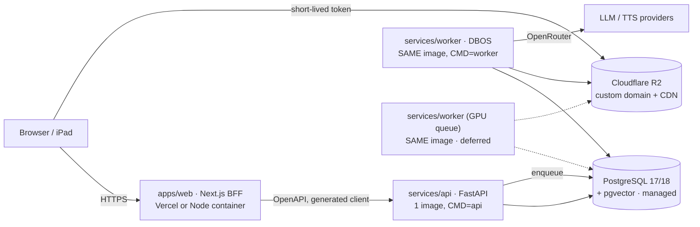
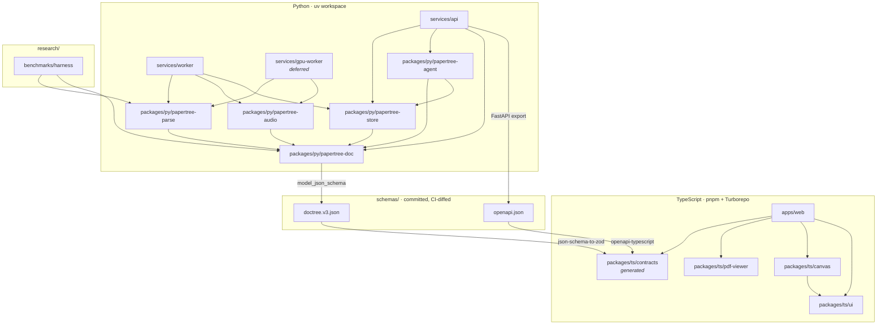

# 14 · 15 · 16 — Stack options, recommendation & ADRs, monorepo design

*Draws on `literature/30-database-and-storage.md`, `31-language-and-architecture.md`,
`32-frontend-canvas-pdf-tech.md`, `21-durable-workflows.md`, `20-agent-runtimes.md`,
plus the measured results in `findings.md` and
`experiment-results/ptub-capability-matrix.json`.*

**Team assumption, stated once and applied everywhere below: 1–3 people, commercial
product, no dedicated ops.** Every score in section 14 weights *developer velocity* and
*operational simplicity* above raw performance, because the binding constraint on this
project is engineer-hours, not CPU cycles. Where a research report and this synthesis
disagree, the disagreement is called out explicitly rather than smoothed over.

---

## 14. Stack options

### 14.0 What is actually already decided by evidence

Three facts remove most of the design space before the options are compared.

1. **Ingestion cannot live in an HTTP request.** Docling measured **19 s/page on ResNet
   (228 s for 12 pages) and 5 s/page on Attention (75 s for 15 pages)**, CPU-only
   (`findings.md` §H2). Even the optimistic figure puts a 20-page paper at ~100 s. Vercel
   Functions cap at **300 s on Hobby and 800 s on Pro** (1800 s in beta) (`31` §2); the
   current code already exceeds this — `generate_book` can run up to **4,950 s inside one
   request** (`findings.md` §C1). A queue is not a preference; it is arithmetic.
2. **Python is not optional for the document plane.** Docling, MinerU, Marker, TableFormer
   and the formula/layout model post-processing exist only in Python (`31` §1). Rust has
   **exactly one reading-order crate — `xycut-plus-plus` v0.0.2, GPL-3.0, 98 lifetime
   downloads, untouched since 2025-11-16** — which for a commercial product is equivalent
   to nothing (`31` §3).
3. **The current parser is not a thing to be preserved.** The live path scores **zero on
   every column of the capability matrix**; Docling finds **7 figures / 15 tables / 342
   addressable cells** on the same paper where both PaperTree extractors find 0
   (`findings.md` §H2). There is no working system to protect, which removes migration
   risk as a reason to stand still.

### 14.1 The four options

| | **A — Incremental** Next.js + FastAPI + Mongo, fix the parser in place | **B — TS control plane + Python doc workers** | **C — Rust doc core + TS app + Python ML** | **D — One Python plane, two entrypoints, Postgres spine** *(recommended)* |
|---|---|---|---|---|
| **Implementation effort** | ✅ Lowest — 0 new infra | ⚠️ +1 deployable, +queue, +2nd contract system | ❌ Highest — +language, +FFI, +rewrite of unvalidated algorithms | ⚠️ Low — +queue, +Postgres, +1 contract |
| **Library compatibility** | ✅ | ✅ | ❌ No reading-order, no layout models, `ort` still **2.0.0-rc.13** after 14 months in RC (`31` §3) | ✅ |
| **Performance (real bottleneck)** | ⚠️ Bottleneck is model inference, not language | ⚠️ Same | ⚠️ Fast on the ~3 % that isn't the bottleneck | ⚠️ Same as A/B — correctly so |
| **GPU support** | ✅ Python owns the models | ✅ | ✅ (models still Python) | ✅ Dedicated worker process on a GPU queue |
| **Operational complexity** | ✅ 1 process — but no durable jobs | ⚠️ 3 runtimes to deploy, monitor, page on | ❌ 3 languages, 3 build toolchains, cross-compilation | ✅ 2 processes from **1 image**, 1 managed Postgres |
| **Developer velocity** | ✅ until the parser rewrite starts | ⚠️ Every parse-output change crosses a language boundary | ❌ `cargo build --release` kills the empirical tuning loop | ✅ Parser tuning stays a notebook cell |
| **Type safety** | ❌ Hand-written types; **two `Highlight` types already contradict each other** (`findings.md` §G5) | ✅ | ✅ | ✅ once OpenAPI + DocTree codegen lands (§16.3) |
| **Deployment** | ✅ One container | ⚠️ Three | ❌ Native deps, WASM artefacts, cross-compilation | ✅ One Python image (2 CMDs) + one web build |
| **Observability** | ⚠️ | ⚠️ Trace context must cross HTTP *and* queue | ❌ Spans across 3 runtimes | ✅ One OTel SDK covers api + worker + agent |
| **Hiring / maintenance (1–3 ppl)** | ⚠️ Monolith rots without seams | ⚠️ Bus factor 1 per runtime | ❌ Smallest candidate pool of any option here | ✅ Largest pool; one person holds the whole model |
| **Migration risk** | ✅ Lowest | ⚠️ Medium | ❌ Rewrite before the algorithm is validated | ✅ Low — Postgres cutover is 3 papers (§15.1) |

Scoring adapted from `31` §5, with two amendments explained in §14.3.

### 14.2 Where each option is over- or under-engineered — plainly

**Option A is under-engineered in exactly one place, and that place is fatal.** Everything
about A is right except that long parse jobs sit inside a request/response process. It is
also the option that keeps MongoDB, and §15.1 shows the 16 MiB BSON limit forces the block
table out of the document anyway — so A pays for the block-collection rewrite *and* keeps
a store with no foreign keys, no joins in the vector path, and no DDL migrations for an IR
that is explicitly versioned (`30` §1.2).

**Option B is defensible but premature.** It buys tRPC-grade inference for the web tier at
the cost of a third deployable and a second contract mechanism — and tRPC cannot cross to
Python at all (`31` §2), so you end up with two contract systems for a two-person team.
Revisit at ~5 engineers, or when the web tier genuinely needs Node-only libraries.

**Option C is over-engineered, and I will say it plainly.** It proposes rewriting — in the
language with the worst iteration loop — the one component (reading order, layout
heuristics) that is *most* empirical and *least* specified. The vendor-self-reported speed
numbers (`pdfsink-rs`: **9.6×** aggregate over pdfplumber; `pdf-inspector`: **2.8 s vs
15.5 s** on 200 PDFs) are real but benchmarked against *pdfplumber, the slowest reasonable
Python option*, and irrelevant when the wall-clock is dominated by model inference at
5–19 s/page. The one honest Rust argument — WASM in the browser — is defeated by
`pdfium-render`'s own README ("non-growable WASM heap … attempting to open a PDF document
longer than just a few pages will result in an unrecoverable out of memory error") against
`pdfjs-dist@6.2.108`, which already gives per-character transforms today (`31` §3).
**Rust budget for this project: zero, with exactly one trigger** — if profiling shows a
specific geometry hot loop dominating wall-clock, add it as a PyO3/maturin extension
*inside* the existing Python package. No new deployable, no new contract, no new on-call
surface.

**Option D — the recommendation.** Keep Next.js for the whole web tier (route handlers are
a thin BFF that enqueue and read status). Keep FastAPI, but split it into **two entrypoints
over one codebase and one container image**: `api` (sub-second request/response) and
`worker` (the parse/audio/embed pipeline). Postgres + pgvector + R2 as the spine. This is
report `31`'s Option 4 with two amendments.

### 14.3 Two places where the research contradicts itself — resolved

**(i) MongoDB: `31` says leave it, `30` says move now.** `31` §5 recommends "MongoDB:
leave it. Migrating it now is unrelated risk." `30` §0/§6 recommends moving immediately.
**Resolution: move now.** `31`'s premise — that the migration is *unrelated* work — is
false for this project. The IR is being rewritten wholesale, every IR consumer is being
rewritten, and `30` §6 states the migration is "cheapest of all if done in the same pass as
the next IR version bump, since you are rewriting the IR consumers anyway." That pass is
this project. Additionally the security fix required by `findings.md` §F (33 call sites
with no `user_id` filter, no repository layer) is *the same code* as the data-access
rewrite. Doing them separately means writing the DAO twice.

**(ii) Job queue: `31` proposes `arq`, `21` disqualifies it.** `31` §5 suggests `arq`
0.28.0; `21` §2 records that arq is in **maintenance-only mode** (PyPI cites issue #510)
and says "Do not build on it." **Resolution: `21` wins** — it is the more specific
research, and the claim is checkable. See ADR-204.

---

## 15. The recommendation, and the ADRs

**Adopt Option D.** One Python codebase with two entrypoints, Next.js as a pure BFF,
PostgreSQL 17/18 + pgvector as the system of record, Cloudflare R2 for every byte that
isn't a row, DBOS Transact for durable steps on the Postgres already present, Pydantic AI
in-process for the agent, and `pdfjs-dist` + `@xyflow/react` on the frontend.

The canonical document representation and the parser pipeline have their own ADRs
elsewhere in this report (**ADR-101 Canonical Document Representation**, **ADR-102 Parser
Pipeline**); the ADRs below depend on them but do not restate them.

---

### ADR-201 — Primary database: PostgreSQL 17/18

**Status:** Accepted.

**Context.** MongoDB Atlas today. The IR will hold tens of thousands of geometry-bearing
blocks per paper, will be explicitly versioned, and is consumed by four independent
subsystems (highlighting, explanations, canvas, audiobook).

**Decision.** PostgreSQL 17/18 as the system of record. `documents` → `doc_versions` →
`blocks` with a typed spine and JSONB flanks. Every other store is a derived, rebuildable
index.

```sql
CREATE TABLE doc_versions (
  id            uuid PRIMARY KEY,
  document_id   uuid NOT NULL REFERENCES documents(id) ON DELETE RESTRICT,
  ir_version    int  NOT NULL,           -- the IR version is a ROW, not a field
  extractor     text NOT NULL,           -- 'docling@2.116.0+cfg-sha'
  created_at    timestamptz NOT NULL DEFAULT now()
);

CREATE TABLE blocks (
  id            uuid PRIMARY KEY,        -- content-derived, stable across re-parse
  doc_version_id uuid NOT NULL REFERENCES doc_versions(id) ON DELETE CASCADE,
  parent_id     uuid REFERENCES blocks(id),
  ordinal       int  NOT NULL,
  block_type    text NOT NULL,
  page          int  NOT NULL,
  bbox          real[4] NOT NULL,        -- NEVER nullable. Geometry is not optional.
  path          ltree,                   -- materialised, for cheap subtree filters
  text          text,
  payload       jsonb NOT NULL DEFAULT '{}'::jsonb
);
CREATE INDEX ON blocks USING gist (path);
CREATE INDEX ON blocks (doc_version_id, page);
```

**Alternatives.** MongoDB (status quo); SQLite/libSQL + `sqlite-vec`.

**Evidence.** MongoDB's **16 MiB hard BSON limit** against ~300–500 bytes of BSON per block
puts 30k blocks at **9–15 MB** — inside the limit today, over it the moment per-span
geometry is added (`30` §0). Blocks must therefore live in their own collection *regardless*,
which deletes the only real reason to stay. Mongo has no foreign keys, no DDL migrations,
and `$vectorSearch` **must be the first stage** and cannot appear in `$lookup` sub-pipelines
— so "descendants of section 3.2" must be pre-materialised as an ancestor array on every
block and re-materialised on every IR bump (`30` §2). `sqlite-vec` is **explicitly pre-v1
("expect breaking changes") and does brute-force KNN** (`30` §1.5) — dev fixtures only.

**Positive consequences.** Vector + keyword + arbitrary structural filter in one SQL
statement; real FKs so `findings.md` §D3's orphaned-data class of bug becomes impossible;
transactional highlight+block+explanation writes; Alembic migrations with rollback.

**Negative consequences, honestly.** Postgres FTS has **no IDF** — `ts_rank`/`ts_rank_cd`
are term-frequency and cover-density, and the docs say outright "the ranking functions do
not use any global information" (`30` §1.4). For scientific text, where discriminative
terms are rare, this hurts. `tsvector` is capped at **1 MB**, so index **per block**, not
per paper. The BM25 answer, ParadeDB `pg_search` 0.24.3, is **AGPL-3.0** and needs legal
sign-off, not a `pip install`.

**Migration plan (real, and cheap only because it is now).**

Current volume: **3 papers**, a handful of users, and — critically — the derived artefacts
are all *wrong* (page-indexed outline `findings.md` §C3, fabricated Mermaid §C5, error
strings persisted as content §C7). So:

| # | Step | Notes |
|---|---|---|
| 0 | Rotate Atlas + OpenRouter credentials | Independent of this ADR; `findings.md` §F is a live incident |
| 1 | Alembic baseline DDL for the target schema | ~1 day |
| 2 | `mongoexport` → JSONL → `COPY` into `staging.<coll>(doc jsonb)` | Minutes. Staging is the rollback artefact |
| 3 | `$type` aggregation over **every** collection (not a sample — there are 3 papers) | Field-type variance is the usual estimate-killer (`30` §6.1) |
| 4 | Project staging → typed tables | `users`, uploaded PDFs, `highlights`, `explanations`, `canvases`, `canvas_nodes` |
| 5 | **Do not migrate** `extracted_text`, `book_content.page_summaries`, `paper_images` | Re-derivable, and demonstrably defective. Migrating them imports the defects |
| 6 | Highlights: preserve `_id` as `legacy_mongo_id text`, store the selected text as a `TextQuoteSelector`, set `anchor_status='needs_reanchor'` | See divergence note below |
| 7 | Cutover: freeze writes, ETL, count + sampled deep-diff, flip `DATABASE_URL` | Single maintenance window. **No dual-write, no CDC** — not worth the complexity pre-launch |

**Divergence from `30` §6.5.** That report says "preserve the original block IDs verbatim
… that turns a re-anchoring project into a column copy." **That advice does not apply
here**, because `findings.md` §A proves there *are* no block IDs — and highlight geometry
is currently stored as a fraction of `window.innerWidth` (`read/page.tsx:228`), i.e.
device-dependent and already wrong. There is nothing correct to preserve. Re-anchoring
from the text quote is both cheaper and more correct.

**Cost.** `30` §6 prices this at 3–7 engineer-days if Motor calls are localised, 2–4 weeks
if scattered. `findings.md` §F5 shows they are scattered (33 unfiltered call sites, no
repository layer). **Realistic combined estimate: 8–12 engineer-days**, of which ~4 are the
security fix that must happen regardless.

**The asymmetry that is the whole argument.** Blocks, embeddings, page images and audio are
re-derivable forever. **Highlights, explanation trees and canvases are not** — they are the
user's own intellectual work. Today that table is nearly empty. At 1,000 users × 200
highlights it is 200,000 anchor records that must survive an engine change with zero
user-visible breakage. The migration cost is roughly flat in engineer-days and roughly
linear in *irreplaceable rows*. Right now that multiplier is ~0.

**Rollback.** Mongo is read-only during cutover and is never dropped; a `mongodump` plus
the `staging.*` schema are retained 30 days. Rollback = revert the deploy and repoint
`MONGO_URI`. Drop Postgres and re-run.

**We would revisit this if:** a `$type` audit reveals field-shape variance so pervasive that
projection SQL exceeds ~2 days of work, or if the block table proves to need a document
model we cannot express as typed-spine + JSONB. Neither is plausible at 3 papers.

---

### ADR-202 — Blob storage: Cloudflare R2

**Status:** Accepted.

**Context.** PDFs, page images, figure crops, audiobook segments. Today: local disk
(`apps/api/storage/`), served through an endpoint that takes the **JWT in the query
string** (`findings.md` §D1) with an **unbounded `scale` parameter** (§D2).

**Decision.** Cloudflare R2 from day one. Content-addressed keys
`sha256(pdf)/ir_v{n}/p{page}@{scale}.webp` with `Cache-Control: public, max-age=31536000,
immutable`. Page images and audio served via a **custom domain** with Worker-issued
short-lived tokens; **presigned S3-endpoint URLs reserved for genuinely private artefacts**
(the user's uploaded PDF).

**Alternatives.** Backblaze B2; AWS S3; Supabase Storage; local disk.

**Evidence.** The dominant cost here is *egress*, not storage: a 40-page paper at 2× is
~8–20 MB of page images, a 30-minute audiobook at 64 kbps mono Opus is ~14 MB, so a user
reading 20 papers/month pulls ~0.5 GB. **At 1,000 such users — ~500 GB/month — that is
~$45/mo on S3 and $0 on R2** (`30` §4). Storage itself is noise: R2 is $0.015/GB-mo
(IA $0.01), free tier 10 GB-mo / 1M Class A / 10M Class B.

**Negative consequences.** R2 presigned URLs max out at **7 days (604,800 s)** and work
**only against `<ACCOUNT_ID>.r2.cloudflarestorage.com`, not custom domains**; POST form
uploads are unsupported (`30` §4). So presigned traffic bypasses custom-domain CDN config
— hence the two-path serving rule above. Vendor concentration on Cloudflare is real but
cheap to unwind: the S3 API is the interface.

**Migration plan.** Copy `apps/api/storage/papers/*.pdf` to R2 keyed by SHA-256 (this also
fixes `findings.md` §D5 — the two byte-identical PDFs in storage collapse to one object).
Delete every generated page image; they are re-derived by the new pipeline. IR-version
bumps become a key-space change, not a cache-invalidation problem.

**Rollback.** Keep a filesystem-backed implementation of the same `BlobStore` interface;
flip an env var. Local disk stays valid for dev.

**We would revisit this if:** egress ever becomes free elsewhere at meaningful scale, or if
a customer contract requires data residency R2 cannot satisfy.

---

### ADR-203 — Vector retrieval: pgvector in the same Postgres

**Status:** Accepted. Qdrant deferred, with a named trigger.

**Decision.** `pgvector` 0.8.5 in the primary database, `halfvec` embeddings, HNSW index,
`tsvector` + `pg_trgm` per block, and **retrieval as one SQL statement** from day one:
recursive-CTE structural filter → keyword CTE + vector CTE → RRF fusion in the outer
select. Raise `maintenance_work_mem` to 1–2 GB *during index builds* — the 64 MB default
forces a disk-based build reported (blog-sourced) at 10–50× slower.

**Alternatives.** Qdrant (Apache-2.0, native `MAX_SIM`); Weaviate (BSD-3, MUVERA ~80 %
memory saving — *vendor-reported*); Milvus; VectorChord; Turbopuffer.

**Evidence.** Only Postgres allows the structural filter to be **an arbitrary join or graph
traversal** — which is precisely PaperTree's "search within section 3.2 and its
descendants" requirement (`30` §2). pgvector ≥ 0.8.0 supports iterative index scans
(`hnsw.iterative_scan`, `hnsw.max_scan_tuples` default 20000) so recall survives selective
filters. Licences are clean: pgvector and pgvectorscale are both PostgreSQL-licensed.
Every dedicated store adds a second system to keep consistent with the IR.

**Negative consequences.** **pgvector has no MaxSim.** If ColPali-style visual retrieval is
adopted, pgvector cannot express it — and the case for ColPali in this exact domain is
strong: **ArxivQA nDCG@5 of 79.1 for ColPali vs 35.7–40.1 for caption+OCR pipelines**
(authors' self-reported, `11` §2), at **257.5 KB of index per page**. Also: no IDF, per
ADR-201.

**Migration plan.** None — there is no vector store today. Embeddings are derived; the
architectural rule is: **if you cannot drop the vector store and rebuild it from Postgres
in an afternoon, you have made a mistake** (`30` §5b).

**Rollback / escalation ladder.** (1) tsvector; (2) tsvector + a hand-rolled IDF
term-weight table over the fixed corpus; (3) add `pgvectorscale` when embeddings exceed RAM
(StreamingDiskANN, label filtering *during* traversal, PostgreSQL-licensed — no legal
work); (4) add **Qdrant** *only* when ColPali lands, holding page-image multi-vectors with
`MAX_SIM` while pgvector keeps block-level text embeddings; (5) `pg_search` only if AGPL
clears legal.

**We would revisit this if:** the PTUB Tier C task benchmark shows figure-grounded question
accuracy is the dominant failure mode — that is the ColPali trigger, and it is a
measurement, not a hunch. Note `30` §7 flags that pgvector's *indexable* dimension limits
(commonly cited 2,000 / 4,000) were **not confirmed** — verify before fixing embedding
dimensionality.

---

### ADR-204 — Job queue / workflow engine: DBOS Transact on Postgres

**Status:** Accepted. Temporal Cloud held as a named contingency.

**Context.** Three pipelines: parse (~8 steps), audiobook (~39 steps: plan → 12 chapters ×
[script, TTS, align] → stitch → persist), embed/index (~7 steps). Volume at T0 ≈ **1,100
steps/month**; at T1 (~100 paying users) ≈ **42,000**. GPU work is required for layout and
possibly TTS.

**Decision.** **DBOS Transact** (MIT, `dbos-transact-py`), which checkpoints every step to
the Postgres from ADR-201. No new server, no new datastore, no vendor. Worker processes are
plain Python; a GPU worker is the same image on a different queue.

**Alternatives.** Temporal Cloud; Hatchet Cloud; Inngest; plain Postgres `SKIP LOCKED`;
the "stage-table" middle path; Celery; arq.

**Evidence.** GPU eliminates half the field outright: **Trigger.dev, Cloudflare Workflows
and Vercel Workflows all run your code on their runtime and offer no GPU tier** (`21` §0).
Of what remains, DBOS "is entirely contained in this open-source library, there's no
additional infrastructure for you to configure or manage" — **the lowest infrastructure
burden of anything with real step checkpointing** (`21` §4). Celery is disqualified on
merit, not taste: `task_acks_late=False` by default loses in-flight tasks, and the Redis
visibility timeout defaults to 1 hour and re-delivers long tasks — *exactly* the audiobook
shape (`21` §2). arq is maintenance-only (`21` §2), overriding `31` §5.

**Why not Temporal, which `21` §7 actually recommends.** Temporal is the better engine and
the reasoning in `21` is sound at its own framing ("lowest operational burden *with
per-step resumability*"). But its cost at T0 is a **flat $100/month floor for ~1,100
steps**, and its real price is a **~2-week ramp on determinism, replay and workflow
versioning** plus a permanent second mental model. For a 1–3 person team weighting velocity
and operational simplicity, buying an event-sourced control plane before the first paying
user is the wrong order. This is a deliberate, stated deviation from `21` §7.

**Why not DIY.** `21` §6 prices a hand-built durable-workflow layer at **22–38
engineer-days** (~$13–23k), against $0–100/month for a bought one. The cheaper "stage-table"
middle path is 8–12 days but explicitly does not give you fan-in barriers you can trust —
and audiobook fan-in over chapters is exactly where that bites.

**Negative consequences.** DBOS is younger and smaller-ecosystem than Temporal. `21` §8
could not verify DBOS's free-tier limits from a DBOS-owned page. The Conductor UI is
$99/month and optional — **treat the MIT library as the commitment and Conductor as
disposable.** No hosted operator UI until you pay.

**Migration plan.** There is nothing to migrate — there is no queue today, no task table,
no `processing_status` field, no progress endpoint (`findings.md` §C1). Add
`jobs(id, kind, doc_version_id, status, attempts, error, created_at)` in the same Alembic
migration as ADR-201 and make the upload endpoint return `202 Accepted` with a job id.

**Rollback / contingency.** DBOS steps are ordinary Python functions with a decorator; the
step boundaries are the durable unit and they map 1:1 onto Temporal activities. If we
outgrow it, the migration is decorator replacement plus a worker bootstrap, not a redesign.
Pydantic AI (ADR-205) ships a **native Temporal durable-execution integration** (`20` §2.6),
which makes that path cheaper still.

**We would revisit this if:** (a) we need a run-timeline / retry-from-step operator UI more
than twice a quarter; (b) audiobook fan-in partial-failure semantics cost more than ~3 days
to get right on DBOS; (c) a single workflow's payload history approaches the limits that
bite every engine (**Temporal caps at 51,200 events / 50 MB, warns at 10,240 / 10 MB**) —
in which case the fix is the same everywhere: **store payloads in R2, pass keys**.

---

### ADR-205 — Agent runtime: Pydantic AI, in-process

**Status:** Accepted (confirming the established direction).

**Context.** ~20 read-only, in-process tools (`get_block`, `crop_pdf_region`,
`search_semantic_blocks`, `resolve_citation`, …). The agent must **never** touch a shell or
filesystem. Untrusted PDF text must never reach a path that writes durable user memory.

**Decision.** `pydantic-ai-slim[openrouter]` 2.20.0 (MIT) inside the existing FastAPI
process. All tools live behind a plain registry (name → JSON schema → async callable) that
the runtime merely *adapts* — keeping the runtime a swappable dependency, not a rewrite.

**Alternatives.** OpenAI Agents SDK (MIT); Pi / `pi-agent-core` (MIT, TS); Claude Agent
SDK; Anthropic Managed Agents; LangGraph; Vercel AI SDK; roll-your-own.

**Evidence.** Pydantic AI is the only candidate that is simultaneously Python-native, MIT,
has **no filesystem or shell tools to disable**, treats OpenRouter as first-class *with*
Anthropic cache-control breakpoints (`openrouter_cache_instructions/_messages/_tool_definitions`
— material when 20 tool schemas ride in every request), sends telemetry nowhere by default,
and has the strongest typed structured-output story (`20` §4). Hard rejects, each on a
decisive ground: **Claude Agent SDK** — the TypeScript LICENSE.md reads in full "© Anthropic
PBC. All rights reserved," and the Python MIT grant covers a wrapper around a bundled
proprietary binary. **Managed Agents** — "not currently eligible for Zero Data Retention
(ZDR) or HIPAA Business Associate Agreement (BAA) coverage," which is unacceptable for
users' unpublished papers, plus $0.08/session-hour for a sandbox you must then lock down.
**OpenAI Agents SDK** — viable and MIT, but **tracing is ON by default and uploads to
OpenAI's backend**; `OPENAI_AGENTS_DISABLE_TRACING=1` would be a day-one non-negotiable.

**Negative consequences.** `20` §5 records that Pydantic AI's docs list durable execution
and message history but **no compaction primitive** — and §1 prices compaction (never
orphaning a `tool_use` from its `tool_result`, re-anchoring prompt-cache breakpoints) at
**2–4 weeks to get right**. Assume we write it. No conversation branching (the OpenAI SDK's
`AdvancedSQLiteSession` has it; Pydantic AI does not).

**Migration plan.** Replace the **four independent OpenRouter clients with four different
prompt vocabularies** (`findings.md` §G5) with one. Delete the three-regex JSON recovery
path (`llm_service.py:366-380`) in favour of provider structured output. Drop
`temperature=0.7` for extraction tasks.

**Rollback.** The tool registry is the abstraction; `20` §4 notes every candidate here can
consume it in under 100 lines of glue. Swapping to the OpenAI Agents SDK is a day.

**We would revisit this if:** long reading sessions make compaction the dominant engineering
cost (then LangGraph's checkpointers become worth the graph model), or if the agent layer
moves to Node — in which case `pi-agent-core` is the pick, but only after a stability
signal, given **breaking changes in v0.81.0 and v0.82.0 three days apart**.

---

### ADR-206 — Frontend framework: keep Next.js, as a pure BFF

**Status:** Accepted.

**Decision.** Keep Next.js (App Router), upgrade from the pinned **14.1.0**. Route handlers
do exactly three things: proxy auth, mint short-lived blob tokens, and enqueue/poll jobs.
**No document-plane logic in `apps/web`.**

**Alternatives.** Vite SPA + Hono edge worker; TS control plane (Option B); Remix/TanStack
Start.

**Evidence.** The parse pipeline can never live in a route handler regardless of language
(300 s Hobby / 800 s Pro function limits vs 5–19 s/page × N pages, `31` §2 and
`findings.md` §H2). Once a queue exists, "Next.js API routes or Fastify/Hono?" collapses to
a preference — and the preference should favour the zero-migration option. tRPC is
excluded structurally: it infers types from a TypeScript router, so a Python worker cannot
participate (`31` §2).

**Negative consequences.** Next.js server features will be under-used, which is a smell.
Vercel's function limits constrain even the BFF; anything approaching them is a design
error, not a config problem.

**Migration plan.** Delete one of the two API clients and one of the two `Highlight` type
systems (`findings.md` §G5); generated `packages/ts/contracts` becomes the only source
(§16.3). Remove the JWT-in-query-string pattern (`api.ts:99-118`, `findings.md` §D1) —
short-lived blob tokens replace it.

**Rollback.** Because the BFF is thin by contract, collapsing to a Vite SPA later is
days, not weeks.

**We would revisit this if:** after three months the only server code in `apps/web` is a
token proxy. Then collapse it.

---

### ADR-207 — PDF + canvas: `pdfjs-dist` directly, `@xyflow/react` for the graph

**Status:** Accepted.

**Context.** Current: `pdfjs-dist ^3.11.174`, `react-pdf ^7.7.0`, `reactflow ^11.10.4`,
`katex ^0.16.9`. Current upstream: **6.2.108**, **10.4.1**, **@xyflow/react 12.11.2**,
**0.18.1**. The PDF stack is three major versions behind.

**Decision.**
1. **Drive `pdfjs-dist` 6.2.108 (Apache-2.0) directly; drop `react-pdf`.** Canvas for
   pixels + pdf.js `TextLayer` for selection + our own absolutely-positioned highlight
   overlay.
2. **Migrate `reactflow` 11 → `@xyflow/react` 12.11.2 (MIT)** — a package rename plus API
   deltas, not a rewrite.
3. **KaTeX on screen** with the default `output: 'htmlAndMathml'`, `throwOnError: false`,
   and **`trust: false`** (the default) — `trust: true` enables `\includegraphics` and
   `\href`, an injection vector for LLM output.

**Evidence.** `react-pdf@10.4.1` declares `"pdfjs-dist": "5.4.296"` as an **exact pin, not
a range**, one major version behind, and you cannot simply override it (`32` §1.2). pdf.js
ships text-selection, shading, SMask and font-conversion fixes almost monthly — which are
exactly what determines whether a highlight lands on the right glyphs. **MuPDF.js is
rejected on licence: `mupdf@1.28.0` is AGPL-3.0-or-later**, and AGPL §13 reaching
network-interactive users is the worst case for a commercial SaaS (`32` §1.1). For the
canvas, PaperTree's nodes must render markdown + LaTeX + an image crop — that is DOM, and
React Flow's nodes *are* React components (`32` §2.3). **tldraw is rejected on licence:**
the tldraw licence forbids production use without a key, includes "technical measures to …
detect deployment environments … and ensure proper watermark display" and may "collect and
transmit usage data to tldraw," publishes **no price** (the $6,000/yr figure is
third-party, rumour-grade), and terminates automatically on any patent/copyright claim
against tldraw (`32` §2.2).

**Negative consequences.** No `react-pdf` means we own the viewer: virtualisation, DPR
handling, and the text-layer lifecycle. `renderTextLayer`/`updateTextLayer` were **removed**
(PR 18349); current usage is `new TextLayer({...}); await tl.render()`. And
`convertToViewportRectangle` **does not exist** in current `page_viewport.js` — convert
corners individually with `convertToPdfPoint`, and remember `userUnit` is folded into
`scale`. React Flow gives no node-count guarantee and the maintainers say it "is not
intended to be used at that scale" for 1000+ complex nodes — so **level-of-detail rendering
keyed off zoom (dot → title-only → full markdown/LaTeX) is mandatory, not an optimisation**
(`32` §2.4). Undo/redo is ours to build, which for a research tool is desirable anyway
(history can then be semantic).

**Migration plan.** (1) `@xyflow/react` rename + codemod; (2) new viewer package behind a
feature flag, old `react-pdf` path kept for one release; (3) rewrite highlight capture to
persist **quads in PDF user space against `getViewport({scale:1, rotation:0})` plus a
`TextQuoteSelector`** — replacing the current fraction-of-`window.innerWidth` storage
(`findings.md` §G1), which is why highlights render differently on every device.

**Rollback.** Feature flag on the viewer; the canvas rename is a single commit to revert.

**We would revisit this if:** profiling on target iPad hardware shows pdf.js text-layer
construction dominating on 100+ page papers (then a `@embedpdf/pdfium` WASM escape hatch
for pathological files), or if the product pivots to freehand-first drawing (then price
tldraw's licence *and* its telemetry clause explicitly). Note `32` flags the iOS canvas
ceilings (**16,777,216 px per canvas; ~384 MB total**) as **2022-sourced and unverified for
2026** — measure on device before sizing the page cache.

---

### ADR-208 — Deployment architecture

**Status:** Accepted. *(Lowest research backing of the eight — the reports cover
constraints, not PaaS vendors. Treat the vendor names as replaceable; treat the shape as
the decision.)*

**Decision.** Four deployable units, one of which is deferred:



- `apps/web` — Next.js. Vercel, or a container next to the API. Never touches Postgres.
- `services/api` + `services/worker` — **one image, two `CMD`s.** This is the seam that
  fixes Option A's only real defect at near-zero operational cost.
- **Managed Postgres** (Neon Launch at $0.106/CU-hour + $0.35/GB-mo, or Supabase Pro $25/mo)
  — chosen over self-hosting specifically to buy backups without ops. `30` §5a puts the
  realistic day-one bill at **$0–$50/month total**.
- **R2** per ADR-202.
- **GPU worker deferred** until the PTUB Tier A robustness screen says CPU-only Docling is
  too slow at real volume. Same image, different queue, different machine.

**Alternatives.** Everything on one VPS with Docker Compose (cheapest, but you own
backups and PITR); Kubernetes (categorically wrong at this size); fully serverless
(eliminated by the 300/800 s function limits and the absence of a GPU tier).

**Negative consequences.** Two hosting vendors (web and compute) plus Postgres and R2 is
four bills. The GPU deferral means the first months of production run at 5–19 s/page — which
is acceptable *only because* ingestion is a background job.

**Migration plan.** Replace `docker-compose.yml` (which currently ships
`JWT_SECRET=your-super-secret-jwt-key-change-in-production` as both the compose default
*and* the code default — `findings.md` §D9) with a compose file for local dev only, and put
production config in the platform's secret store. Fix hardcoded localhost CORS
(`main.py:36-40`).

**Rollback.** The whole thing is a Docker Compose file away from running on one box. Keep
that compose file working — it is both the local dev environment and the disaster plan.

**We would revisit this if:** ingestion latency becomes a user-visible complaint (add the
GPU worker), or if a compliance requirement forces self-hosting (then the single-VPS route
is already tested).

---

## 16. Monorepo design

### 16.1 Layout

```
papertree/
├─ apps/
│  └─ web/                      Next.js App Router. UI + thin BFF route handlers.
│                               Depends: packages/ts/*. Never on services/* source.
├─ services/                    DEPLOYABLES. Each is an entrypoint + Dockerfile + config.
│  ├─ api/                      uvicorn entrypoint. ~1 file of wiring.
│  ├─ worker/                   DBOS worker entrypoint. SAME IMAGE as api/.
│  └─ gpu-worker/               Deferred. Same image, GPU queue, GPU base layer.
├─ packages/
│  ├─ ts/                       pnpm workspace members
│  │  ├─ contracts/             GENERATED ONLY: OpenAPI types + DocTree Zod. Never hand-edited.
│  │  ├─ pdf-viewer/            pdfjs-dist wrapper: TextLayer, overlay, quad↔viewport transforms
│  │  ├─ canvas/                @xyflow/react node/edge types, LOD renderers
│  │  ├─ ui/                    design primitives
│  │  └─ tsconfig/              shared tsconfig bases
│  └─ py/                       uv workspace members
│     ├─ papertree-doc/         DocTree Pydantic v2 models — THE DURABLE ASSET (ADR-101)
│     ├─ papertree-parse/       pypdfium2 → layout → tables → reading order (ADR-102)
│     ├─ papertree-store/       SQLAlchemy models, Alembic, repository layer, assert_owns()
│     ├─ papertree-agent/       tool registry + Pydantic AI adapter (ADR-205)
│     └─ papertree-audio/       TTS + alignment + speech-string generation
├─ schemas/                     COMMITTED GENERATED ARTEFACTS. CI diffs these.
│  ├─ openapi.json
│  └─ doctree.v3.json
├─ infrastructure/
│  ├─ docker/                   Dockerfile.python (one image, two CMDs) · Dockerfile.web
│  ├─ compose/                  local dev == disaster-recovery topology
│  └─ migrations/               Alembic (owned by papertree-store, run from here)
├─ research/                    literature/ · audit-*.md · benchmarks/ · experiment-results/
└─ pnpm-workspace.yaml · turbo.json · pyproject.toml · justfile
```

### 16.2 Deviations from the shape proposed in `31` §6, and why

| Deviation | Reason |
|---|---|
| `packages/ts/` + `packages/py/` instead of `packages/` (TS) + `libs/` (Python) | `libs` carries no language signal and new contributors guess wrong. The split also makes the workspace globs **non-overlapping by construction**: pnpm claims `apps/*` and `packages/ts/*`; uv claims `packages/py/*` and `services/*`. No directory is ever owned by two package managers. |
| `services/*` contain **almost no code** — an entrypoint, a Dockerfile, config | A "service" here is a *deployment shape*, not a codebase. All logic lives in `packages/py/*` so it is importable by tests, notebooks and the benchmark harness. This is what makes "two entrypoints, one image" cheap. |
| Added `schemas/` at the repo root, above both language roots | The DocTree schema is the durable asset (`31` §4). Burying it inside a Python package makes the TypeScript side's dependency on it invisible in the tree, which is exactly how drift starts. |
| Added `packages/py/papertree-store` | `findings.md` §F5 found **33 data-access call sites with no `user_id` filter, no repository layer, and no test**. The repository layer is not a nicety; it is the structural fix for a critical security class. Giving it a package makes "no raw SQL outside this package" an enforceable lint rule. |
| `research/benchmarks/harness/` becomes a **uv workspace member** depending on `papertree-parse` | A benchmark harness that imports a *copy* of the parser measures nothing. PTUB must exercise the production code path. |
| No `libs/`, no `tools/`, no `scripts/` | Three near-synonymous folders is how monorepos become unnavigable. Scripts live in the `justfile` or in the package they serve. |

### 16.3 Tooling for a mixed Python + TypeScript repo

| Option | Verified | Verdict | Trade-off |
|---|---|---|---|
| **pnpm workspaces + Turborepo** | `turbo` 2.10.7 (2026-07-25, MIT) | ✅ **for the TS half** | Turborepo "uses package-manager workspaces and `package.json` scripts to discover most packages and tasks" and does **not** infer non-JS package graphs — it will not read `pyproject.toml`. Python would be cached only at the crude granularity of a wrapper `package.json` script (`31` §6). |
| **uv workspaces** | — | ✅ **for the Python half** | One lockfile, very fast. Documented limits: **a single `requires-python` for the entire workspace**, and "uv can't ensure that packages don't import dependencies declared by another workspace member." |
| **Nx** | `nx` 23.1.0 (2026-07-13, MIT) | ❌ Overkill | Real cross-language support and generators, but a plugin/executor model that is a second thing to learn. Justified at ~10 engineers. |
| **Moon** | `@moonrepo/cli` 2.4.6 (2026-07-28, MIT) | ⚠️ The interesting outsider | Genuinely polyglot with managed toolchains — the most *correct* answer for a mixed repo. Smaller community means you debug alone. `31` §7 flags its Python toolchain maturity as **unverified**. |
| **Bazel / Pants** | — | ❌ No | Correct at Google scale, catastrophic for two people. |

**Decision: pnpm + Turborepo for TypeScript, a uv workspace for Python, and a `justfile` at
the root as the honest cross-language entrypoint.** Do not pretend one task runner owns both
graphs. Accept the seam, keep it short, and spend the saved time on the parser.
**Re-evaluate Moon only if the root `justfile` exceeds ~100 lines.**

```yaml
# pnpm-workspace.yaml
packages: ["apps/*", "packages/ts/*"]
```
```toml
# pyproject.toml (workspace root)
[tool.uv.workspace]
members = ["packages/py/*", "services/*", "research/benchmarks/harness"]
requires-python = ">=3.12,<3.14"   # ONE value for the whole workspace — uv's documented limit
```

Pin `requires-python` conservatively: `31` §7 notes that free-threaded Python 3.14 is
officially supported but **it was not verified that PyTorch, ONNX Runtime or pypdfium2 ship
working free-threaded wheels**. Assume process-based parallelism for workers until tested.

### 16.4 Keeping schemas in sync across languages

**Decision: Python types are the source of truth; TypeScript types are always generated,
never hand-written. Two artefacts, one direction, one CI rule.**

| Artefact | Source | Generator | Consumer |
|---|---|---|---|
| `schemas/openapi.json` | FastAPI (code-first from Pydantic; FastAPI emits **3.1** natively) | `openapi-typescript` 7.13.0 | `packages/ts/contracts` |
| `schemas/doctree.v{N}.json` | `papertree_doc` Pydantic v2 → `model_json_schema()` | `json-schema-to-zod` | `packages/ts/contracts` |

```bash
# just contracts  — and the identical step runs in CI
uv run python -m papertree_doc.export_schema   > schemas/doctree.v3.json
uv run python -m papertree_api.export_openapi  > schemas/openapi.json
pnpm --filter @papertree/contracts run generate
git diff --exit-code schemas/ packages/ts/contracts/   # ← this line is the whole mechanism
```

**Why this and not the alternatives.**

- **vs. hand-authored JSON Schema as the source of truth** (`31` §4 lists it as a low-drift
  option): nobody hand-edits raw JSON Schema. The parser is the component being iterated
  dozens of times a day; forcing a `.json` edit before every experiment puts friction
  exactly where velocity matters most, and in practice the Pydantic models would become the
  de-facto source anyway — with the `.json` silently stale. Generating *from* Pydantic makes
  the real source the declared source.
- **vs. protobuf/gRPC**: lowest drift risk of all, and still the wrong answer. It adds a
  proto toolchain, breaks plain browser `fetch`, and buys strictness this system does not
  need (`31` §4).
- **vs. tRPC**: structurally impossible — it infers from a TypeScript router, and the
  document plane is Python.
- **vs. nothing**: the current state, and it has already produced two contradictory
  `Highlight` types with the API layer typed as the wrong one (`findings.md` §G5).

**The DocTree schema is not the API schema.** They version independently: the API changes on
a UI cadence, the DocTree on a parser cadence. `doctree_version` is an explicit integer in
the payload and a row in `doc_versions` (ADR-201). Migrations, not drift, are the risk there.

**Honest caveats.** `@hey-api/openapi-ts` is still **0.x** — if used instead of
`openapi-typescript`, pin it exactly. Pydantic's JSON Schema output for discriminated
unions and `$defs` naming is not always codegen-friendly; pin the generator version and
snapshot-test its output so a generator upgrade cannot silently reshape `contracts/`.

### 16.5 Dependency graph



**Rules the graph encodes, all of them enforceable in CI.** (1) `apps/web` depends on
`packages/ts/*` only — never on `services/*` source, only on `schemas/`-derived types.
(2) `packages/py/papertree-doc` depends on nothing internal; it is the root of the Python
graph because it is the durable asset. (3) `services/*` are leaves — no package may import
a service. (4) Only `papertree-store` may issue SQL. (5) `packages/ts/contracts` is
generated; a hand edit fails the drift check. (6) `research/` depends on production
packages, and nothing depends on `research/`.

---

### Open risks carried out of this section

1. **DBOS is the least-proven choice here** and is a deliberate deviation from `21` §7's
   Temporal recommendation. The contingency is real but costs ~2 weeks if triggered.
2. **Postgres FTS has no IDF**, and the BM25 fix (`pg_search`) is AGPL. If keyword recall on
   rare scientific terms proves bad, the escalation ladder in ADR-203 has a legal step in it.
3. **pgvector's indexable dimension limit was not confirmed** (`30` §7). Verify before
   fixing embedding dimensionality — a wrong choice here is a full re-embed.
4. **No latency or retrieval-quality number in this section is measured on PaperTree's own
   corpus.** Docling's 5–19 s/page is; nothing else is. PTUB Tier B/C do not exist yet, and
   the ColPali/Qdrant decision in ADR-203 is explicitly gated on them.
5. **iOS canvas memory ceilings are 2022-sourced.** Measure on target hardware before sizing
   the page cache (`32`).
