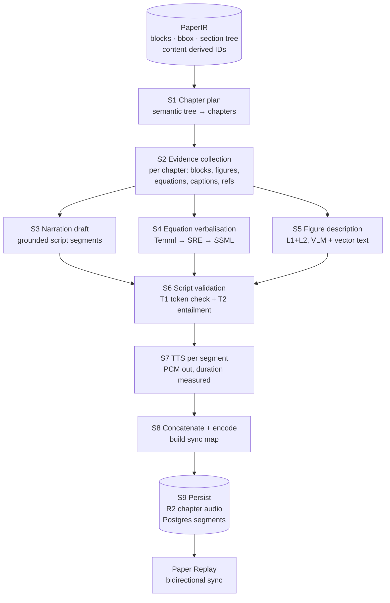
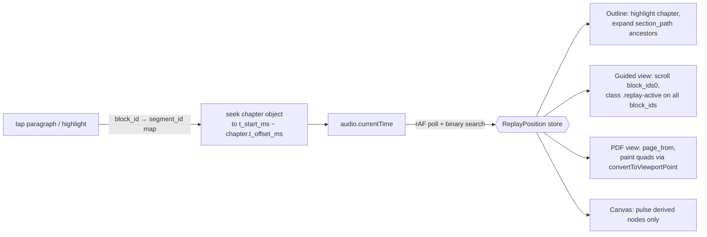

# 17 — Audiobook and Paper Replay Architecture

**Primary source:** `literature/14-audiobook-tts.md`. Supporting: `literature/07-formula-recognition.md`, `literature/13-highlight-anchoring.md`, `literature/21-durable-workflows.md`, `literature/22-memory-and-injection.md`, `literature/30-database-and-storage.md`, `literature/32-frontend-canvas-pdf-tech.md`, `literature/02-docling.md`, `findings.md`.

---

## 17.0 Bottom line

Paper Replay is not a TTS integration. It is a **durable, resumable, source-grounded content pipeline** whose audio artefact happens to be produced by a TTS engine at the end. Four decisions carry the whole design:

1. **Synthesise per segment, concatenate per chapter.** Segment start times are then the arithmetic sum of preceding segment durations — exact by construction, no vendor timestamp API, no forced alignment, no drift (`14-audiobook-tts.md` §4). This collapses the TTS vendor from a lock-in decision into a swappable quality/cost knob and makes segment-level source sync free on *every* engine, including local Kokoro.
2. **Chapters come from the semantic section tree.** The current product does the opposite — `SmartOutlineItem.section_id = f"page-{n}"`, one "chapter" per PDF page, titled by an LLM (`findings.md` §C3). That is the explicit anti-requirement.
3. **Mathematics is verbalised by a rule engine, never by an LLM.** `LaTeX → MathML → Speech Rule Engine (ClearSpeak) → SSML`. SRE is Apache-2.0 and is the engine behind MathJax's accessibility layer (`14-audiobook-tts.md` §5).
4. **The agent runtime is not the job queue.** Pydantic AI is a typed tool-calling loop inside one process. Temporal (or Hatchet) owns ordering, retry, fan-out/fan-in and the resume ledger.

Marginal cost for a 20-page paper end to end: **≈$0.53** on the local-TTS tier, **≈$1.41** with Azure Neural, **≈$3.28** with ElevenLabs Flash v2.5 (§17.12).

---

## 17.1 Pipeline



### Stage specification

| # | Stage | Input | Output | Storage | Model / service | Cost (20p) | Failure mode | Resume |
|---|---|---|---|---|---|---|---|---|
| S1 | **Chapter plan** | `ir_sections` tree (BODY layer only), per-section word counts, page spans | `audio_chapters` rows; `plan.json` | Postgres + R2 `renders/{id}/plan.json` | Deterministic algorithm + 1 Sonnet-5 call for chapter *titles only* | $0.03 | Degenerate tree (one level-1 heading, or 58 spurious headings as measured in `findings.md` §B6) → 1 giant or 58 tiny chapters | Cheap; re-run. Chapter IDs content-derived so re-plan on an unchanged tree is a no-op |
| S2 | **Evidence collection** | chapter → block IDs | `evidence.json` per chapter: verbatim block texts, figure crops + vector text runs, equation LaTeX + MathML, caption links, in-text references | R2 (keys), Postgres FKs | Pure SQL over `blocks` (recursive CTE) | $0 | Missing figure crop / null LaTeX → downstream stage must degrade, not fabricate | Deterministic; re-derivable from IR at any time |
| S3 | **Narration draft** | one chapter's `evidence.json` + prior chapter's 2-sentence summary | ordered segment array, each with `spoken_text` + `block_ids` + `kind` | R2 `script/{chapter_id}.json`; Postgres on commit | Sonnet 5 via OpenRouter, Pydantic AI structured output, `temperature=0.2` | $0.35 | Ungrounded assertion; drifting into interpretation; segment with empty `block_ids` | Per-chapter activity. Failed chapter retried alone; other chapters untouched |
| S4 | **Equation verbalisation** | equation LaTeX + `formula_number` | SSML fragment + plain transcript per equation | Postgres `ir_equations.speech_ssml` (computed at **ingest**, not render) | Temml 0.13.3 (MIT) → SRE v4 (Apache-2.0), ClearSpeak | $0 (CPU ms) | LaTeX won't compile; MathML conversion fails; SRE empty | Idempotent, cached by `equation_id`. Fallback ladder §17.5 |
| S5 | **Figure description** | crop @2×, **vector text runs inside bbox**, caption, referring paragraphs | typed L1/L2 object | Postgres `ir_figures.description` | Sonnet 5 (vision) | $0.08 | Vector diagram rasterised → labels lost; L3/L4 confabulation | Per-figure activity, cached by `figure_id` + `ir_version` |
| S6 | **Script validation** | segments + their cited block texts | per-segment `grounding_verdict` + score | Postgres `audio_segments` | T1: deterministic (CPU). T2: Haiku 4.5, quarantined, no tools | $0.06 | Judge over-accepts; thresholds uncalibrated | Per-chapter; failure triggers one regeneration, then extractive fallback |
| S7 | **TTS** | validated segment `ssml`/`text` | one PCM buffer per segment + measured sample count | R2 `scratch/{chapter}/{segment_id}.wav`, 7-day lifecycle | Kokoro-82M (Apache-2.0 code+weights) default; Azure Neural / ElevenLabs premium | $0 / $0.88 / $2.75 | Engine 429/5xx; chunk-length caps; leading-silence variance | Per-*segment* idempotency: `segment_id` is content-derived, so retry lists existing keys and resumes mid-chapter |
| S8 | **Stitch + sync map** | per-segment PCM + durations | one Opus object per chapter + `sync.json` | R2, immutable keys | ffmpeg/libopus, CPU | ~$0 | Encoder frame padding corrupting timings (§17.7) | Cheap re-run from scratch PCM |
| S9 | **Persist** | chapter objects, sync map, segment rows | published render | R2 + Postgres transaction | — | $0.006 | Partial publish | Publish is one Postgres transaction flipping `render.status`; R2 writes precede it |

---

## 17.2 Chapter planning — from the section tree, never from pages

**Input is the semantic tree, output includes page ranges.** Pages are derived, never consulted. Docling's `ContentLayer` already separates BODY from running heads and page furniture (`02-docling.md` §3), which is the input filter; PaperTree must set `heading_hierarchy_options.enabled=True` or every heading arrives at `level=1` and there is no tree to plan against (`02-docling.md` §6, corroborated by the measured run in `findings.md` §H2).

```python
TARGET_WORDS   = (600, 1800)   # ≈4–12 min at 150 wpm
MERGE_FLOOR    = 350
SPLIT_CEILING  = 1800

def plan_chapters(tree, opts):
    chapters = [Chapter(kind="front_matter", sections=[title, authors, abstract])]
    for node in tree.body_children_level1():          # numbering-derived level, see 10-reading-order §7
        if node.role == "references" and not opts.narrate_references:
            chapters.append(Chapter(kind="refs_notice", sections=[node], narrate=False))
            continue
        if node.words > SPLIT_CEILING:
            for child in node.children_level2() or node.paragraph_groups():
                chapters.extend(split_recursive(child))
        else:
            chapters.append(Chapter(sections=[node],
                                    optional=node.is_appendix()))
    return merge_runts(chapters, floor=MERGE_FLOOR)
```

Rules that matter:

- **Split** below `SPLIT_CEILING` by descending to level-2 children first. Only if the deepest heading is still oversized do you split on **paragraph boundaries**, choosing the boundary nearest the 1,200-word mark. Never split mid-paragraph, and never inside an equation/figure/table group — the group is atomic because its segments share evidence.
- **Merge** adjacent level-1 sections under `MERGE_FLOOR`, but never across a numbering-family boundary (body → appendix, main → supplementary). Merged chapters keep both `section_id`s in `section_ids[]`.
- **Figures and tables travel with the referring chapter**, not with the page they are printed on. A figure with no in-text reference attaches to the chapter containing the nearest preceding body block in reading order.
- **Chapter IDs are content-derived**, following the same principle that `13-highlight-anchoring.md` §8.2 establishes for blocks: `chap_ + base32(sha256(paper_id ‖ ir_version ‖ section_path ‖ split_index))[:12]`. Re-planning an unchanged tree reproduces the same IDs, so unchanged chapters keep their audio and are never re-synthesised.

**Falsification:** we would revisit paragraph-boundary splitting if PTUB Tier B shows the heading tree on our corpus is unreliable enough that level-2 descent produces chapters that do not correspond to arguments. The measured heading counts in `findings.md` §B6 (58 "headings" on a 12-page ResNet paper against ~8 real sections) are from the *dead* extractor, not from Docling — but Docling's 22 headings on the same paper is still above the real count, so this needs Tier B validation before we trust automatic splitting without review.

---

## 17.3 Equation verbalisation — reuse the accessibility stack

**Pipeline:** `LaTeX → MathML (Temml 0.13.3, MIT) → SRE v4 (Apache-2.0, ClearSpeak) → SSML fragment`, wrapped in `<bookmark mark="eq:{equation_id}"/>`. Computed **at ingest and stored beside the block**, never at playback (`32-frontend-canvas-pdf-tech.md` §4).

**Why not an LLM:**

1. **Determinism.** SRE is a rule engine: identical MathML yields an identical string, so the transcript is diffable and the audio is content-addressable. An LLM is not, which defeats the caching that makes chapter-level re-renders cheap.
2. **The failure mode is undetectable by ear.** An LLM reading maths produces *plausible-sounding wrong maths* — a dropped subscript, a misread limit. `findings.md` §B2 already records this exact class of damage from the existing regex path: `√d_k` → `\sqrt dk` (renders as √d·k), and every subscript in `h_{t+1} = h_t + f(h_t, θ_t)` lost. This is precisely the silent-hallucination class the product forbids.
3. **It is a solved twenty-year problem.** ClearSpeak and MathSpeak are *specified* rule sets with disambiguation conventions blind readers already know. SRE implements both plus Nemeth braille, in a dozen-plus languages, and is what MathJax ships. MathCAT (MIT, Rust) is the equivalent inside NVDA and JAWS.
4. **It emits SSML directly** (also VoiceXML, Sable, ACSS), so equation prosody and pauses are generated rather than hand-tuned — and this is a second, independent reason OpenAI TTS is disqualified, since it accepts no SSML at all.
5. **Cost.** CPU milliseconds versus a per-equation token spend on a paper where 68.3% of blocks were classified as math (`findings.md` §B1, Neural ODEs).
6. **Verbosity becomes a product setting** for free: ClearSpeak's fine-grained preferences, or MathSpeak's three verbosity levels.

**Fallback ladder — the point is that failure is *spoken*, not hidden:**

| Tier | Condition | Spoken output | Record |
|---|---|---|---|
| F0 | SRE succeeds, LaTeX compiles | full ClearSpeak verbalisation | `provenance='verbatim'` |
| F1 | LaTeX present but fails the render check (`07-formula-recognition.md` §7.6) | "Equation 7, displayed. Shown on screen." | `equation_render_status='unverified'`, crop retained and displayable |
| F2 | MathML conversion or SRE returns empty/low-confidence | same announcement form | `speech_status='degraded'` |
| F3 | **Inline math** | never verbalised as maths; short alphabetic runs read literally, otherwise "…, an inline expression, …" | inline spans stay flagged low-confidence per `07` §5 — inline MER is unsolved and must not be OCR'd |
| F4 | No LaTeX at all (scan, figure-embedded) | routed to the figure path with L1-only description | `kind='figure'` |

**Version flag:** SRE v5.0.0-rc.4 (2026-07-02) is a **release candidate**; last stable major is v4. Pin v4 (`14-audiobook-tts.md` §8).

**Falsification:** we would revisit if a listening test shows ClearSpeak output on our corpus is materially harder to follow than a plain-language rendering — the degradation rule ("say so, don't narrate a mangled expression") stands either way.

---

## 17.4 Figure description

**What gets described.** Only regions the parser detected as figure/table with a bbox, that are either referenced by the chapter's prose or fall inside its page span. Publisher marks, logos and rules are excluded. `findings.md` §B3 is the reason this stage exists at all: the current extractor finds **0 figures** on ResNet, where 60 significant vector draw operations are present; Docling finds 7 with 18 linked captions (`findings.md` §H2).

**Four inputs, all mandatory:**

1. Rendered crop at ≥2× (`generate_page_images`, `images_scale≈2.0`).
2. **Extracted vector text runs inside the figure bbox**, with coordinates. `14-audiobook-tts.md` §6 is explicit that a raster-only VLM path silently rasterises and loses the label text that makes CS architecture diagrams describable. On our corpus this is not an edge case — it is most figures.
3. The **caption**, verbatim, with its `caption_block_id`.
4. The **referring paragraphs**. FigurA11y (Singh, Wang & Bragg, IUI 2024) is the evidence that grounding in surrounding paper text — not just pixels — is what makes scientific figure description work.

**Output is a typed object, not prose:**

```json
{ "figure_id": "fig_7k3m…", "caption_block_id": "blk_…",
  "level1": "A line chart of training error against iteration count.",
  "level2": ["Plain-34 error stays above ResNet-34 across the full range.",
             "Both curves drop sharply near iteration 30 on the x-axis."],
  "level3": null, "level4": null,
  "axes":   [{"label":"iter. (1e4)","range":["0","60"]},
             {"label":"error (%)","range":["0","60"]}],
  "series": [{"name":"plain-34","encoding":"line"},{"name":"ResNet-34","encoding":"line"}],
  "evidence_block_ids": ["blk_a1…","blk_b9…"],
  "unreadable": false }
```

Levels follow Lundgard & Satyanarayan (IEEE TVCG InfoVis 2022, arXiv:2110.04406): L1 construction properties, L2 statistical relations, L3 perceptual phenomena, L4 domain insight. **L1+L2 auto-generated; L3 behind explicit per-user opt-in; L4 never auto-generated.** L1/L2 are grounded in the figure and caption; L3/L4 are interpretation and are where a VLM confabulates. The paper's key empirical finding — that blind and sighted readers differ significantly in which levels they find useful — is the argument for making verbosity a setting rather than a constant.

**Grounding.** L1 claims about axis labels and series names must match strings present in the extracted vector text runs. L2 numeric claims go through the Tier-1 token check (§17.6) against caption + referring paragraphs. Unmatched numbers are stripped, not softened. `unreadable: true` (a photograph, a raster with no text) → the segment becomes `"Figure 4. The paper's caption reads: …"` and nothing more.

**How it is marked as AI-generated in the audio — three independent layers:**

1. **Spoken frame:** `"Figure 3, described automatically."` … `"End of automatic description."` This is the accessible marker and the one that survives being played through a car stereo.
2. **Distinct voice profile** for `provenance='ai_generated'` segments, plus a 250 ms low-level earcon at the boundary. Cost is identical; both Kokoro and Azure ship multiple voices.
3. **`provenance='ai_generated'` in the segment record**, so the transcript, the scrubber and the Guided view all render it in the AI-content style.

This is the audio expression of the hard rule that AI content must never look like source. `findings.md` §C5 records the current product doing the exact opposite: `llm_service.py:41-55` instructs the model to emit Mermaid diagrams for "process flows, system architectures", which are then rendered indistinguishably from the paper's own figures. **The figure describer describes what is present; it may never add a figure.**

---

## 17.5 Timestamps: native marks vs forced alignment

The whole question is: for an arbitrary audio time *t*, what was being spoken? Vendors differ enormously and marketing does not surface it (`14-audiobook-tts.md` §1).

| Approach | Granularity | Offsets into input text? | Marginal cost / 1,000 words | Verdict |
|---|---|---|---|---|
| **Per-segment synthesis + concatenation** | segment (exact) | n/a — exact by arithmetic | **$0.00** | **Primary mechanism, all engines** |
| Azure `WordBoundary` + `<bookmark>` | word, punctuation, sentence, arbitrary mark | **Yes** — `TextOffset` + `WordLength` are char indices into the submitted text/SSML | **$0.00 incremental** (rides the ~$0.098/1k-word synthesis) | Best native; only vendor with all three |
| ElevenLabs `with-timestamps` | character | implicitly (array index *is* the input index) | **$0.00 incremental** (rides $0.305 Flash / $0.61 Multilingual v2 per 1k words) | Finer than needed |
| Amazon Polly speech marks | word, sentence, `<mark>`, viseme | **Yes** — byte offsets | **unverified** — Polly pricing not verified from primary source | Cleanest design, unpriced |
| Google `enableTimePointing=SSML_MARK` | mark only | only at marks you insert | unverified | You instrument the SSML; Chirp 3 HD docs never mention timepoints |
| OpenAI TTS | **none** | no | — | **Disqualified** (also no SSML) |
| Kokoro / Chatterbox / Piper | **none natively** | no | $0 | Fine — segment timing is arithmetic |
| MFA (repair) | word / phoneme | via the known script | CPU only; **throughput not published in sources read** | ~21.9 ms mean word-boundary deviation on TIMIT (third-party, unconfirmed) |
| WhisperX (repair) | word | via the known script | ~51 s GPU for 60 min audio (70× realtime, large-v2, <8 GB VRAM) | Materially less precise than MFA per its own issue tracker |
| ElevenLabs Forced Alignment API | word **and** char, with per-word confidence | yes | not published in sources read | Best uncertainty representation; ≤10 h / ≤675k chars |
| aeneas | — | — | — | **Double reject:** AGPL-3.0 *and* dead since 2020 |
| stable-ts | — | — | — | **Reject:** archived 2026-05-30 |

**Recommendation: buy neither.** Segment-level timing is exact by construction and costs **$0.00 per 1,000 words on every engine**. Word-level marks are a polish feature: take them free from Azure and ElevenLabs where you are already paying for synthesis, and **never purchase a forced-alignment pass to obtain them**. Keep MFA (MIT, CPU-viable) installed strictly as a **repair tool** for audio that arrives without a sync map (a re-encoded file, an imported narration). It must never be on the hot path.

**The implementation detail that makes "exact by construction" true.** Do **not** concatenate encoded Opus/MP3 frames — encoder frame padding destroys the arithmetic. Synthesise each segment to **raw PCM** (Azure `Riff24Khz16BitMonoPcm`; Kokoro emits float32 arrays), concatenate PCM samples with a fixed inter-segment pause of *N* samples, then **encode the chapter once**. Segment starts are then exact in integer samples; `t_start_ms` is the only rounding (±0.5 ms, an order of magnitude below MFA's reference deviation). For Azure word marks, `AudioOffset` is in 100 ns ticks: convert with `(offset + 5000) / 10000`.

**Required calibration spike before the schema freezes.** `14-audiobook-tts.md` §8 lists real-world sync accuracy of the concatenation approach as **untested**, and engine-side leading/trailing silence trimming as needing empirical calibration. This is the single largest unknown in this section. The spike: synthesise 50 segments per engine, measure leading/trailing silence at a −50 dBFS threshold, store per-engine `lead_trim_ms` / `tail_trim_ms` in the engine profile, and assert concatenated duration equals the sum of measured durations within ±5 ms.

---

## 17.6 Segment record schema

Every spoken segment maps to block IDs, section IDs, page range, and equation/figure/table IDs.

```sql
CREATE TABLE audio_segments (
  segment_id        text PRIMARY KEY,   -- base32(sha256(chapter_id‖ordinal‖norm(spoken_text)))[:16]
  render_id         uuid    NOT NULL REFERENCES audio_renders(id) ON DELETE CASCADE,
  chapter_id        text    NOT NULL REFERENCES audio_chapters(chapter_id),
  ordinal           int     NOT NULL,
  kind              text    NOT NULL CHECK (kind IN
                      ('chapter_intro','prose','equation','figure','table',
                       'caption','footnote','transition','disclosure','chapter_outro')),
  provenance        text    NOT NULL CHECK (provenance IN
                      ('verbatim','paraphrase','ai_generated','system')),

  spoken_text       text    NOT NULL,
  ssml              text,                          -- present for equation segments

  -- source mapping ------------------------------------------------------
  section_id        text    REFERENCES ir_sections(section_id),
  section_path      text[]  NOT NULL,              -- ['3','3.2']
  block_ids         text[]  NOT NULL,              -- content-derived IDs, 13-anchoring §8.2
  block_char_range  int4range,                     -- when a block spans several segments
  page_from         int     NOT NULL,              -- DERIVED from blocks, never an input
  page_to           int     NOT NULL,
  quads             jsonb   NOT NULL,              -- PDF user space, origin bottom-left
  view_box          jsonb   NOT NULL,              -- CropBox ∩ MediaBox + rotate + userUnit
  equation_id       text    REFERENCES ir_equations(equation_id),
  figure_id         text    REFERENCES ir_figures(figure_id),
  table_id          text    REFERENCES ir_tables(table_id),

  -- timing (exact by construction) --------------------------------------
  t_start_ms        int     NOT NULL,
  t_end_ms          int     NOT NULL,
  n_samples         int     NOT NULL,
  audio_object_key  text    NOT NULL,              -- chapter object this lives in
  word_marks        jsonb,                         -- NULL unless engine supplies them
                                                   -- [{w,t0,t1,c0,c1}] c* = char range in spoken_text

  -- verification --------------------------------------------------------
  grounding_verdict text CHECK (grounding_verdict IN
                      ('supported','partial','unsupported','not_applicable')),
  grounding_score   real,
  unmatched_tokens  text[],

  tts_engine        text NOT NULL,
  tts_voice         text NOT NULL,
  ir_version        int  NOT NULL,
  script_version    int  NOT NULL,
  created_at        timestamptz NOT NULL DEFAULT now()
);

CREATE INDEX ON audio_segments (render_id, t_start_ms);      -- audio → source
CREATE INDEX ON audio_segments USING gin (block_ids);        -- source → audio
CREATE INDEX ON audio_segments (chapter_id, ordinal);
```

Notes. A segment is **at most one IR block and at most ~60 spoken words**; long paragraphs split at sentence boundaries into several segments sharing `block_ids` but carrying distinct `block_char_range`. That gives ~230 segments for a 9,000-word script and useful sync granularity without any word marks. `quads` + `view_box` follow the `ShapeSelector` convention verbatim — PDF user space, origin bottom-left, view box recorded so coordinates are re-normalisable (`13-highlight-anchoring.md` §3.4). Segments are **ARTEFACT memory** in the trust model of `22-memory-and-injection.md` Part 3(b): derived-untrusted, content-only, never instruction-bearing, rendered through a template that escapes markup and blocks link/image auto-fetch.

---

## 17.7 Script validation — the grounding check

The question: does the narration assert things the paper does not say?

**Tier 0 — structural (reject, no model).** Any segment with empty `block_ids` is rejected unless `kind ∈ {chapter_intro, transition, disclosure}`, which are system-authored from fixed templates and carry no factual content.

**Tier 1 — deterministic token check (every segment, zero model cost).** Extract from `spoken_text`: numbers with units, proper nouns, dataset names, metric names, citation markers, and figure/table/equation references. Each must appear in the normalised concatenation of the cited blocks plus their captions. Normalisation folds numeral↔word forms, unit aliases, `%`, `×`, hyphenation and ligatures — and **must preserve U+2212 MINUS separately from ASCII hyphen** rather than silently rewriting it, which is the defect recorded at `findings.md` §B7. Unmatched tokens land in `unmatched_tokens`. This catches the highest-consequence hallucination in scientific narration — a wrong number — for free.

**Tier 2 — claim entailment (batched per chapter, Haiku-4.5 class).** The judge receives, in a structured schema, each segment's `spoken_text` and the **verbatim text of exactly the cited blocks — nothing else**. No retrieval, no other chapters, no cross-paper access. It labels each sentence `supported | partially_supported | unsupported | contradicted` and returns supporting span offsets. The judge is a **quarantined, tool-less model instance** and its output is schema-constrained: this is the Dual-LLM / Map-Reduce pattern of `22-memory-and-injection.md` Part 3(b). It is not shown the drafting prompt and is not told the segment is expected to be correct.

**Tier 3 — action.**

- `contradicted` / `unsupported` → regenerate the segment **once** with the offending sentence removed and evidence re-presented. On second failure, replace with a **source-quote segment**: read the cited block verbatim, prefixed `"Quoting the paper:"`, `provenance='verbatim'`.
- `partially_supported` → ship, record `grounding_verdict='partial'`, mark it "approximate" in the transcript UI.
- A chapter failing Tier 1 on >20% of segments is failed whole and retried once with a stricter, more extractive prompt. Failing that, the chapter falls back to **extractive mode** — narration is the paper's own sentences, selected but not rewritten.
- A chapter that exhausts retries is marked `status='failed'` and **omitted from the playlist with an audible and visible notice**. It is never filled with an error string. `findings.md` §C7 records the current system persisting `"_Failed to generate summary: {error}_"` as normal content, which then blocks retry forever.

**Honest calibration note.** The 20% threshold, the single retry and the score cut-offs are **proposals, not measured values** — the same status `13-highlight-anchoring.md` §9 gives its 0.72/0.60 anchoring thresholds. They need calibration against PTUB Tier C (12 papers × 10 questions with evidence spans), and the judge itself needs a held-out set of deliberately-corrupted segments to measure its false-accept rate. **Falsification:** if the Tier-2 judge's false-accept rate on injected errors exceeds ~10%, drop Tier 2 and ship extractive-only narration for factual chapters, keeping generative narration for chapter intros and transitions.

---

## 17.8 Paper Replay — bidirectional sync



**Forward (audio → view).** The player loads the render's `sync.json` once — a flat array sorted by `t_start_ms` (~230 entries, ~120 KB raw, ~30 KB gzipped for a 60-minute paper). Position is resolved by binary search on every animation frame (`timeupdate` fires only ~4 Hz and is too coarse), giving O(log n) and **zero server round-trips**. One `ReplayPosition` store fans out to four subscribers: outline, Guided view (DOM lookup by `data-block-id`, scroll-margin so the block lands at ~38% viewport height), PDF view (virtualised page list scrolls to `page_from`; `quads` painted in the existing highlight overlay — convert corners individually with `viewport.convertToViewportPoint`, since `convertToViewportRectangle` does not exist in current pdf.js, per `32-frontend-canvas-pdf-tech.md` §1.4), and canvas (pulse only; **never auto-create nodes** — `findings.md` §G3 records `populate_canvas` doing exactly that today).

Word-level karaoke is a second binary search inside `word_marks` **when present**. The UI is built for the segment-level case first; word-level is a progressive enhancement keyed off `word_marks !== null`. A sticky **Follow audio** toggle (default on) suspends auto-scroll for ~4 s after any manual scroll — scroll-jacking a reader who is looking elsewhere is the fastest way to make the feature hated.

**Reverse (view → audio).** Every block in every view carries `data-block-id`; tap or long-press gives *Play from here*. The common case is resolved client-side from a `block_id → segment_id` map shipped inside `sync.json` (zero round-trips); the server fallback is `WHERE render_id = $1 AND block_ids && ARRAY[$2] ORDER BY t_start_ms LIMIT 1` against the GIN index. Chapters are **separate R2 objects**, so the seek is: load chapter object, seek to `t_start_ms − chapter.t_offset_ms`. This is why chapters are stored separately rather than as one 60-minute file — `30-database-and-storage.md` §4 makes the point directly ("segment audiobooks per section so the player prefetches rather than range-seeking a 90-minute file").

**Blocks with no segment** (references, running heads, an undescribed figure, a chapter the user excluded) resolve **upward** to the nearest preceding narrated block in reading order, and the UI says so: *"This part isn't narrated — starting from the paragraph above."* Never a silent jump.

**Highlights → audio.** An existing highlight resolves to block IDs through the anchoring cascade already specified (`13-highlight-anchoring.md` §8.3, tiers T0–T6). Even a T4 geometry-only resolution jumps exactly, because segments carry `quads` in the same PDF user space.

**Re-parse invalidation.** The sync map keys on `block_id`. Because block IDs are content-derived, a re-parse producing the same block reproduces the same ID — so the map survives exactly as far as highlights do and no further. Segments whose `block_ids` no longer resolve go to the **same orphan tray** as orphaned highlights: never deleted, always surfaced (Hypothesis's 2017 orphans-tab lesson, `13` §3.5).

---

## 17.9 Durability, resumability and cost control

**The agent runtime is not the job queue.** Pydantic AI (MIT, 2.20.0, first-class OpenRouter — `20-agent-runtimes.md` §4) is a typed tool-calling loop inside one Python process. It has no durable store, no retry ledger, no fan-in barrier and no operator UI; its own answer to durability is **to be driven by Temporal**, not to be it (`20` §3 table). Every LLM and TTS interaction is an *activity*; the workflow owns ordering, retry and state.

**Engine: Temporal Cloud, Python workers on PaperTree's own hardware** (`21-durable-workflows.md` §7) — $100/month floor, GPU/CPU routing via dedicated task queues, MIT server, both SDKs mature. Hatchet Cloud (MIT, free to 100k task runs/month, worker labels + sticky assignment) is the cheaper spike-worthy alternative; the risk is its unpublished $0→$500 tier cliff. **Explicitly avoid Celery**: `task_acks_late=False` by default loses in-flight tasks, and the Redis 1-hour visibility timeout re-delivers long tasks — which is exactly the audiobook's shape.

**Workflow shape.** Parent `AudiobookRender(paper_id, ir_version, voice_profile, options)`; **child workflow per chapter**. This is not stylistic: Temporal caps history at **51,200 events / 50 MB** and warns at 10,240 / 10 MB, and a 12-chapter render with inline payloads approaches that (`21` §1, §7). **Every activity returns an R2 key + sha256, never a payload.**

**What is persisted per step.** Beyond Temporal's own event history, each activity writes a row *before returning*:

```
audio_render_steps(render_id, chapter_id, step_name, attempt, status,
                   input_hash, output_key, output_sha256,
                   cost_cents, tokens_in, tokens_out,
                   started_at, finished_at, error_class, error_detail)
```

Temporal skips completed activities on replay; this table is for the operator, for cost accounting, and — critically — as a **vendor-independent resume ledger**. If Temporal is ever replaced, this table is the resume state.

**Resumability, concretely.** Crash mid-TTS of chapter 7: chapters 1–6 are complete immutable objects in R2. Chapter 7's completed segments are individually keyed `renders/{id}/scratch/chap_7/{segment_id}.wav`, and `segment_id` is content-derived from the spoken text — so retry lists existing keys and **resumes at segment 13**, re-paying nothing. Per-chapter retry is a first-class user action: a `chapter_rejected` signal regenerates one chapter under a new `script_version` for that chapter alone; the other eleven chapter objects keep their keys and are not touched.

**Cost controls.**

- **Pre-flight estimate** from word count, shown to the user before any spend.
- **Hard budget per render**, checked before every paid activity. On exceedance the workflow *pauses* on `workflow.wait_condition` awaiting a user-approval signal. It never silently overspends and never silently truncates — `findings.md` §C6 records the current code dropping the middle of any page over 5,000 chars while still claiming to summarise the whole page.
- `maximum_attempts` = 3 for LLM/TTS, 5 for R2, with `non_retryable_error_types` covering schema violations so a malformed prompt does not burn 3× the money.
- **Render deduplication:** `render_id = sha256(paper_id ‖ ir_version ‖ script_version ‖ voice_profile ‖ options)`.
- **Prompt caching** via Pydantic AI's `openrouter_cache_instructions` — the ~1,500-token system prompt and schema ride 20 calls per render.

**Storage layout (Cloudflare R2, `30-database-and-storage.md` §4):**

```
renders/{render_id}/manifest.json
renders/{render_id}/sync.json                       gzip, immutable
renders/{render_id}/chapters/{chapter_id}.opus      published, Cache-Control: immutable
renders/{render_id}/scratch/{chapter_id}/{seg}.wav  7-day lifecycle rule
```

Published chapter audio is served through a custom domain with Worker-issued short-lived tokens so the CDN caches; presigned S3-endpoint URLs (max 7 days, `<ACCOUNT_ID>.r2.cloudflarestorage.com` only — they do **not** work on custom domains) are reserved for genuinely private artefacts. Renders unplayed for 90 days move to R2 Infrequent Access ($0.01/GB-month, 30-day minimum).

---

## 17.10 Cost model — 20-page paper, end to end

**Assumptions (stated so they can be attacked):** 8,000 source body words → ~9,000 spoken words → ~60 min at 150 wpm; 10 chapters; ~230 segments; 8 figures/tables described; 12 display equations; Docling parsing (19 s/page ResNet, 5 s/page Attention, CPU-only — `findings.md` §H2) is charged to ingestion, not to the audiobook.

| Component | Service | Free tier (Kokoro) | Azure Neural | ElevenLabs Flash v2.5 |
|---|---|---|---|---|
| Chapter plan (titles only) | Sonnet 5 | $0.03 | $0.03 | $0.03 |
| Script drafting, 10 chapters | Sonnet 5 | $0.35 | $0.35 | $0.35 |
| Figure description, 8 figures | Sonnet 5 (vision) | $0.08 | $0.08 | $0.08 |
| Equation verbalisation, 12 eqs | Temml + SRE, CPU | $0.00 | $0.00 | $0.00 |
| Grounding validation | Haiku 4.5 | $0.06 | $0.06 | $0.06 |
| **TTS, 9,000 words** | — | **~$0.00** (≈12 min of 32-vCPU time at ~5× realtime) | **$0.88** | **$2.75** |
| Stitch + Opus encode | ffmpeg, CPU | ~$0.00 | ~$0.00 | ~$0.00 |
| R2 storage, 28.8 MB, month 1 | R2 | $0.0004 | $0.0004 | $0.0004 |
| R2 egress | R2 | **$0.00** | $0.00 | $0.00 |
| R2 Class A writes (~250) | R2 | $0.001 | $0.001 | $0.001 |
| Temporal Actions (~100) | Temporal Cloud | $0.005 | $0.005 | $0.005 |
| **Marginal total** | | **≈$0.53** | **≈$1.41** | **≈$3.28** |
| Per minute of audio | | $0.009 | $0.023 | $0.055 |

Amortised fixed cost: Temporal Cloud's $100/month floor divided across T1 volume (300 audiobooks/month, `21` §3) adds **+$0.33/render**; it disappears as a per-render concern above ~1,000 renders/month.

**Price caveats, marked as the sources mark them.** ElevenLabs' $0.05/$0.10 per 1k chars **were read off the official pricing page**. Azure's **$16 per 1M characters is not verified** — both Azure's and Google's pricing pages render via JavaScript and returned nothing; the figure comes from search-result summaries. Polly's pricing was **not verified from primary source at all**. The per-1,000-word derivations (~$0.098 Azure, ~$0.305 ElevenLabs Flash, ~$0.61 Multilingual v2) are the report author's arithmetic at ~6.1 chars/word, not vendor-quoted figures. Anthropic list prices are Opus 5 $5/$25, Sonnet 5 $2/$10 *introductory through 2026-08-31* then $3/$15, Haiku 4.5 $1/$5 per MTok. At introductory Sonnet pricing the LLM subtotal is ~$0.36 rather than $0.52 — i.e. the free-tier render is ~$0.37 today and ~$0.53 from September.

---

## 17.11 Recommendations and falsification conditions

| # | Recommendation | We revisit this if… |
|---|---|---|
| 1 | Per-segment synthesis + concatenation as the timing mechanism | the calibration spike shows engine-side silence trimming makes concatenated timings drift >20 ms over a 10-minute chapter, in which case add MFA as a post-pass on long chapters only |
| 2 | **Kokoro-82M** (Apache-2.0 code *and* weights) as default engine | a blind listening test on our corpus rates it below acceptable for 60-minute listening — its quality tier is **self-reported with no MOS or Elo published**, and no listening test has been run; or the year-stale wrapper (last commit 2025-08-06, 195 open issues) breaks on a Python bump, in which case vendor the inference code (the weights are permanent) |
| 3 | **Azure Speech** as premium engine | its unverified $16/1M-char list price proves materially wrong on the real rate card, at which point ElevenLabs Flash v2.5 (verified $0.05/1k chars) becomes the premium tier at ~3× the cost |
| 4 | **SRE v4 (ClearSpeak)** for equations, MathCAT as the Rust swap-in | a listening test shows ClearSpeak output is harder to follow than plain-language rendering on our corpus. The **degradation rule stands regardless**: announce the equation rather than narrate a mangled one |
| 5 | **L1+L2 only** for figure descriptions | user research shows L3 is wanted by default — it is already gated behind opt-in, so this is a default flip, not a redesign. **L4 stays off permanently** |
| 6 | **Temporal Cloud** as the workflow engine | the Hatchet spike shows its free tier retains enough history for 3am debugging, in which case Hatchet saves $100/month through T1; or history size forces further child-workflow decomposition |
| 7 | **Chapters from level-1 sections with 600–1,800-word targets** | PTUB Tier B shows Docling's heading tree on our corpus is too noisy for automatic level-2 descent, in which case chapter plans go through a one-click user review before synthesis |
| 8 | **Reject** OpenAI TTS, XTTS-v2 (CPML non-commercial), F5-TTS (CC-BY-NC weights), aeneas (AGPL + dead), stable-ts (archived) | only a licence change would move any of these; XTTS-v2 cannot move at all, since Coqui shut down in January 2024 and there is no counterparty to buy from |

**Carried-forward uncertainties** (from `14-audiobook-tts.md` §8, not resolved here): Azure/Google/Polly list prices; Azure and Polly behaviour on very long inputs (chunking limits, whether offsets stay absolute across chunks); the MFA 21.9 ms figure and the WhisperX-vs-MFA comparison, both third-party; Chatterbox's training-data provenance (the exact issue that made F5-TTS's weights non-commercial); per-voice Piper licences; SRE v5 stability. **And, most importantly, real-world sync accuracy of the concatenation approach is untested** — §17.5's calibration spike is a prerequisite to freezing the segment schema, not a nice-to-have.
